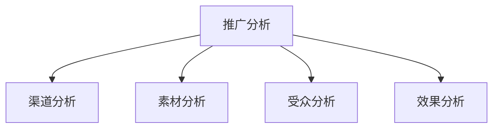

# 电商营销数据分析

> 远哥说：营销数据分析是优化营销策略的基础，通过对营销数据的系统分析，可以提升营销效果，优化投放策略。

## 一、活动效果分析

### 1.1 分析维度
```
分析框架：
1. 流量维度
   - 活动曝光
   - 活动点击
   - 点击率
   - 到达率

2. 转化维度
   - 参与人数
   - 转化人数
   - 转化率
   - GMV贡献

3. 成本维度
   - 活动成本
   - 获客成本
   - 转化成本
   - ROI

4. 用户维度
   - 新客占比
   - 复购率
   - 客单价
   - 留存率
```

### 1.2 效果评估
| 维度 | 指标 | 方法 | 应用 |
|------|------|------|------|
| 效果评估 | ROI | 投入产出比 | 效果评估 |
| 成本分析 | CAC | 获客成本 | 成本优化 |
| 价值分析 | LTV | 生命周期价值 | 价值评估 |
| 留存分析 | 留存率 | 留存曲线 | 留存优化 |

## 二、推广效果分析

### 2.1 分析框架


### 2.2 核心指标
```
指标体系：
1. 流量指标
   - 展现量
   - 点击量
   - CTR
   - 到达率

2. 转化指标
   - 转化量
   - 转化率
   - CPA
   - ROI

3. 成本指标
   - 投放成本
   - CPC
   - CPM
   - ARPU

4. 质量指标
   - 跳出率
   - 停留时长
   - 互动率
   - 分享率
```

## 三、渠道分析

### 3.1 渠道体系
```
渠道矩阵：
1. 自有渠道
   - APP渠道
   - 小程序渠道
   - 公众号渠道
   - 站内渠道

2. 付费渠道
   - 搜索引擎
   - 信息流广告
   - 社交广告
   - KOL合作

3. 社交渠道
   - 微信生态
   - 微博平台
   - 短视频平台
   - 社区平台

4. 其他渠道
   - 线下渠道
   - 异业合作
   - 会员推广
   - 口碑传播
```

### 3.2 优化策略
| 环节 | 问题 | 解决方案 | 效果预期 |
|------|------|----------|----------|
| 获客 | 成本高 | 渠道优化 | 降低成本 |
| 转化 | 效率低 | 流程优化 | 提升转化 |
| 分配 | 不均衡 | 预算调整 | 优化配置 |
| 创新 | 增长慢 | 渠道创新 | 开拓增长 |

## 四、投放分析

### 4.1 投放策略
```
策略框架：
1. 目标设定
   - 品牌目标
   - 销售目标
   - 获客目标
   - ROI目标

2. 受众定向
   - 人群画像
   - 行为特征
   - 兴趣偏好
   - 场景匹配

3. 创意策略
   - 创意主题
   - 视觉设计
   - 文案设计
   - 素材形式

4. 投放优化
   - 预算分配
   - 出价策略
   - 时段优化
   - 效果优化
```

### 4.2 优化方法
| 维度 | 策略 | 方法 | 效果 |
|------|------|------|------|
| 定向 | 精准投放 | 人群细分 | 提升效率 |
| 创意 | 素材优化 | A/B测试 | 提升点击 |
| 预算 | 智能分配 | 动态调整 | 优化成本 |
| 时段 | 峰值投放 | 时段控制 | 提升效果 |

## 五、分析工具

### 5.1 工具体系
```
工具矩阵：
1. 数据采集
   - 广告监测
   - 埋点系统
   - 日志系统
   - 爬虫系统

2. 分析工具
   - GA分析
   - 百度统计
   - 友盟分析
   - 自研系统

3. 优化工具
   - A/B测试
   - 智能出价
   - 创意优选
   - 效果预测

4. 可视化
   - 数据看板
   - 实时监控
   - 效果报告
   - 决策支持
```

### 5.2 应用场景
| 场景 | 工具 | 用途 | 优势 |
|------|------|------|------|
| 监测 | 监测工具 | 数据采集 | 准确全面 |
| 分析 | 分析平台 | 效果分析 | 深入专业 |
| 优化 | 优化工具 | 策略优化 | 智能高效 |
| 决策 | BI系统 | 决策支持 | 直观及时 |
