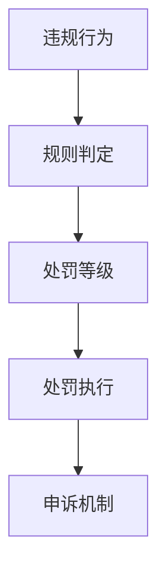

# 电商平台规则体系

> 远哥说：平台规则是电商平台健康发展的基础，通过建立完善的规则体系，保障平台的有序运营。

## 一、规则框架

### 1.1 规则体系
```
规则架构：
1. 基础规则
   - 平台准入规则
   - 商品管理规则
   - 交易管理规则
   - 服务管理规则

2. 运营规则
   - 店铺运营规则
   - 商品运营规则
   - 活动运营规则
   - 营销推广规则

3. 保障规则
   - 质量保障规则
   - 物流保障规则
   - 售后保障规则
   - 支付保障规则
```

### 1.2 规则分级
| 级别 | 规则类型 | 处罚力度 | 适用范围 |
|------|----------|----------|----------|
| 一级 | 红线规则 | 永久封禁 | 全平台 |
| 二级 | 重要规则 | 临时封禁 | 相关类目 |
| 三级 | 一般规则 | 扣分处罚 | 具体场景 |
| 四级 | 引导规则 | 规则提醒 | 日常运营 |

## 二、处罚机制

### 2.1 处罚体系


### 2.2 处罚方式
```
处罚矩阵：
1. 账户处罚
   - 账户警告
   - 功能限制
   - 临时冻结
   - 永久封禁

2. 商品处罚
   - 下架商品
   - 删除商品
   - 屏蔽展示
   - 限制上新

3. 店铺处罚
   - 店铺降级
   - 流量限制
   - 展示限制
   - 关店整改
```

## 三、信用体系

### 3.1 信用模型
```
信用维度：
1. 基础维度
   - 主体资质
   - 经营时长
   - 违规记录
   - 投诉记录

2. 运营维度
   - 商品质量
   - 服务水平
   - 物流表现
   - 售后处理

3. 交易维度
   - 成交规模
   - 退款率
   - 评价分
   - 复购率
```

### 3.2 信用应用
| 场景 | 应用方式 | 权益内容 | 效果预期 |
|------|----------|----------|----------|
| 流量分配 | 信用加权 | 流量倾斜 | 优质激励 |
| 活动准入 | 信用门槛 | 活动资格 | 质量保障 |
| 功能开放 | 信用等级 | 特权功能 | 分级管理 |
| 保证金 | 信用免保 | 保证金减免 | 成本优化 |

## 四、争议处理

### 4.1 处理流程
```
处理机制：
1. 投诉受理
   - 投诉登记
   - 材料收集
   - 初步审核
   - 分级分类

2. 调查核实
   - 证据收集
   - 双方沟通
   - 实地核查
   - 专业鉴定

3. 处理决定
   - 争议协调
   - 赔付处理
   - 处罚执行
   - 结果通知
```

### 4.2 处理方案
| 争议类型 | 处理方式 | 解决方案 | 时效要求 |
|----------|----------|----------|----------|
| 质量争议 | 专业鉴定 | 赔付退款 | 7天内 |
| 服务争议 | 协商调解 | 补偿和解 | 3天内 |
| 物流争议 | 证据核实 | 赔付处理 | 5天内 |
| 价格争议 | 政策说明 | 解释处理 | 1天内 |

## 五、规则优化

### 5.1 优化机制
```
优化体系：
1. 数据监控
   - 规则覆盖率
   - 规则触发率
   - 处罚成功率
   - 申诉通过率

2. 效果评估
   - 规则遵守度
   - 违规下降率
   - 投诉解决率
   - 商家满意度

3. 规则迭代
   - 规则审视
   - 漏洞修补
   - 规则更新
   - 版本迭代
```

### 5.2 优化策略
| 环节 | 问题 | 解决方案 | 效果预期 |
|------|------|----------|----------|
| 规则设计 | 覆盖不全 | 完善规则 | 提升覆盖 |
| 执行效果 | 执行不力 | 优化流程 | 提高效率 |
| 处罚力度 | 威慑不够 | 调整力度 | 加强威慑 |
| 申诉机制 | 处理不公 | 优化机制 | 提升公平 |
