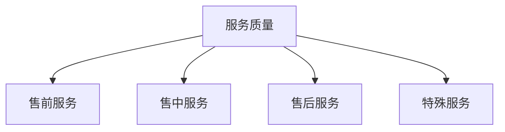

# 电商平台质量管理

> 远哥说：质量管理是电商平台提升用户体验的关键，通过建立完善的质量管理体系，保障商品质量和服务水平。

## 一、商品质量管理

### 1.1 质量体系
```
管理框架：
1. 准入管理
   - 资质审核
   - 品牌认证
   - 商品资质
   - 质量标准

2. 过程管理
   - 上架审核
   - 质量抽检
   - 投诉处理
   - 定期复查

3. 评价管理
   - 用户评价
   - 专业评测
   - 第三方检测
   - 质量报告

4. 处罚管理
   - 违规处理
   - 质量整改
   - 赔付处理
   - 商家退出
```

### 1.2 管理策略
| 环节 | 重点 | 措施 | 效果 |
|------|------|------|------|
| 准入 | 资质审核 | 严格把关 | 源头控制 |
| 过程 | 质量监控 | 动态监管 | 过程管理 |
| 评价 | 用户反馈 | 及时处理 | 持续改进 |
| 处罚 | 违规处理 | 严格执行 | 警示教育 |

## 二、服务质量管理

### 2.1 服务标准


### 2.2 管理体系
```
服务体系：
1. 基础服务
   - 在线客服
   - 商品咨询
   - 订单处理
   - 投诉处理

2. 特色服务
   - 预约服务
   - 定制服务
   - VIP服务
   - 增值服务

3. 售后服务
   - 退换货
   - 维修保养
   - 安装调试
   - 技术支持

4. 应急服务
   - 紧急处理
   - 特殊情况
   - 突发事件
   - 危机处理
```

## 三、物流质量管理

### 3.1 物流体系
```
管理维度：
1. 仓储管理
   - 入库质检
   - 存储条件
   - 库存管理
   - 出库检查

2. 配送管理
   - 配送时效
   - 配送质量
   - 配送安全
   - 配送服务

3. 包装管理
   - 包装规范
   - 包装质量
   - 防护要求
   - 环保要求

4. 售后物流
   - 退货物流
   - 换货物流
   - 维修物流
   - 特殊物流
```

### 3.2 质量标准
| 环节 | 标准 | 措施 | 效果 |
|------|------|------|------|
| 仓储 | 存储标准 | 规范管理 | 保障质量 |
| 配送 | 时效标准 | 监控跟踪 | 提升效率 |
| 包装 | 包装标准 | 质量检查 | 降低损坏 |
| 售后 | 服务标准 | 快速响应 | 提升体验 |

## 四、售后质量管理

### 4.1 售后体系
```
售后框架：
1. 服务类型
   - 退货服务
   - 换货服务
   - 维修服务
   - 补偿服务

2. 服务标准
   - 响应时效
   - 处理时效
   - 服务态度
   - 解决质量

3. 服务流程
   - 需求受理
   - 问题处理
   - 结果反馈
   - 满意度评价

4. 服务监控
   - 时效监控
   - 质量监控
   - 满意度监控
   - 问题跟踪
```

### 4.2 管理策略
| 环节 | 问题 | 解决方案 | 效果预期 |
|------|------|----------|----------|
| 响应 | 响应慢 | 快速响应 | 提升效率 |
| 处理 | 处理难 | 标准化处理 | 提高质量 |
| 反馈 | 反馈差 | 及时沟通 | 提升满意 |
| 评价 | 评价低 | 持续改进 | 提高评分 |

## 五、质量工具

### 5.1 工具体系
```
工具矩阵：
1. 监控工具
   - 质量监控
   - 服务监控
   - 物流监控
   - 售后监控

2. 分析工具
   - 质量分析
   - 问题分析
   - 原因分析
   - 效果分析

3. 改进工具
   - PDCA循环
   - 6Sigma
   - 精益管理
   - 持续改进

4. 评估工具
   - 质量评估
   - 服务评估
   - 满意度评估
   - 效果评估
```

### 5.2 应用场景
| 场景 | 工具 | 用途 | 优势 |
|------|------|------|------|
| 监控 | 监控系统 | 质量监控 | 实时监控 |
| 分析 | 分析工具 | 问题分析 | 准确分析 |
| 改进 | 改进方法 | 持续改进 | 系统改进 |
| 评估 | 评估体系 | 效果评估 | 全面评估 |
