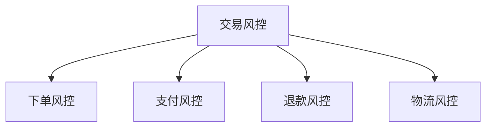

# 电商平台风控体系

> 远哥说：风控体系是电商平台安全运营的基础，通过建立完善的风控机制，保障平台的交易安全和用户权益。

## 一、反作弊系统

### 1.1 作弊类型
```
作弊行为：
1. 流量作弊
   - 刷单炒信
   - 虚假流量
   - 恶意点击
   - 虚假转化

2. 营销作弊
   - 虚假优惠
   - 虚假秒杀
   - 恶意囤货
   - 价格欺诈

3. 账号作弊
   - 批量注册
   - 账号盗用
   - 恶意注册
   - 身份冒用

4. 支付作弊
   - 信用卡套现
   - 虚假退款
   - 恶意退单
   - 支付欺诈
```

### 1.2 防控策略
| 环节 | 风险点 | 防控措施 | 效果 |
|------|--------|----------|------|
| 预防 | 批量注册 | 实名认证 | 降低风险 |
| 监控 | 异常行为 | 实时监控 | 及时发现 |
| 处置 | 违规账号 | 限制处罚 | 快速处理 |
| 优化 | 规则漏洞 | 持续优化 | 提升效果 |

## 二、交易风控

### 2.1 风控框架


### 2.2 风控策略
```
策略体系：
1. 规则引擎
   - 基础规则
   - 业务规则
   - 场景规则
   - 黑白名单

2. 风险评分
   - 用户评分
   - 商家评分
   - 商品评分
   - 交易评分

3. 实时监控
   - 行为监控
   - 交易监控
   - 资金监控
   - 物流监控

4. 智能决策
   - 风险预警
   - 风险处置
   - 风险追踪
   - 效果评估
```

## 三、账号安全

### 3.1 安全体系
```
安全框架：
1. 身份认证
   - 实名认证
   - 人脸识别
   - 手机验证
   - 邮箱验证

2. 登录安全
   - 密码强度
   - 异地登录
   - 设备绑定
   - 二次验证

3. 操作安全
   - 支付验证
   - 修改验证
   - 敏感操作
   - 行为验证

4. 隐私保护
   - 数据加密
   - 信息脱敏
   - 访问控制
   - 授权管理
```

### 3.2 防护策略
| 环节 | 风险 | 措施 | 效果 |
|------|------|------|------|
| 注册 | 身份冒用 | 多重验证 | 降低风险 |
| 登录 | 账号盗用 | 异常检测 | 提升安全 |
| 支付 | 资金风险 | 支付验证 | 保障交易 |
| 信息 | 隐私泄露 | 数据加密 | 保护隐私 |

## 四、内容安全

### 4.1 内容管理
```
管理体系：
1. 商品内容
   - 商品信息
   - 商品图片
   - 商品描述
   - 商品评价

2. 营销内容
   - 活动信息
   - 广告内容
   - 推广内容
   - 直播内容

3. 社区内容
   - 用户评论
   - 问答内容
   - 社区帖子
   - 互动内容

4. 其他内容
   - 店铺信息
   - 客服对话
   - 系统消息
   - 通知公告
```

### 4.2 审核策略
| 内容类型 | 风险点 | 审核方式 | 处理方式 |
|----------|--------|----------|----------|
| 商品内容 | 违规信息 | 机审+人审 | 下架处理 |
| 营销内容 | 虚假宣传 | 预审+巡查 | 限制发布 |
| 用户内容 | 违规评论 | 实时监控 | 删除屏蔽 |
| 直播内容 | 违规直播 | 实时审核 | 断流处理 |

## 五、风控工具

### 5.1 工具体系
```
工具矩阵：
1. 规则引擎
   - 规则配置
   - 规则执行
   - 规则优化
   - 效果分析

2. 监控系统
   - 实时监控
   - 异常检测
   - 预警提醒
   - 处置跟踪

3. 分析工具
   - 风险分析
   - 行为分析
   - 关联分析
   - 效果分析

4. 智能工具
   - 机器学习
   - 深度学习
   - 图像识别
   - 文本分析
```

### 5.2 应用场景
| 场景 | 工具 | 用途 | 优势 |
|------|------|------|------|
| 规则配置 | 规则引擎 | 风控规则 | 灵活高效 |
| 实时监控 | 监控系统 | 风险监控 | 及时预警 |
| 风险分析 | 分析工具 | 风险评估 | 准确全面 |
| 智能识别 | AI工具 | 智能识别 | 自动高效 |
