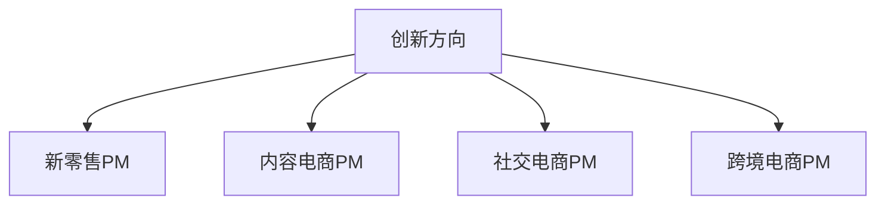

# 电商产品经理岗位选择指南

> 远哥说：电商产品经理岗位类型丰富，选择合适的发展方向对职业发展至关重要。

## 一、岗位类型分析

### 1.1 业务方向
```
岗位职责：
1. 商品运营PM
   - 商品体系搭建
   - 类目规划管理
   - 商品运营策略
   - 供应链优化

2. 用户运营PM
   - 用户增长策略
   - 用户体验优化
   - 会员体系设计
   - 用户运营方案

3. 活动运营PM
   - 活动策划设计
   - 营销方案制定
   - 活动效果分析
   - 转化率优化

4. 平台运营PM
   - 平台规则设计
   - 商家服务体系
   - 平台生态建设
   - 运营策略制定
```

### 1.2 技术方向
```
系统职责：
1. 交易系统PM
   - 交易链路设计
   - 支付体系优化
   - 订单系统管理
   - 结算系统规划

2. 商品系统PM
   - 商品中台建设
   - SPU/SKU管理
   - 类目属性体系
   - 商品数据治理

3. 会员系统PM
   - 会员体系设计
   - 权益系统建设
   - 积分体系管理
   - 用户画像系统

4. 营销系统PM
   - 营销引擎设计
   - 优惠券系统
   - 促销规则引擎
   - 活动平台建设
```

## 二、创新方向

### 2.1 新兴岗位


### 2.2 岗位特点
| 岗位 | 核心工作 | 能力要求 | 发展前景 |
|------|----------|----------|----------|
| 新零售PM | 线上线下融合 | 零售经验 | 发展快 |
| 内容电商PM | 内容运营 | 内容能力 | 潜力大 |
| 社交电商PM | 社交转化 | 用户增长 | 机会多 |
| 跨境电商PM | 全球化运营 | 国际视野 | 前景好 |

## 三、专业方向

### 3.1 专业岗位
```
岗位分类：
1. 数据分析PM
   - 数据产品设计
   - 分析平台建设
   - 数据应用设计
   - 决策支持系统

2. 用户体验PM
   - 用户研究
   - 交互设计
   - 体验优化
   - 用户反馈

3. 算法产品PM
   - 推荐系统
   - 搜索系统
   - 广告系统
   - 风控系统

4. 风控产品PM
   - 风险识别
   - 规则引擎
   - 安全防护
   - 监控预警
```

### 3.2 能力要求
| 方向 | 专业技能 | 工具要求 | 经验要求 |
|------|----------|----------|----------|
| 数据 | 数据分析 | 分析工具 | 数据经验 |
| 体验 | 用户研究 | 设计工具 | 设计经验 |
| 算法 | 算法理解 | 技术基础 | 算法经验 |
| 风控 | 风险分析 | 规则引擎 | 安全经验 |

## 四、选择建议

### 4.1 选择维度
```
考虑因素：
1. 个人特点
   - 专业背景
   - 兴趣爱好
   - 性格特征
   - 发展意愿

2. 岗位特点
   - 工作内容
   - 能力要求
   - 发展空间
   - 薪资待遇

3. 公司特点
   - 公司规模
   - 行业地位
   - 发展阶段
   - 企业文化

4. 市场机会
   - 市场需求
   - 竞争情况
   - 发展趋势
   - 薪资水平
```

### 4.2 建议策略
| 阶段 | 重点 | 策略 | 建议 |
|------|------|------|------|
| 入门 | 基础积累 | 大平台 | 打基础 |
| 成长 | 能力提升 | 重实践 | 抓机会 |
| 进阶 | 专业深化 | 找方向 | 突破点 |
| 转型 | 领域突破 | 跨界创新 | 把握机遇 |

## 五、发展趋势

### 5.1 趋势分析
```
发展方向：
1. 技术驱动
   - AI应用
   - 数据智能
   - 算法创新
   - 技术融合

2. 业务创新
   - 模式创新
   - 场景融合
   - 服务升级
   - 体验优化

3. 能力要求
   - 复合型人才
   - 专业深度
   - 创新思维
   - 国际视野

4. 机会挑战
   - 竞争加剧
   - 要求提高
   - 机会增多
   - 价值提升
```

### 5.2 机会分析
| 方向 | 机会 | 挑战 | 建议 |
|------|------|------|------|
| 技术 | 创新多 | 门槛高 | 持续学习 |
| 业务 | 空间大 | 竞争强 | 找差异 |
| 能力 | 价值高 | 要求高 | 重积累 |
| 创新 | 机会多 | 风险大 | 稳中求进 |
