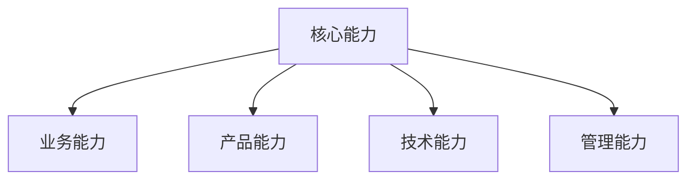

# 电商产品经理求职指南

> 远哥说：电商产品经理是一个充满挑战和机遇的岗位，需要全面的知识储备和实践经验。本指南将帮助你更好地规划职业发展。

## 一、岗位选择

### 1.1 岗位类型
```
岗位分类：
1. 业务方向
   - 商品运营PM
   - 用户运营PM
   - 活动运营PM
   - 平台运营PM

2. 技术方向
   - 交易系统PM
   - 商品系统PM
   - 会员系统PM
   - 营销系统PM

3. 创新方向
   - 新零售PM
   - 内容电商PM
   - 社交电商PM
   - 跨境电商PM

4. 专业方向
   - 数据分析PM
   - 用户体验PM
   - 算法产品PM
   - 风控产品PM
```

### 1.2 选择建议
| 方向 | 特点 | 要求 | 发展空间 |
|------|------|------|----------|
| 业务 | 重运营 | 商业思维 | 上升快 |
| 技术 | 重系统 | 技术背景 | 发展稳 |
| 创新 | 重创新 | 创新能力 | 机会多 |
| 专业 | 重专业 | 专业技能 | 竞争小 |

## 二、能力要求

### 2.1 核心能力


### 2.2 能力模型
```
能力要求：
1. 业务能力
   - 电商认知
   - 商业分析
   - 运营思维
   - 数据分析

2. 产品能力
   - 需求分析
   - 产品设计
   - 用户研究
   - 项目管理

3. 技术能力
   - 技术认知
   - 系统设计
   - 数据处理
   - 工具应用

4. 管理能力
   - 团队协作
   - 沟通能力
   - 执行力
   - 领导力
```

## 三、面试重点

### 3.1 面试环节
```
面试流程：
1. 简历筛选
   - 经历匹配
   - 能力匹配
   - 背景匹配
   - 期望匹配

2. 初试环节
   - 自我介绍
   - 经历介绍
   - 案例分析
   - 基础考察

3. 复试环节
   - 专业能力
   - 项目深度
   - 思维方式
   - 价值观

4. 终试环节
   - 综合能力
   - 发展潜力
   - 团队契合
   - 价值匹配
```

### 3.2 重点准备
| 环节 | 重点 | 准备方向 | 注意事项 |
|------|------|----------|----------|
| 简历 | 经历突出 | 项目梳理 | 逻辑清晰 |
| 初试 | 基础能力 | 知识储备 | 表达清楚 |
| 复试 | 专业深度 | 案例分析 | 思路完整 |
| 终试 | 综合素质 | 职业规划 | 诚恳真实 |

## 四、简历亮点

### 4.1 简历框架
```
简历要点：
1. 基本信息
   - 个人信息
   - 教育背景
   - 技能特长
   - 个人特点

2. 工作经历
   - 公司介绍
   - 岗位职责
   - 项目经验
   - 业绩突破

3. 项目经验
   - 项目背景
   - 个人角色
   - 主要工作
   - 项目成果

4. 个人优势
   - 专业能力
   - 经验积累
   - 成果展示
   - 发展潜力
```

### 4.2 亮点展示
| 维度 | 重点 | 展示方式 | 效果 |
|------|------|----------|------|
| 经历 | 核心项目 | 数据说明 | 突出价值 |
| 能力 | 专业技能 | 案例展示 | 证明实力 |
| 成果 | 业绩贡献 | 量化描述 | 体现能力 |
| 潜力 | 学习成长 | 经历证明 | 显示潜力 |

## 五、发展规划

### 5.1 职业路径
```
发展方向：
1. 管理路线
   - 产品经理
   - 高级产品经理
   - 产品总监
   - 产品VP

2. 专业路线
   - 专业产品经理
   - 产品专家
   - 产品架构师
   - 首席产品官

3. 创业路线
   - 创业合伙人
   - 创业顾问
   - 创业投资
   - 独立创业

4. 转型路线
   - 产品运营
   - 战略咨询
   - 投资分析
   - 创新创业
```

### 5.2 发展建议
| 阶段 | 目标 | 行动 | 建议 |
|------|------|------|------|
| 入门 | 基础积累 | 实践学习 | 多实践 |
| 成长 | 专业提升 | 项目历练 | 抓机会 |
| 进阶 | 领域专精 | 深度研究 | 找方向 |
| 突破 | 创新发展 | 开拓视野 | 勇创新 |
