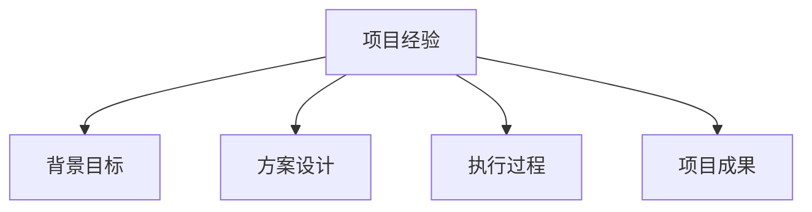

# 电商产品经理简历指南

> 远哥说：简历是求职的敲门砖，一份优秀的简历能够充分展示个人价值，提高面试机会。

## 一、简历框架

### 1.1 基本结构
```
简历框架：
1. 基本信息
   - 个人信息
   - 联系方式
   - 教育背景
   - 技能特长

2. 工作经历
   - 公司介绍
   - 岗位职责
   - 工作内容
   - 工作业绩

3. 项目经验
   - 项目背景
   - 项目职责
   - 解决方案
   - 项目成果

4. 个人评价
   - 能力总结
   - 性格特点
   - 职业规划
   - 求职意向
```

### 1.2 内容要求
| 模块 | 重点 | 要求 | 禁忌 |
|------|------|------|------|
| 信息 | 完整准确 | 清晰简洁 | 信息过多 |
| 经历 | 经验相关 | 重点突出 | 流水账 |
| 项目 | 个人价值 | 数据支撑 | 虚假夸大 |
| 评价 | 特色亮点 | 真实客观 | 空洞说辞 |

## 二、项目经验

### 2.1 项目描述


### 2.2 描述框架
```
描述要点：
1. 项目背景
   - 业务背景
   - 项目目标
   - 问题挑战
   - 个人角色

2. 解决方案
   - 方案设计
   - 创新点
   - 实施步骤
   - 资源投入

3. 执行过程
   - 任务分工
   - 团队协作
   - 风险管控
   - 问题解决

4. 项目成果
   - 业务指标
   - 技术突破
   - 经验总结
   - 个人成长
```

## 三、亮点展示

### 3.1 能力亮点
```
能力维度：
1. 业务能力
   - 业务理解
   - 数据分析
   - 战略规划
   - 商业创新

2. 产品能力
   - 需求分析
   - 产品设计
   - 用户研究
   - 项目管理

3. 技术能力
   - 技术认知
   - 架构理解
   - 工具应用
   - 创新应用

4. 管理能力
   - 团队协作
   - 资源协调
   - 项目推进
   - 问题解决
```

### 3.2 成果展示
| 维度 | 展示重点 | 方法 | 效果 |
|------|----------|------|------|
| 业务 | 业绩提升 | 数据对比 | 价值体现 |
| 产品 | 用户价值 | 指标改善 | 效果明显 |
| 技术 | 技术创新 | 突破点 | 影响显著 |
| 管理 | 团队贡献 | 案例说明 | 认可度高 |

## 四、写作技巧

### 4.1 表达技巧
```
技巧要点：
1. 语言表达
   - 清晰准确
   - 简洁专业
   - 重点突出
   - 逻辑性强

2. 数据支撑
   - 具体数字
   - 对比数据
   - 增长指标
   - 业绩证明

3. 案例展示
   - 典型案例
   - 创新案例
   - 难点突破
   - 价值创造

4. 排版设计
   - 结构清晰
   - 层次分明
   - 重点醒目
   - 美观大方
```

### 4.2 注意事项
| 环节 | 重点 | 建议 | 避免 |
|------|------|------|------|
| 内容 | 真实准确 | 数据支撑 | 虚假夸大 |
| 结构 | 逻辑清晰 | 重点突出 | 杂乱无章 |
| 表达 | 专业简洁 | 直击重点 | 啰嗦冗长 |
| 排版 | 美观规范 | 突出重点 | 花哨杂乱 |

## 五、优化建议

### 5.1 优化方向
```
优化重点：
1. 内容优化
   - 针对性强化
   - 重点突出
   - 数据完善
   - 案例充实

2. 结构优化
   - 框架清晰
   - 层次分明
   - 重点突出
   - 逻辑顺畅

3. 表达优化
   - 语言精炼
   - 专业准确
   - 数据支撑
   - 案例生动

4. 视觉优化
   - 版式规范
   - 字体统一
   - 排版美观
   - 重点醒目
```

### 5.2 改进建议
| 方向 | 问题 | 改进方法 | 效果 |
|------|------|----------|------|
| 内容 | 针对性弱 | 岗位匹配 | 匹配度高 |
| 结构 | 重点不明 | 层次优化 | 重点突出 |
| 表达 | 数据不足 | 数据补充 | 说服力强 |
| 视觉 | 排版混乱 | 规范统一 | 专业美观 |
