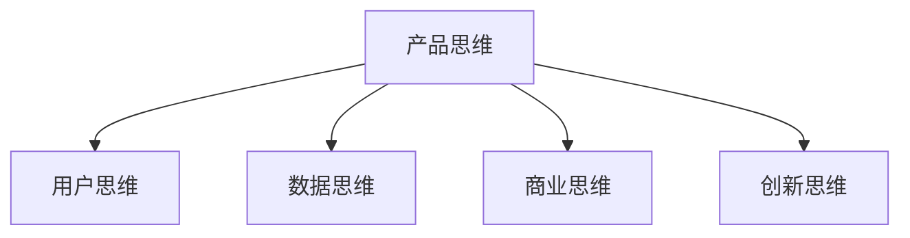

# 电商产品经理能力要求

> 远哥说：电商产品经理需要具备全面的能力体系，包括业务能力、产品能力、技术能力和管理能力。

## 一、业务能力

### 1.1 电商认知
```
业务理解：
1. 行业认知
   - 行业发展
   - 商业模式
   - 竞争格局
   - 发展趋势

2. 业务理解
   - 业务流程
   - 业务规则
   - 业务指标
   - 业务痛点

3. 用户洞察
   - 用户需求
   - 用户行为
   - 用户心理
   - 用户价值

4. 市场分析
   - 市场规模
   - 市场格局
   - 市场机会
   - 市场趋势
```

### 1.2 商业分析
| 维度 | 重点 | 方法 | 工具 |
|------|------|------|------|
| 战略 | 战略分析 | SWOT | 战略地图 |
| 竞争 | 竞品分析 | 对标分析 | 竞品矩阵 |
| 运营 | 运营分析 | ROI分析 | 运营看板 |
| 财务 | 财务分析 | 财务模型 | 财务报表 |

## 二、产品能力

### 2.1 产品思维


### 2.2 专业能力
```
核心能力：
1. 需求管理
   - 需求收集
   - 需求分析
   - 需求评估
   - 需求排期

2. 产品设计
   - 功能设计
   - 交互设计
   - 体验设计
   - 视觉设计

3. 项目管理
   - 项目规划
   - 资源协调
   - 进度管理
   - 风险控制

4. 数据分析
   - 数据采集
   - 数据处理
   - 数据分析
   - 数据应用
```

## 三、技术能力

### 3.1 技术认知
```
技术体系：
1. 基础技术
   - 开发语言
   - 数据库
   - 网络协议
   - 系统架构

2. 专业技术
   - 电商系统
   - 支付系统
   - 物流系统
   - 营销系统

3. 新兴技术
   - 人工智能
   - 大数据
   - 云计算
   - 区块链

4. 工具应用
   - 原型工具
   - 分析工具
   - 管理工具
   - 协作工具
```

### 3.2 技能要求
| 领域 | 核心技能 | 工具 | 应用 |
|------|----------|------|------|
| 开发 | 开发流程 | IDE | 需求对接 |
| 数据 | 数据分析 | SQL | 数据处理 |
| 架构 | 架构设计 | 架构图 | 系统设计 |
| 运维 | 部署运维 | 监控工具 | 问题处理 |

## 四、管理能力

### 4.1 团队管理
```
管理维度：
1. 团队协作
   - 跨部门协作
   - 资源协调
   - 冲突处理
   - 团队建设

2. 项目管理
   - 项目规划
   - 进度管理
   - 质量管理
   - 风险管理

3. 沟通管理
   - 向上沟通
   - 平级沟通
   - 向下沟通
   - 外部沟通

4. 人员管理
   - 任务分配
   - 能力培养
   - 绩效管理
   - 团队激励
```

### 4.2 管理策略
| 维度 | 重点 | 方法 | 效果 |
|------|------|------|------|
| 协作 | 目标一致 | 定期沟通 | 高效协作 |
| 项目 | 进度控制 | 敏捷管理 | 按期交付 |
| 沟通 | 有效沟通 | 沟通技巧 | 达成共识 |
| 人员 | 能力提升 | 培训指导 | 团队成长 |

## 五、能力提升

### 5.1 学习路径
```
提升方向：
1. 理论学习
   - 专业书籍
   - 行业报告
   - 案例分析
   - 课程培训

2. 实践积累
   - 项目实践
   - 问题解决
   - 经验总结
   - 方法创新

3. 交流分享
   - 行业交流
   - 同行研讨
   - 经验分享
   - 知识输出

4. 创新突破
   - 创新思考
   - 方法创新
   - 工具创新
   - 模式创新
```

### 5.2 提升建议
| 阶段 | 重点 | 方法 | 建议 |
|------|------|------|------|
| 入门 | 基础知识 | 系统学习 | 重实践 |
| 进阶 | 专业深化 | 项目历练 | 抓重点 |
| 资深 | 体系构建 | 方法创新 | 求突破 |
| 专家 | 行业影响 | 价值创造 | 树品牌 |
