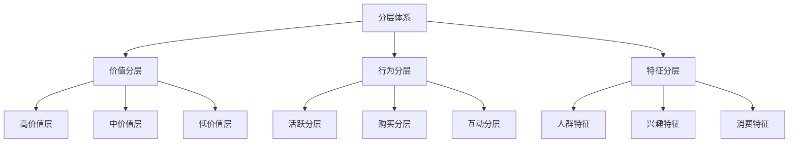
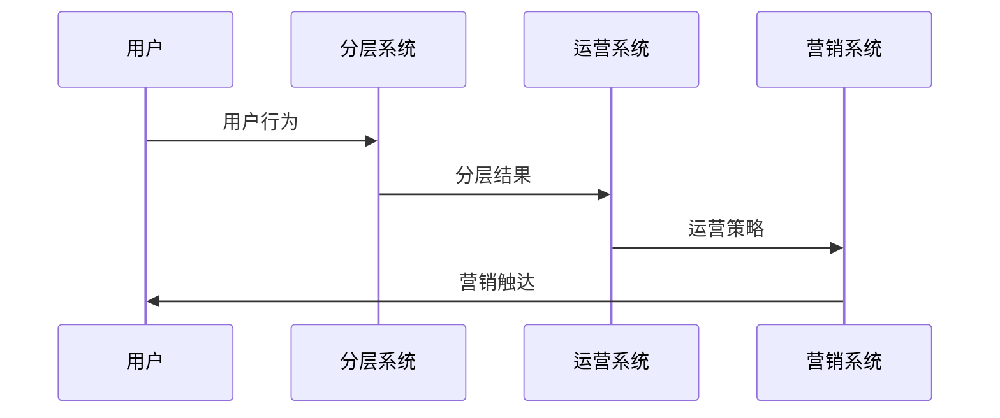
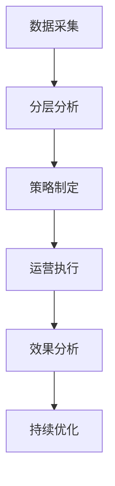
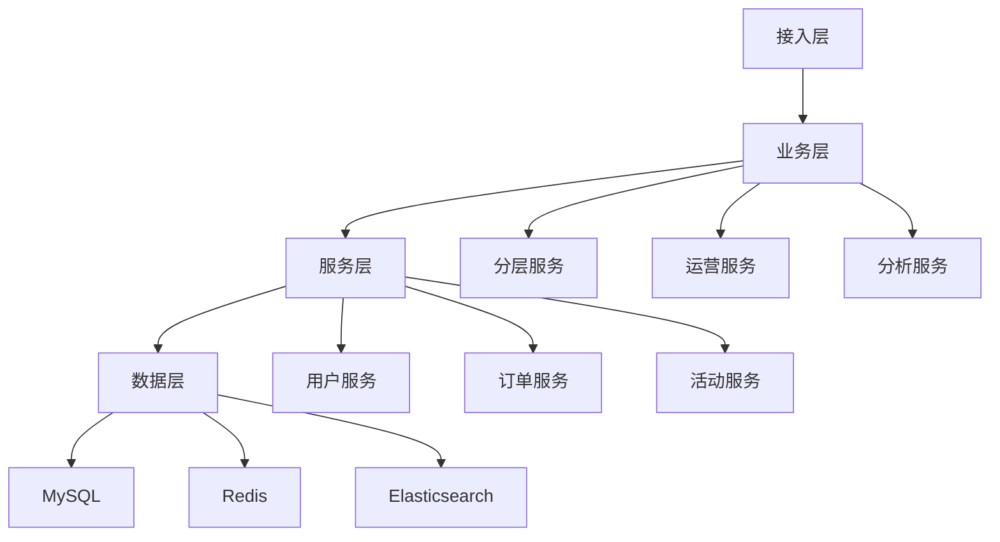

# 电商用户分层运营设计

> 远哥说：用户分层运营是电商平台精细化运营的基础，通过对用户进行科学分层，实现精准营销和服务，提升运营效率和效果。这里我结合多个电商平台的实践经验，分享用户分层运营的设计方法。

## 一、产品定义

### 1.1 业务价值
```
核心价值：
1. 用户价值
   - 个性化：个性化服务
   - 体验好：优质体验
   - 权益多：丰富权益

2. 平台价值
   - 效率高：运营效率
   - 转化好：转化效果
   - 成本低：运营成本

3. 商家价值
   - 精准化：精准营销
   - 效果好：营销效果
   - 收益高：投资回报
```

### 1.2 设计原则
| 原则 | 说明 | 正确示范 | 错误示范 |
|------|------|----------|----------|
| 科学性 | 分层科学 | 数据驱动 | 主观判断 |
| 动态性 | 分层动态 | 实时调整 | 固定不变 |
| 价值性 | 分层价值 | 价值导向 | 规模导向 |
| 可用性 | 分层可用 | 易于应用 | 复杂难用 |

## 二、系统设计

### 2.1 分层架构


### 2.2 分层流程


## 三、功能设计

### 3.1 核心功能
```
功能模块：
1. 分层管理
   - 规则管理：分层规则管理
   - 标签管理：用户标签管理
   - 模型管理：分层模型管理
   - 效果管理：分层效果管理

2. 运营管理
   - 策略管理：运营策略管理
   - 活动管理：营销活动管理
   - 权益管理：权益分配管理
   - 效果管理：运营效果管理

3. 分析管理
   - 数据分析：分层数据分析
   - 效果分析：运营效果分析
   - 价值分析：用户价值分析
   - 优化分析：优化建议分析

4. 工具支持
   - 分层工具：分层支持工具
   - 运营工具：运营支持工具
   - 分析工具：分析支持工具
   - 优化工具：优化支持工具
```

### 3.2 场景示例
| 场景 | 需求 | 解决方案 | 效果 |
|------|------|----------|------|
| 价值分层 | 价值识别 | RFM模型 | 准确率高 |
| 行为分层 | 行为分析 | 行为模型 | 效果好 |
| 特征分层 | 特征识别 | 特征模型 | 精准度高 |
| 运营策略 | 策略执行 | 智能策略 | 效率高 |

## 四、交互设计

### 4.1 运营流程


### 4.2 页面设计
```
页面布局：
1. 分层中心
   - 分层概况
   - 分层详情
   - 分层工具
   - 分层分析

2. 运营中心
   - 运营概况
   - 运营管理
   - 运营工具
   - 运营分析

3. 分析中心
   - 分析概况
   - 分析详情
   - 分析工具
   - 分析报告

4. 工具中心
   - 分层工具
   - 运营工具
   - 分析工具
   - 优化工具
```

## 五、数据分析

### 5.1 核心指标
| 维度 | 指标 | 目标 | 分析 |
|------|------|------|------|
| 规模 | 分层规模 | 提升规模 | 规模分析 |
| 效率 | 运营效率 | 提升效率 | 效率分析 |
| 效果 | 运营效果 | 提升效果 | 效果分析 |
| 价值 | 用户价值 | 提升价值 | 价值分析 |

### 5.2 效果分析
```
分析维度：
1. 规模分析
   - 用户规模
   - 分层规模
   - 活动规模
   - 转化规模

2. 效果分析
   - 分层效果
   - 运营效果
   - 活动效果
   - 转化效果

3. 价值分析
   - 用户价值
   - 活动价值
   - 平台价值
   - 生态价值
```

## 六、技术架构

### 6.1 系统架构


### 6.2 技术选型
| 技术 | 应用 | 方案 | 说明 |
|------|------|------|------|
| 存储 | 数据存储 | MySQL集群 | 主从架构 |
| 缓存 | 数据缓存 | Redis集群 | 高性能 |
| 计算 | 实时计算 | Spark | 实时分析 |
| 分析 | 离线分析 | Hadoop | 离线分析 |

## 七、案例分析

### 7.1 案例一：淘宝用户分层
```
案例要点：
1. 业务特点
   - 规模大
   - 维度多
   - 价值高

2. 解决方案
   - 数据驱动
   - 模型智能
   - 策略精准

3. 实施效果
   - 效率高
   - 效果好
   - 价值大
```

### 7.2 案例二：京东用户分层
| 特点 | 挑战 | 方案 | 效果 |
|------|------|------|------|
| 科学性 | 分层科学 | 数据驱动 | 准确性高 |
| 效率性 | 运营效率 | 智能工具 | 效率性好 |
| 价值性 | 价值提升 | 价值运营 | 价值性强 |
| 可持续 | 持续优化 | 长期机制 | 可持续性好 |