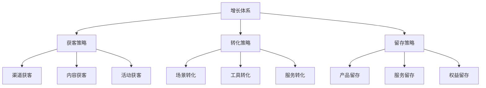
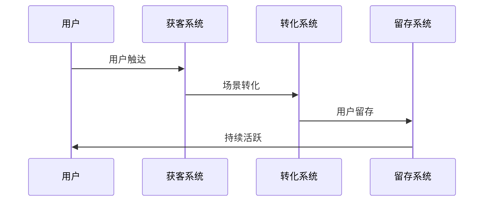
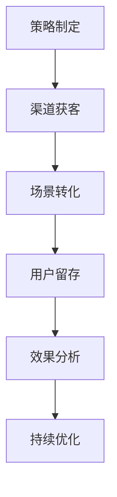
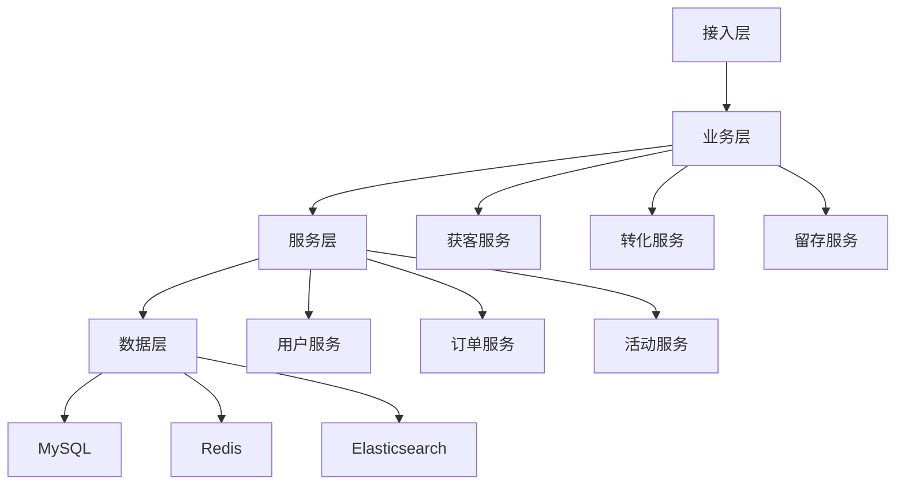

# 电商用户增长策略设计

> 远哥说：用户增长是电商平台发展的核心驱动力，通过科学的增长策略和方法，实现用户规模的持续增长。这里我结合多个电商平台的实践经验，分享用户增长策略的设计方法。

## 一、产品定义

### 1.1 业务价值
```
核心价值：
1. 用户价值
   - 获客成本：降低成本
   - 获客质量：提升质量
   - 获客效率：提升效率

2. 平台价值
   - 规模增长：规模扩大
   - 效率提升：效率提高
   - 价值提升：价值增长

3. 商家价值
   - 流量增加：流量提升
   - 转化提升：转化增长
   - 收益提高：收益增加
```

### 1.2 设计原则
| 原则 | 说明 | 正确示范 | 错误示范 |
|------|------|----------|----------|
| 科学性 | 增长科学 | 数据驱动 | 主观判断 |
| 持续性 | 增长持续 | 长期增长 | 短期冲量 |
| 价值性 | 增长价值 | 价值导向 | 规模导向 |
| 可复制 | 增长复制 | 可复制性 | 一次性增长 |

## 二、系统设计

### 2.1 增长架构


### 2.2 增长流程


## 三、功能设计

### 3.1 核心功能
```
功能模块：
1. 获客管理
   - 渠道管理：渠道获客管理
   - 内容管理：内容获客管理
   - 活动管理：活动获客管理
   - 效果管理：获客效果管理

2. 转化管理
   - 场景管理：场景转化管理
   - 工具管理：工具转化管理
   - 服务管理：服务转化管理
   - 效果管理：转化效果管理

3. 留存管理
   - 产品管理：产品留存管理
   - 服务管理：服务留存管理
   - 权益管理：权益留存管理
   - 效果管理：留存效果管理

4. 工具支持
   - 获客工具：获客支持工具
   - 转化工具：转化支持工具
   - 留存工具：留存支持工具
   - 分析工具：分析支持工具
```

### 3.2 场景示例
| 场景 | 需求 | 解决方案 | 效果 |
|------|------|----------|------|
| 渠道获客 | 获客增长 | 多渠道获客 | 规模大 |
| 场景转化 | 转化提升 | 场景优化 | 效果好 |
| 产品留存 | 留存提升 | 产品优化 | 留存高 |
| 效果分析 | 效果评估 | 数据分析 | 准确性强 |

## 四、交互设计

### 4.1 增长流程


### 4.2 页面设计
```
页面布局：
1. 获客中心
   - 获客概况
   - 获客管理
   - 获客工具
   - 获客分析

2. 转化中心
   - 转化概况
   - 转化管理
   - 转化工具
   - 转化分析

3. 留存中心
   - 留存概况
   - 留存管理
   - 留存工具
   - 留存分析

4. 工具中心
   - 获客工具
   - 转化工具
   - 留存工具
   - 分析工具
```

## 五、数据分析

### 5.1 核心指标
| 维度 | 指标 | 目标 | 分析 |
|------|------|------|------|
| 规模 | 用户规模 | 提升规模 | 规模分析 |
| 效率 | 获客效率 | 提升效率 | 效率分析 |
| 质量 | 用户质量 | 提升质量 | 质量分析 |
| 价值 | 用户价值 | 提升价值 | 价值分析 |

### 5.2 效果分析
```
分析维度：
1. 规模分析
   - 获客规模
   - 转化规模
   - 留存规模
   - 活跃规模

2. 效果分析
   - 获客效果
   - 转化效果
   - 留存效果
   - 活跃效果

3. 价值分析
   - 用户价值
   - 渠道价值
   - 平台价值
   - 生态价值
```

## 六、技术架构

### 6.1 系统架构


### 6.2 技术选型
| 技术 | 应用 | 方案 | 说明 |
|------|------|------|------|
| 存储 | 数据存储 | MySQL集群 | 主从架构 |
| 缓存 | 数据缓存 | Redis集群 | 高性能 |
| 计算 | 实时计算 | Spark | 实时分析 |
| 分析 | 离线分析 | Hadoop | 离线分析 |

## 七、案例分析

### 7.1 案例一：淘宝用户增长
```
案例要点：
1. 业务特点
   - 规模大
   - 渠道多
   - 效果好

2. 解决方案
   - 多渠道获客
   - 场景转化
   - 服务留存

3. 实施效果
   - 规模大
   - 效果好
   - 价值高
```

### 7.2 案例二：京东用户增长
| 特点 | 挑战 | 方案 | 效果 |
|------|------|------|------|
| 科学性 | 增长科学 | 数据驱动 | 准确性高 |
| 效率性 | 增长效率 | 智能工具 | 效率性好 |
| 价值性 | 价值提升 | 价值运营 | 价值性强 |
| 可持续 | 持续优化 | 长期机制 | 可持续性好 |