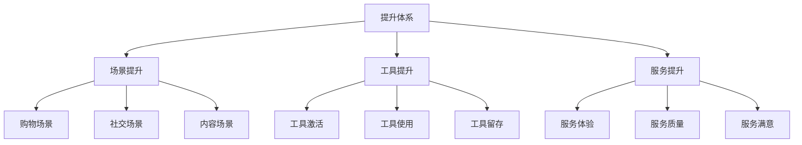
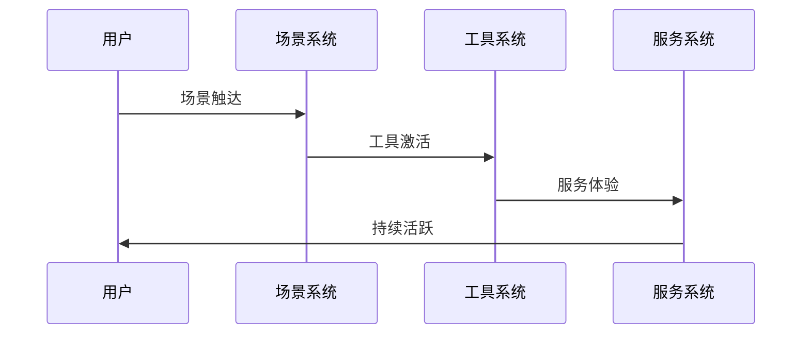
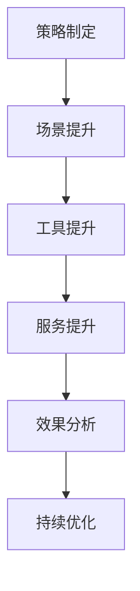
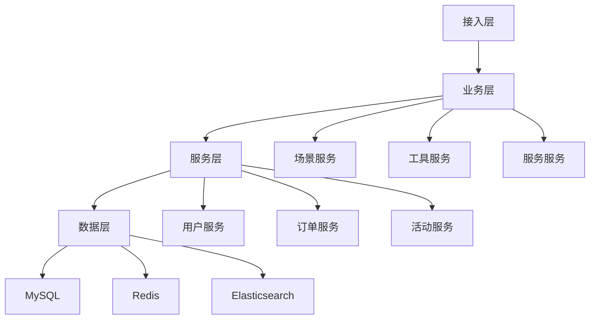

# 电商用户活跃度提升设计

> 远哥说：用户活跃度是电商平台的核心运营指标，通过科学的活跃度提升策略，实现用户价值的持续增长。这里我结合多个电商平台的实践经验，分享用户活跃度提升的设计方法。

## 一、产品定义

### 1.1 业务价值
```
核心价值：
1. 用户价值
   - 体验提升：体验优化
   - 价值增长：价值提升
   - 黏性增强：黏性提高

2. 平台价值
   - 活跃提升：活跃增长
   - 转化提升：转化增长
   - 收益提升：收益增长

3. 商家价值
   - 流量增加：流量提升
   - 转化提升：转化增长
   - 收益提高：收益增加
```

### 1.2 设计原则
| 原则 | 说明 | 正确示范 | 错误示范 |
|------|------|----------|----------|
| 科学性 | 提升科学 | 数据驱动 | 主观判断 |
| 持续性 | 提升持续 | 长期增长 | 短期冲量 |
| 价值性 | 提升价值 | 价值导向 | 规模导向 |
| 可复制 | 提升复制 | 可复制性 | 一次性增长 |

## 二、系统设计

### 2.1 提升架构


### 2.2 提升流程


## 三、功能设计

### 3.1 核心功能
```
功能模块：
1. 场景管理
   - 场景设计：场景设计管理
   - 场景优化：场景优化管理
   - 场景分析：场景分析管理
   - 效果管理：场景效果管理

2. 工具管理
   - 工具设计：工具设计管理
   - 工具优化：工具优化管理
   - 工具分析：工具分析管理
   - 效果管理：工具效果管理

3. 服务管理
   - 服务设计：服务设计管理
   - 服务优化：服务优化管理
   - 服务分析：服务分析管理
   - 效果管理：服务效果管理

4. 工具支持
   - 场景工具：场景支持工具
   - 工具支持：工具支持工具
   - 服务工具：服务支持工具
   - 分析工具：分析支持工具
```

### 3.2 场景示例
| 场景 | 需求 | 解决方案 | 效果 |
|------|------|----------|------|
| 购物场景 | 活跃提升 | 场景优化 | 效果好 |
| 工具激活 | 使用提升 | 工具优化 | 效率高 |
| 服务体验 | 体验提升 | 服务优化 | 满意度高 |
| 效果分析 | 效果评估 | 数据分析 | 准确性强 |

## 四、交互设计

### 4.1 提升流程


### 4.2 页面设计
```
页面布局：
1. 场景中心
   - 场景概况
   - 场景管理
   - 场景工具
   - 场景分析

2. 工具中心
   - 工具概况
   - 工具管理
   - 工具支持
   - 工具分析

3. 服务中心
   - 服务概况
   - 服务管理
   - 服务工具
   - 服务分析

4. 分析中心
   - 分析概况
   - 分析管理
   - 分析工具
   - 分析报告
```

## 五、数据分析

### 5.1 核心指标
| 维度 | 指标 | 目标 | 分析 |
|------|------|------|------|
| 规模 | 活跃规模 | 提升规模 | 规模分析 |
| 效率 | 活跃效率 | 提升效率 | 效率分析 |
| 质量 | 活跃质量 | 提升质量 | 质量分析 |
| 价值 | 活跃价值 | 提升价值 | 价值分析 |

### 5.2 效果分析
```
分析维度：
1. 规模分析
   - 活跃规模
   - 使用规模
   - 转化规模
   - 留存规模

2. 效果分析
   - 场景效果
   - 工具效果
   - 服务效果
   - 活跃效果

3. 价值分析
   - 用户价值
   - 场景价值
   - 平台价值
   - 生态价值
```

## 六、技术架构

### 6.1 系统架构


### 6.2 技术选型
| 技术 | 应用 | 方案 | 说明 |
|------|------|------|------|
| 存储 | 数据存储 | MySQL集群 | 主从架构 |
| 缓存 | 数据缓存 | Redis集群 | 高性能 |
| 计算 | 实时计算 | Spark | 实时分析 |
| 分析 | 离线分析 | Hadoop | 离线分析 |

## 七、案例分析

### 7.1 案例一：淘宝用户活跃
```
案例要点：
1. 业务特点
   - 规模大
   - 场景多
   - 效果好

2. 解决方案
   - 场景优化
   - 工具提升
   - 服务优化

3. 实施效果
   - 规模大
   - 效果好
   - 价值高
```

### 7.2 案例二：京东用户活跃
| 特点 | 挑战 | 方案 | 效果 |
|------|------|------|------|
| 科学性 | 提升科学 | 数据驱动 | 准确性高 |
| 效率性 | 提升效率 | 智能工具 | 效率性好 |
| 价值性 | 价值提升 | 价值运营 | 价值性强 |
| 可持续 | 持续优化 | 长期机制 | 可持续性好 |