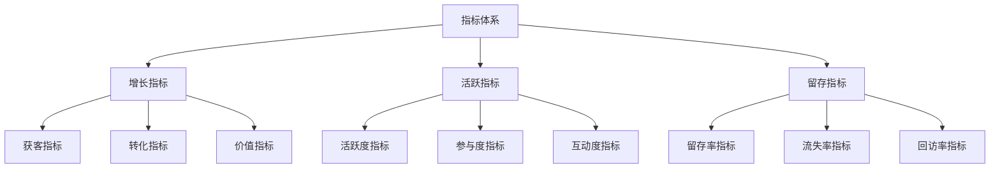
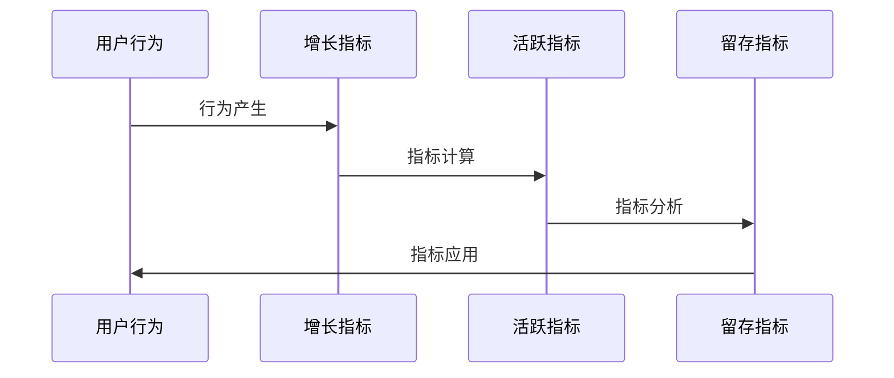
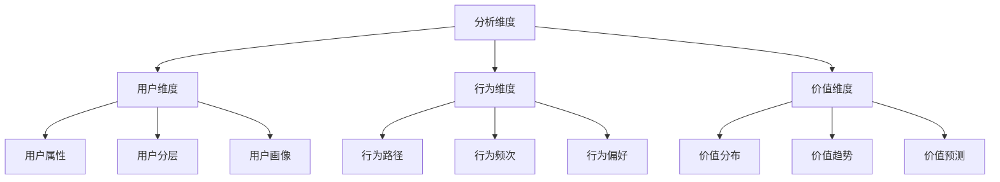
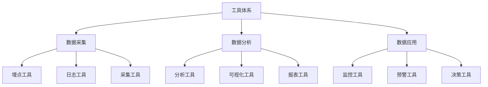

# 电商用户运营指标体系设计

> 远哥说：用户运营指标体系是电商平台运营效果评估和优化的基础，通过科学的指标设计和分析方法，实现用户价值的精准度量和持续优化。这里我结合多个电商平台的实践经验，分享用户运营指标体系的设计方法。

## 一、指标体系定义

### 1.1 业务价值
```
核心价值：
1. 评估价值
   - 效果评估：运营效果评估
   - 价值评估：价值产出评估
   - 效率评估：运营效率评估

2. 优化价值
   - 效果优化：运营效果优化
   - 价值优化：价值产出优化
   - 效率优化：运营效率优化

3. 决策价值
   - 策略决策：运营策略决策
   - 资源决策：资源投入决策
   - 方向决策：发展方向决策
```

### 1.2 设计原则
| 原则 | 说明 | 正确示范 | 错误示范 |
|------|------|----------|----------|
| 科学性 | 指标科学 | 数据驱动 | 主观判断 |
| 系统性 | 指标系统 | 全面覆盖 | 单一维度 |
| 可用性 | 指标可用 | 易于使用 | 复杂难用 |
| 可比性 | 指标可比 | 横向对比 | 无法对比 |

## 二、指标体系设计

### 2.1 指标架构


### 2.2 指标流程


## 三、指标设计

### 3.1 增长指标
```
指标体系：
1. 获客指标
   - 新增用户数：日/周/月新增用户数
   - 获客成本：单用户获客成本
   - 获客效率：单位投入获客数
   - 获客质量：新用户价值评估

2. 转化指标
   - 转化率：各环节转化率
   - 转化成本：单用户转化成本
   - 转化效率：单位时间转化数
   - 转化质量：转化用户价值

3. 价值指标
   - GMV：商品交易总额
   - ARPU：单用户平均收入
   - LTV：用户生命周期价值
   - ROI：投资回报率
```

### 3.2 活跃指标
| 维度 | 指标 | 计算方法 | 应用场景 |
|------|------|----------|----------|
| 活跃度 | DAU/MAU | 日/月活跃用户数 | 活跃度评估 |
| 参与度 | PV/UV | 页面访问量/访客数 | 参与度评估 |
| 互动度 | 互动率 | 互动用户数/总用户数 | 互动度评估 |
| 黏性度 | 使用时长 | 平均使用时长 | 黏性度评估 |

### 3.3 留存指标
```
指标体系：
1. 留存率指标
   - 次日留存率
   - 7日留存率
   - 30日留存率
   - 90日留存率

2. 流失率指标
   - 流失用户数
   - 流失用户率
   - 流失价值量
   - 流失原因分布

3. 回访率指标
   - 回访用户数
   - 回访用户率
   - 回访间隔
   - 回访价值量
```

## 四、分析方法

### 4.1 分析维度


### 4.2 分析方法
```
分析方法：
1. 趋势分析
   - 时间趋势分析
   - 空间趋势分析
   - 对比趋势分析
   - 预测趋势分析

2. 归因分析
   - 行为归因分析
   - 渠道归因分析
   - 价值归因分析
   - 效果归因分析

3. 预测分析
   - 用户预测分析
   - 行为预测分析
   - 价值预测分析
   - 风险预测分析
```

## 五、应用场景

### 5.1 场景示例
| 场景 | 核心指标 | 分析方法 | 应用效果 |
|------|----------|----------|----------|
| 增长分析 | 新增/转化 | 趋势分析 | 增长优化 |
| 活跃分析 | DAU/MAU | 归因分析 | 活跃提升 |
| 留存分析 | 留存率 | 预测分析 | 留存优化 |
| 价值分析 | LTV/ROI | 综合分析 | 价值提升 |

### 5.2 优化策略
```
优化方向：
1. 增长优化
   - 获客策略优化
   - 转化路径优化
   - 价值提升优化
   - 效率提升优化

2. 活跃优化
   - 活跃度优化
   - 参与度优化
   - 互动度优化
   - 黏性度优化

3. 留存优化
   - 产品体验优化
   - 运营策略优化
   - 服务质量优化
   - 价值回报优化
```

## 六、工具支持

### 6.1 分析工具


### 6.2 工具选型
| 环节 | 工具 | 功能 | 优势 |
|------|------|------|------|
| 采集 | 神策 | 数据采集 | 全面性强 |
| 分析 | QuickBI | 数据分析 | 易用性强 |
| 可视化 | Tableau | 数据可视 | 效果好 |
| 决策 | 自研 | 决策支持 | 匹配度高 |

## 七、案例分析

### 7.1 案例一：淘宝指标体系
```
案例要点：
1. 业务特点
   - 规模大
   - 维度多
   - 要求高

2. 解决方案
   - 分层设计
   - 系统覆盖
   - 深度应用

3. 实施效果
   - 效果好
   - 价值高
   - 可推广
```

### 7.2 案例二：京东指标体系
| 特点 | 挑战 | 方案 | 效果 |
|------|------|------|------|
| 全面性 | 覆盖全面 | 系统设计 | 效果好 |
| 科学性 | 指标科学 | 专业设计 | 准确性高 |
| 实用性 | 易于使用 | 工具支持 | 应用性强 |
| 价值性 | 价值导向 | 价值设计 | 价值高 |
