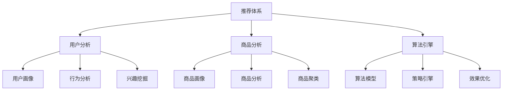
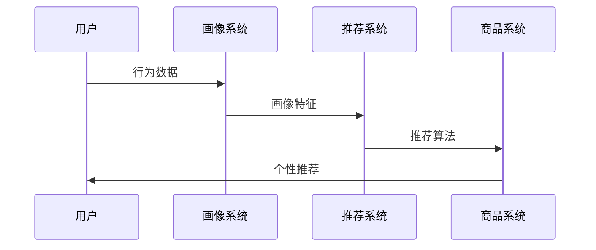
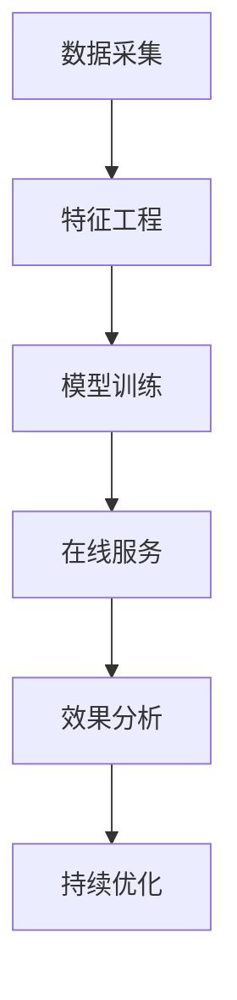
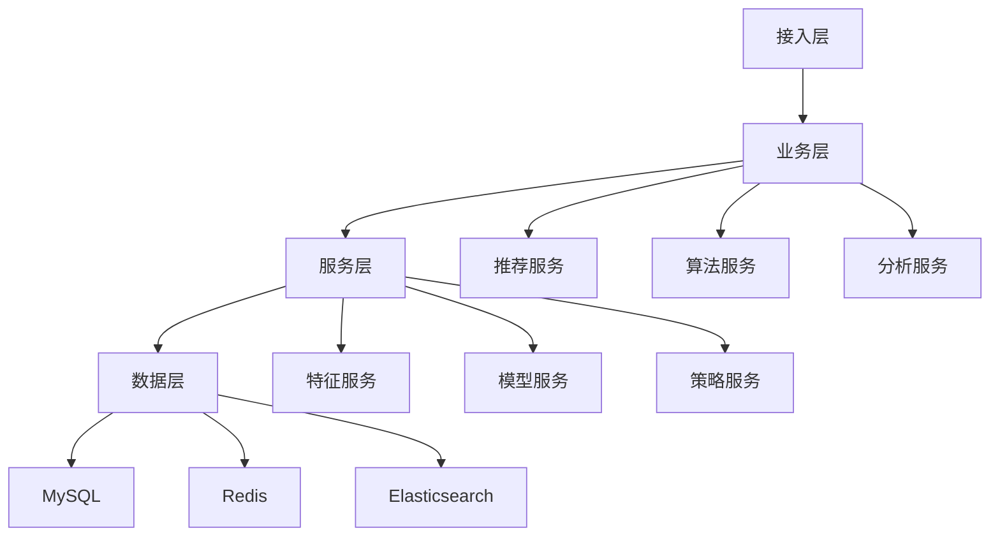

# 电商商品推荐系统设计方案

> 远哥说：商品推荐是电商平台提升用户体验和商品转化的关键环节，通过科学的推荐策略和算法，实现商品与用户的精准匹配。这里我结合多个电商平台的实践经验，分享商品推荐系统的设计方法。

## 一、系统定义

### 1.1 业务价值
```
核心价值：
1. 用户价值
   - 发现效率：商品发现效率
   - 匹配精度：需求匹配精度
   - 体验提升：购物体验提升

2. 平台价值
   - 转化提升：商品转化提升
   - 效率提升：运营效率提升
   - 收益提升：平台收益提升

3. 商家价值
   - 曝光提升：商品曝光提升
   - 转化提升：商品转化提升
   - 收益提升：商家收益提升
```

### 1.2 设计原则
| 原则 | 说明 | 正确示范 | 错误示范 |
|------|------|----------|----------|
| 科学性 | 推荐科学 | 算法驱动 | 主观判断 |
| 个性化 | 推荐个性 | 用户画像 | 统一推荐 |
| 实时性 | 推荐实时 | 实时计算 | 延迟计算 |
| 多样性 | 推荐多样 | 多维推荐 | 单一推荐 |

## 二、系统设计

### 2.1 系统架构


### 2.2 推荐流程


## 三、功能设计

### 3.1 核心功能
```
功能模块：
1. 用户分析
   - 画像构建：用户画像构建
   - 行为分析：用户行为分析
   - 兴趣挖掘：用户兴趣挖掘
   - 标签管理：用户标签管理

2. 商品分析
   - 画像构建：商品画像构建
   - 属性分析：商品属性分析
   - 关系分析：商品关系分析
   - 聚类分析：商品聚类分析

3. 算法引擎
   - 模型管理：算法模型管理
   - 策略管理：推荐策略管理
   - 效果管理：推荐效果管理
   - 优化管理：推荐优化管理

4. 工具支持
   - 分析工具：分析支持工具
   - 算法工具：算法支持工具
   - 效果工具：效果支持工具
   - 优化工具：优化支持工具
```

### 3.2 场景示例
| 场景 | 需求 | 解决方案 | 效果 |
|------|------|----------|------|
| 首页推荐 | 个性化推荐 | 兴趣推荐 | 效果好 |
| 详情推荐 | 相关推荐 | 商品关联 | 转化高 |
| 购物车推荐 | 场景推荐 | 场景关联 | 体验好 |
| 搜索推荐 | 智能推荐 | 智能匹配 | 精准度高 |

## 四、算法设计

### 4.1 算法流程


### 4.2 算法模型
```
算法体系：
1. 召回算法
   - 协同过滤
   - 内容推荐
   - 规则召回
   - 实时召回

2. 排序算法
   - LR模型
   - GBDT模型
   - DNN模型
   - 混合模型

3. 重排算法
   - 规则重排
   - 多样性重排
   - 实时重排
   - 策略重排

4. 特征工程
   - 用户特征
   - 商品特征
   - 场景特征
   - 时间特征
```

## 五、数据分析

### 5.1 核心指标
| 维度 | 指标 | 目标 | 分析 |
|------|------|------|------|
| 规模 | 推荐规模 | 提升规模 | 规模分析 |
| 效率 | 推荐效率 | 提升效率 | 效率分析 |
| 质量 | 推荐质量 | 提升质量 | 质量分析 |
| 价值 | 推荐价值 | 提升价值 | 价值分析 |

### 5.2 效果分析
```
分析维度：
1. 规模分析
   - 推荐规模
   - 点击规模
   - 转化规模
   - 价值规模

2. 效果分析
   - 点击效果
   - 转化效果
   - 留存效果
   - 复购效果

3. 价值分析
   - 用户价值
   - 平台价值
   - 商家价值
   - 生态价值
```

## 六、技术架构

### 6.1 系统架构


### 6.2 技术选型
| 技术 | 应用 | 方案 | 说明 |
|------|------|------|------|
| 存储 | 数据存储 | MySQL集群 | 主从架构 |
| 缓存 | 数据缓存 | Redis集群 | 高性能 |
| 计算 | 实时计算 | Spark | 实时分析 |
| 算法 | 深度学习 | TensorFlow | 模型训练 |

## 七、案例分析

### 7.1 案例一：淘宝推荐系统
```
案例要点：
1. 业务特点
   - 规模大
   - 场景多
   - 要求高

2. 解决方案
   - 深度学习
   - 实时计算
   - 智能优化

3. 实施效果
   - 转化高
   - 体验好
   - 价值大
```

### 7.2 案例二：京东推荐系统
| 特点 | 挑战 | 方案 | 效果 |
|------|------|------|------|
| 个性化 | 千人千面 | 深度学习 | 效果好 |
| 实时性 | 实时推荐 | 实时计算 | 时效好 |
| 多样性 | 推荐多样 | 策略优化 | 体验好 |
| 智能化 | 智能推荐 | 算法优化 | 精准好 |