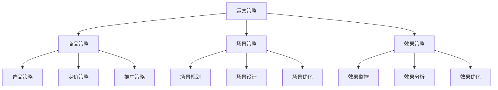
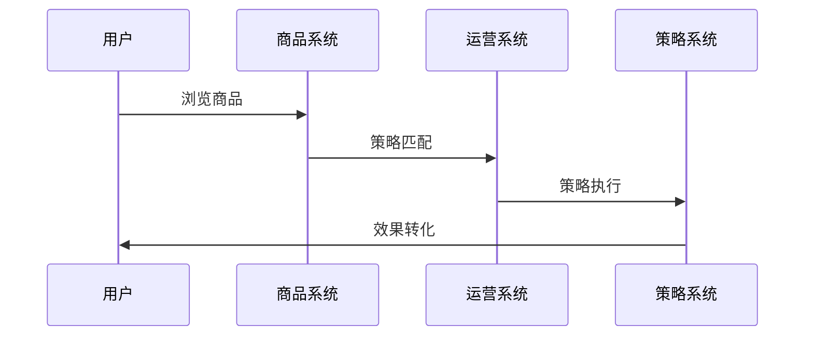
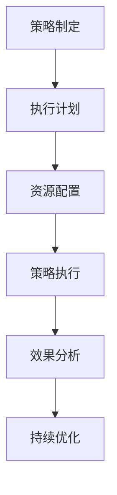
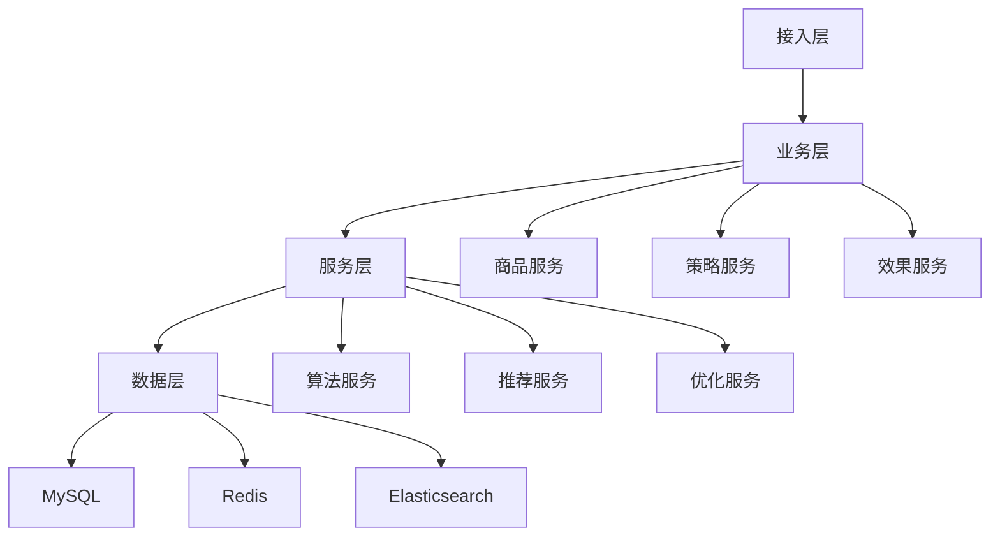

# 电商商品运营策略设计

> 远哥说：商品运营是电商平台的核心运营环节，通过科学的运营策略和方法，实现商品价值的最大化。这里我结合多个电商平台的实践经验，分享商品运营策略的设计方法。

## 一、策略定义

### 1.1 业务价值
```
核心价值：
1. 用户价值
   - 选择效率：商品选择效率
   - 购买效率：商品购买效率
   - 体验提升：购物体验提升

2. 平台价值
   - GMV提升：交易额提升
   - 效率提升：运营效率提升
   - 收益提升：平台收益提升

3. 商家价值
   - 销量提升：商品销量提升
   - 转化提升：商品转化提升
   - 收益提升：商家收益提升
```

### 1.2 设计原则
| 原则 | 说明 | 正确示范 | 错误示范 |
|------|------|----------|----------|
| 科学性 | 运营科学 | 数据驱动 | 主观判断 |
| 系统性 | 运营系统 | 全面覆盖 | 单点突破 |
| 持续性 | 运营持续 | 长期坚持 | 短期冲量 |
| 价值性 | 运营价值 | 价值导向 | 规模导向 |

## 二、系统设计

### 2.1 策略架构


### 2.2 策略流程


## 三、策略设计

### 3.1 核心策略
```
策略模块：
1. 商品策略
   - 选品策略：商品选品策略
   - 定价策略：商品定价策略
   - 推广策略：商品推广策略
   - 优化策略：商品优化策略

2. 场景策略
   - 规划策略：场景规划策略
   - 设计策略：场景设计策略
   - 优化策略：场景优化策略
   - 效果策略：场景效果策略

3. 效果策略
   - 监控策略：效果监控策略
   - 分析策略：效果分析策略
   - 优化策略：效果优化策略
   - 提升策略：效果提升策略

4. 工具策略
   - 商品工具：商品支持工具
   - 场景工具：场景支持工具
   - 效果工具：效果支持工具
   - 分析工具：分析支持工具
```

### 3.2 场景策略
| 场景 | 策略 | 执行方案 | 效果 |
|------|------|----------|------|
| 新品上新 | 爆品打造 | 全链路推广 | 效果好 |
| 促销活动 | 价格策略 | 精准营销 | 转化高 |
| 清仓特卖 | 清仓策略 | 价格引导 | 库存优化 |
| 品牌营销 | 品牌策略 | 品牌推广 | 品牌提升 |

## 四、执行设计

### 4.1 执行流程


### 4.2 执行方案
```
执行要点：
1. 商品执行
   - 商品规划
   - 商品定价
   - 商品推广
   - 商品优化

2. 场景执行
   - 场景规划
   - 场景设计
   - 场景优化
   - 场景分析

3. 效果执行
   - 效果监控
   - 效果分析
   - 效果优化
   - 效果提升

4. 资源执行
   - 资源规划
   - 资源配置
   - 资源优化
   - 资源分析
```

## 五、数据分析

### 5.1 核心指标
| 维度 | 指标 | 目标 | 分析 |
|------|------|------|------|
| 规模 | GMV规模 | 提升规模 | 规模分析 |
| 效率 | 转化效率 | 提升效率 | 效率分析 |
| 质量 | 运营质量 | 提升质量 | 质量分析 |
| 价值 | 运营价值 | 提升价值 | 价值分析 |

### 5.2 效果分析
```
分析维度：
1. 规模分析
   - GMV规模
   - 订单规模
   - 用户规模
   - 商品规模

2. 效果分析
   - 转化效果
   - 留存效果
   - 复购效果
   - 推广效果

3. 价值分析
   - 用户价值
   - 平台价值
   - 商家价值
   - 生态价值
```

## 六、技术架构

### 6.1 系统架构


### 6.2 技术选型
| 技术 | 应用 | 方案 | 说明 |
|------|------|------|------|
| 存储 | 数据存储 | MySQL集群 | 主从架构 |
| 缓存 | 数据缓存 | Redis集群 | 高性能 |
| 搜索 | 数据搜索 | ES集群 | 实时搜索 |
| 计算 | 实时计算 | Spark | 实时分析 |

## 七、案例分析

### 7.1 案例一：淘宝商品运营
```
案例要点：
1. 业务特点
   - 规模大
   - 品类多
   - 要求高

2. 解决方案
   - 精细化运营
   - 场景化运营
   - 数据化运营

3. 实施效果
   - GMV高
   - 转化好
   - 体验优
```

### 7.2 案例二：京东商品运营
| 特点 | 挑战 | 方案 | 效果 |
|------|------|----------|------|
| 品质化 | 品质保证 | 品控体系 | 口碑好 |
| 效率化 | 效率提升 | 智能运营 | 效率高 |
| 价值化 | 价值提升 | 价值运营 | 价值大 |
| 体系化 | 体系完善 | 体系建设 | 体系好 |
