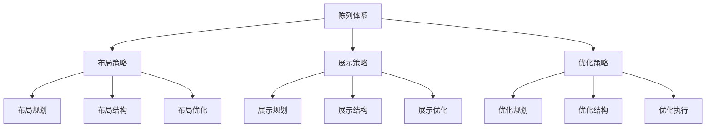
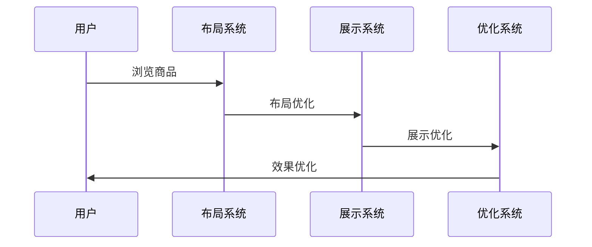
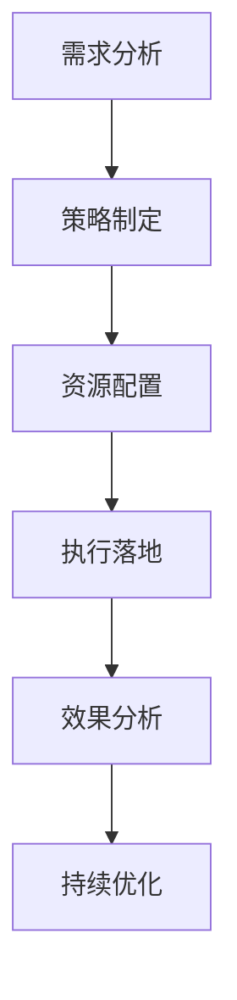
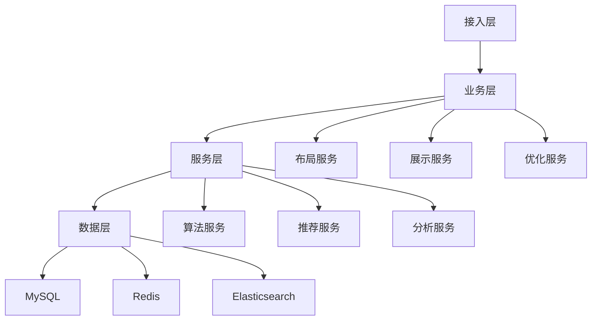

# 电商商品陈列设计方案

> 远哥说：商品陈列是电商平台提升用户体验和商品转化的关键环节，通过科学的陈列策略和方法，实现商品展示的最优化。这里我结合多个电商平台的实践经验，分享商品陈列的设计方法。

## 一、策略定义

### 1.1 业务价值
```
核心价值：
1. 用户价值
   - 浏览效率：商品浏览效率
   - 发现效率：商品发现效率
   - 体验提升：购物体验提升

2. 平台价值
   - 转化提升：商品转化提升
   - 效率提升：运营效率提升
   - 收益提升：平台收益提升

3. 商家价值
   - 曝光提升：商品曝光提升
   - 转化提升：商品转化提升
   - 收益提升：商家收益提升
```

### 1.2 设计原则
| 原则 | 说明 | 正确示范 | 错误示范 |
|------|------|----------|----------|
| 科学性 | 陈列科学 | 数据驱动 | 主观判断 |
| 系统性 | 陈列系统 | 全面覆盖 | 单点突破 |
| 美观性 | 陈列美观 | 视觉美化 | 杂乱无章 |
| 时效性 | 陈列时效 | 及时更新 | 滞后反应 |

## 二、系统设计

### 2.1 策略架构


### 2.2 策略流程


## 三、策略设计

### 3.1 核心策略
```
策略模块：
1. 布局策略
   - 布局规划：布局规划策略
   - 布局结构：布局结构策略
   - 布局优化：布局优化策略
   - 布局分析：布局分析策略

2. 展示策略
   - 展示规划：展示规划策略
   - 展示结构：展示结构策略
   - 展示优化：展示优化策略
   - 展示分析：展示分析策略

3. 优化策略
   - 优化规划：优化规划策略
   - 优化结构：优化结构策略
   - 优化执行：优化执行策略
   - 优化分析：优化分析策略

4. 工具策略
   - 布局工具：布局支持工具
   - 展示工具：展示支持工具
   - 优化工具：优化支持工具
   - 分析工具：分析支持工具
```

### 3.2 场景策略
| 场景 | 策略 | 执行方案 | 效果 |
|------|------|----------|------|
| 首页陈列 | 布局策略 | 布局规划 | 体验好 |
| 列表陈列 | 展示策略 | 展示优化 | 转化高 |
| 详情陈列 | 优化策略 | 优化执行 | 效果好 |
| 专题陈列 | 特色策略 | 差异打造 | 竞争力强 |

## 四、执行设计

### 4.1 执行流程


### 4.2 执行方案
```
执行要点：
1. 布局执行
   - 布局规划
   - 布局结构
   - 布局优化
   - 布局分析

2. 展示执行
   - 展示规划
   - 展示结构
   - 展示优化
   - 展示分析

3. 优化执行
   - 优化规划
   - 优化结构
   - 优化执行
   - 优化分析

4. 效果执行
   - 效果监控
   - 效果分析
   - 效果优化
   - 效果提升
```

## 五、数据分析

### 5.1 核心指标
| 维度 | 指标 | 目标 | 分析 |
|------|------|------|------|
| 规模 | 陈列规模 | 提升规模 | 规模分析 |
| 效率 | 陈列效率 | 提升效率 | 效率分析 |
| 质量 | 陈列质量 | 提升质量 | 质量分析 |
| 价值 | 陈列价值 | 提升价值 | 价值分析 |

### 5.2 效果分析
```
分析维度：
1. 规模分析
   - 陈列规模
   - 展示规模
   - 转化规模
   - 价值规模

2. 效果分析
   - 展示效果
   - 转化效果
   - 留存效果
   - 复购效果

3. 价值分析
   - 用户价值
   - 平台价值
   - 商家价值
   - 生态价值
```

## 六、技术架构

### 6.1 系统架构


### 6.2 技术选型
| 技术 | 应用 | 方案 | 说明 |
|------|------|------|------|
| 存储 | 数据存储 | MySQL集群 | 主从架构 |
| 缓存 | 数据缓存 | Redis集群 | 高性能 |
| 搜索 | 数据搜索 | ES集群 | 实时搜索 |
| 计算 | 实时计算 | Spark | 实时分析 |

## 七、案例分析

### 7.1 案例一：淘宝陈列策略
```
案例要点：
1. 业务特点
   - 规模大
   - 场景多
   - 要求高

2. 解决方案
   - 数据驱动
   - 智能陈列
   - 动态优化

3. 实施效果
   - 体验好
   - 转化高
   - 价值大
```

### 7.2 案例二：京东陈列策略
| 特点 | 挑战 | 方案 | 效果 |
|------|------|------|------|
| 规范化 | 规范保证 | 规范体系 | 规范好 |
| 效率化 | 效率提升 | 智能陈列 | 效率高 |
| 差异化 | 特色打造 | 差异策略 | 竞争力强 |
| 体系化 | 体系完善 | 体系建设 | 体系好 |