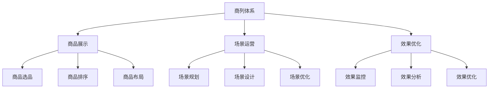
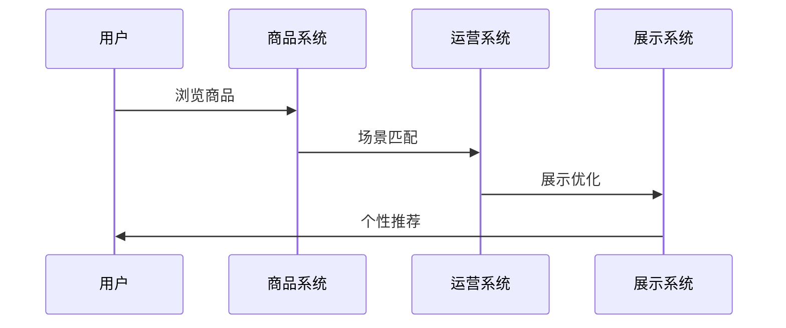
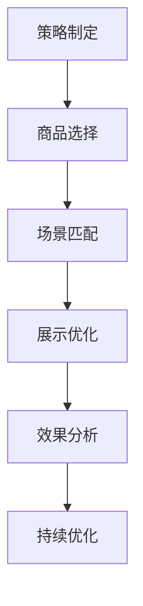
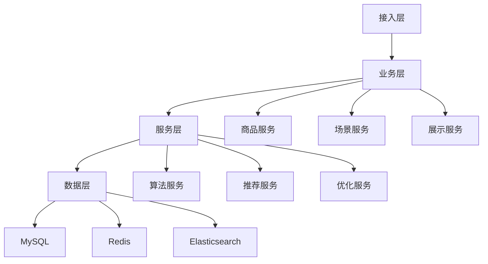

# 电商商品列表页设计方案

> 远哥说：商品列表页是电商平台展示商品和吸引用户的重要入口，通过科学的商列设计方法，实现商品价值的最大化展示。这里我结合多个电商平台的实践经验，分享商品列表页的设计方法。

## 一、产品定义

### 1.1 业务价值
```
核心价值：
1. 用户价值
   - 发现效率：商品发现效率
   - 决策效率：购买决策效率
   - 体验提升：购物体验提升

2. 平台价值
   - 转化提升：商品转化提升
   - 效率提升：运营效率提升
   - 收益提升：平台收益提升

3. 商家价值
   - 曝光提升：商品曝光提升
   - 转化提升：商品转化提升
   - 收益提升：商家收益提升
```

### 1.2 设计原则
| 原则 | 说明 | 正确示范 | 错误示范 |
|------|------|----------|----------|
| 科学性 | 展示科学 | 数据驱动 | 主观判断 |
| 个性化 | 展示个性 | 用户匹配 | 统一展示 |
| 时效性 | 展示时效 | 实时更新 | 固定不变 |
| 美观性 | 展示美观 | 设计优美 | 杂乱无章 |

## 二、系统设计

### 2.1 商列架构


### 2.2 商列流程


## 三、功能设计

### 3.1 核心功能
```
功能模块：
1. 商品管理
   - 选品管理：商品选品管理
   - 排序管理：商品排序管理
   - 布局管理：商品布局管理
   - 效果管理：展示效果管理

2. 场景管理
   - 规划管理：场景规划管理
   - 设计管理：场景设计管理
   - 优化管理：场景优化管理
   - 效果管理：场景效果管理

3. 展示管理
   - 展示管理：商列展示管理
   - 优化管理：展示优化管理
   - 效果管理：展示效果管理
   - 分析管理：展示分析管理

4. 工具支持
   - 商品工具：商品支持工具
   - 场景工具：场景支持工具
   - 展示工具：展示支持工具
   - 分析工具：分析支持工具
```

### 3.2 场景示例
| 场景 | 需求 | 解决方案 | 效果 |
|------|------|----------|------|
| 首页商列 | 转化提升 | 个性推荐 | 效果好 |
| 分类商列 | 发现效率 | 智能分类 | 效率高 |
| 活动商列 | 活动转化 | 场景优化 | 转化高 |
| 店铺商列 | 店铺转化 | 商品优选 | 收益好 |

## 四、交互设计

### 4.1 展示流程


### 4.2 页面设计
```
页面布局：
1. 商品展示
   - 商品图片
   - 商品信息
   - 商品价格
   - 商品标签

2. 场景展示
   - 场景主题
   - 场景布局
   - 场景氛围
   - 场景引导

3. 互动展示
   - 互动入口
   - 互动方式
   - 互动反馈
   - 互动奖励

4. 效果展示
   - 销量展示
   - 评价展示
   - 活动展示
   - 服务展示
```

## 五、数据分析

### 5.1 核心指标
| 维度 | 指标 | 目标 | 分析 |
|------|------|------|------|
| 规模 | 展示规模 | 提升规模 | 规模分析 |
| 效率 | 展示效率 | 提升效率 | 效率分析 |
| 质量 | 展示质量 | 提升质量 | 质量分析 |
| 价值 | 展示价值 | 提升价值 | 价值分析 |

### 5.2 效果分析
```
分析维度：
1. 规模分析
   - 展示规模
   - 点击规模
   - 转化规模
   - 价值规模

2. 效果分析
   - 展示效果
   - 点击效果
   - 转化效果
   - 价值效果

3. 价值分析
   - 用户价值
   - 平台价值
   - 商家价值
   - 生态价值
```

## 六、技术架构

### 6.1 系统架构


### 6.2 技术选型
| 技术 | 应用 | 方案 | 说明 |
|------|------|------|------|
| 存储 | 数据存储 | MySQL集群 | 主从架构 |
| 缓存 | 数据缓存 | Redis集群 | 高性能 |
| 搜索 | 数据搜索 | ES集群 | 实时搜索 |
| 计算 | 实时计算 | Spark | 实时分析 |

## 七、案例分析

### 7.1 案例一：淘宝商列设计
```
案例要点：
1. 业务特点
   - 规模大
   - 场景多
   - 要求高

2. 解决方案
   - 个性化推荐
   - 场景化运营
   - 智能化优化

3. 实施效果
   - 转化高
   - 体验好
   - 价值大
```

### 7.2 案例二：京东商列设计
| 特点 | 挑战 | 方案 | 效果 |
|------|------|------|------|
| 个性化 | 千人千面 | 智能推荐 | 效果好 |
| 场景化 | 场景运营 | 场景设计 | 体验好 |
| 时效性 | 实时更新 | 智能更新 | 时效好 |
| 美观性 | 视觉美观 | 设计优化 | 美观好 |