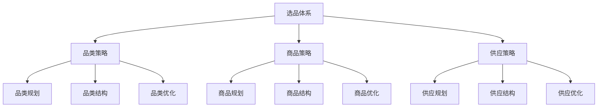
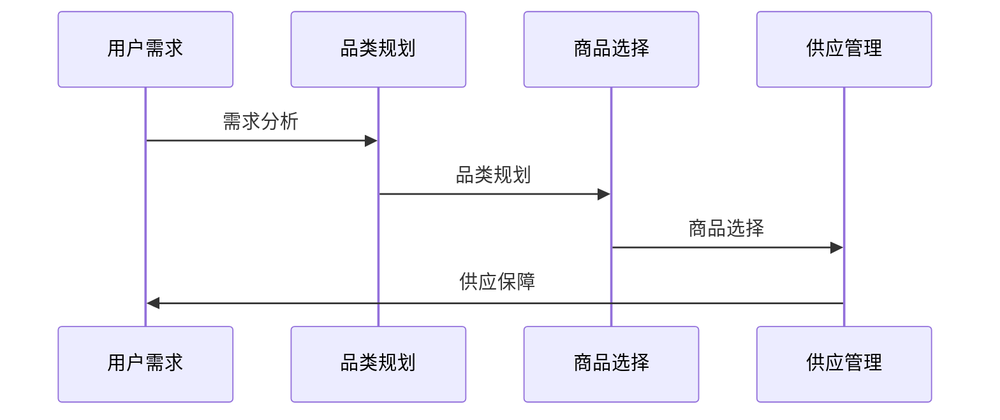
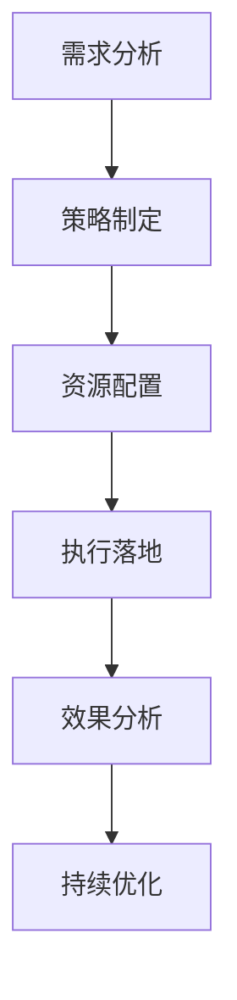
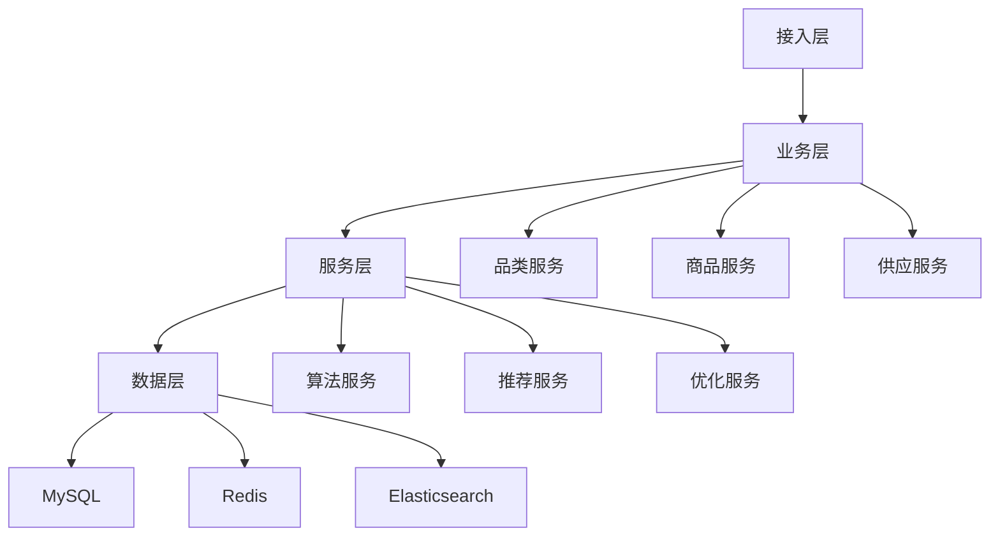

# 电商选品策略设计方案

> 远哥说：选品是电商平台运营的基础环节，通过科学的选品策略和方法，实现商品结构的最优化。这里我结合多个电商平台的实践经验，分享选品策略的设计方法。

## 一、策略定义

### 1.1 业务价值
```
核心价值：
1. 用户价值
   - 选择满足：用户需求满足
   - 体验提升：购物体验提升
   - 性价比高：商品性价比高

2. 平台价值
   - 结构优化：品类结构优化
   - 效率提升：运营效率提升
   - 收益提升：平台收益提升

3. 商家价值
   - 销量提升：商品销量提升
   - 利润提升：商品利润提升
   - 竞争力强：市场竞争力强
```

### 1.2 设计原则
| 原则 | 说明 | 正确示范 | 错误示范 |
|------|------|----------|----------|
| 科学性 | 选品科学 | 数据驱动 | 主观判断 |
| 系统性 | 选品系统 | 全面覆盖 | 单点突破 |
| 差异性 | 选品差异 | 特色商品 | 同质化严重 |
| 时效性 | 选品时效 | 及时更新 | 滞后反应 |

## 二、系统设计

### 2.1 策略架构


### 2.2 策略流程


## 三、策略设计

### 3.1 核心策略
```
策略模块：
1. 品类策略
   - 品类规划：品类规划策略
   - 品类结构：品类结构策略
   - 品类优化：品类优化策略
   - 品类分析：品类分析策略

2. 商品策略
   - 商品规划：商品规划策略
   - 商品结构：商品结构策略
   - 商品优化：商品优化策略
   - 商品分析：商品分析策略

3. 供应策略
   - 供应规划：供应规划策略
   - 供应结构：供应结构策略
   - 供应优化：供应优化策略
   - 供应分析：供应分析策略

4. 工具策略
   - 品类工具：品类支持工具
   - 商品工具：商品支持工具
   - 供应工具：供应支持工具
   - 分析工具：分析支持工具
```

### 3.2 场景策略
| 场景 | 策略 | 执行方案 | 效果 |
|------|------|----------|------|
| 品类扩充 | 品类策略 | 品类规划 | 结构优化 |
| 爆品打造 | 商品策略 | 商品优选 | 销量提升 |
| 长尾商品 | 优化策略 | 结构优化 | 效率提升 |
| 差异化品 | 特色策略 | 差异打造 | 竞争力强 |

## 四、执行设计

### 4.1 执行流程


### 4.2 执行方案
```
执行要点：
1. 品类执行
   - 品类规划
   - 品类结构
   - 品类优化
   - 品类分析

2. 商品执行
   - 商品规划
   - 商品结构
   - 商品优化
   - 商品分析

3. 供应执行
   - 供应规划
   - 供应结构
   - 供应优化
   - 供应分析

4. 效果执行
   - 效果监控
   - 效果分析
   - 效果优化
   - 效果提升
```

## 五、数据分析

### 5.1 核心指标
| 维度 | 指标 | 目标 | 分析 |
|------|------|------|------|
| 规模 | 品类规模 | 提升规模 | 规模分析 |
| 效率 | 运营效率 | 提升效率 | 效率分析 |
| 质量 | 选品质量 | 提升质量 | 质量分析 |
| 价值 | 商品价值 | 提升价值 | 价值分析 |

### 5.2 效果分析
```
分析维度：
1. 规模分析
   - 品类规模
   - 商品规模
   - 供应规模
   - 销售规模

2. 效果分析
   - 转化效果
   - 留存效果
   - 复购效果
   - 推广效果

3. 价值分析
   - 用户价值
   - 平台价值
   - 商家价值
   - 生态价值
```

## 六、技术架构

### 6.1 系统架构


### 6.2 技术选型
| 技术 | 应用 | 方案 | 说明 |
|------|------|------|------|
| 存储 | 数据存储 | MySQL集群 | 主从架构 |
| 缓存 | 数据缓存 | Redis集群 | 高性能 |
| 搜索 | 数据搜索 | ES集群 | 实时搜索 |
| 计算 | 实时计算 | Spark | 实时分析 |

## 七、案例分析

### 7.1 案例一：淘宝选品策略
```
案例要点：
1. 业务特点
   - 规模大
   - 品类多
   - 要求高

2. 解决方案
   - 数据驱动
   - 智能选品
   - 动态优化

3. 实施效果
   - 结构优
   - 效率高
   - 价值大
```

### 7.2 案例二：京东选品策略
| 特点 | 挑战 | 方案 | 效果 |
|------|------|------|------|
| 品质化 | 品质保证 | 品控体系 | 口碑好 |
| 效率化 | 效率提升 | 智能选品 | 效率高 |
| 差异化 | 特色打造 | 差异策略 | 竞争力强 |
| 体系化 | 体系完善 | 体系建设 | 体系好 |