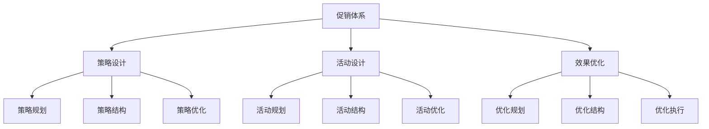
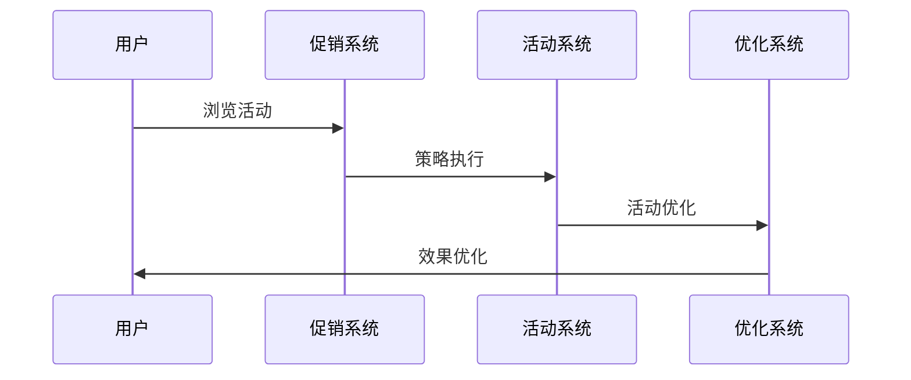
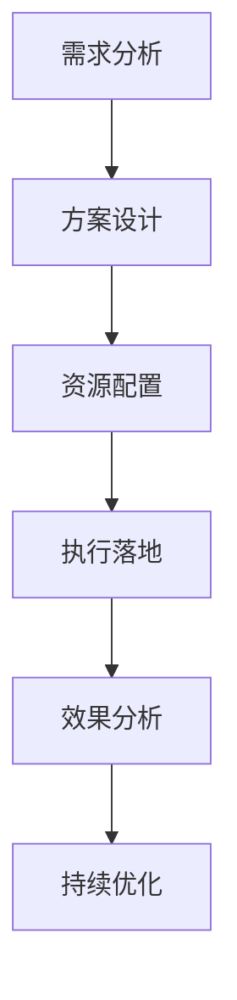
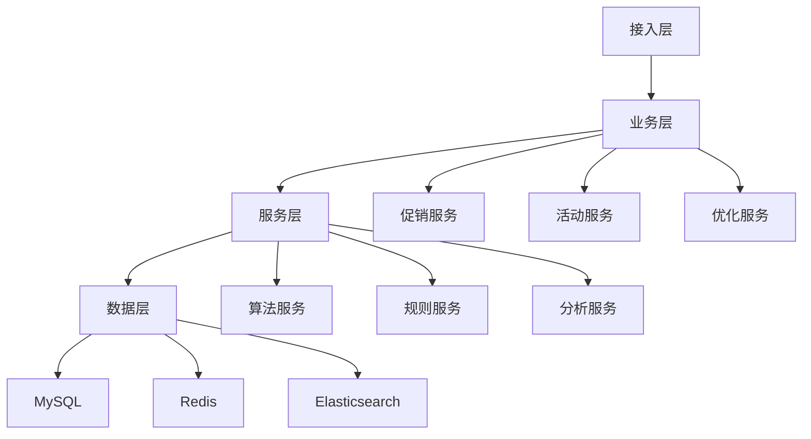

# 电商促销方案设计

> 远哥说：促销是电商平台提升销量和用户活跃的重要手段，通过科学的促销策略和方法，实现销售目标的达成。这里我结合多个电商平台的实践经验，分享促销方案的设计方法。

## 一、方案定义

### 1.1 业务价值
```
核心价值：
1. 用户价值
   - 优惠实惠：用户获得优惠
   - 体验提升：购物体验提升
   - 需求满足：购物需求满足

2. 平台价值
   - 销量提升：商品销量提升
   - 活跃提升：用户活跃提升
   - 收益提升：平台收益提升

3. 商家价值
   - 销量提升：商品销量提升
   - 曝光提升：商品曝光提升
   - 收益提升：商家收益提升
```

### 1.2 设计原则
| 原则 | 说明 | 正确示范 | 错误示范 |
|------|------|----------|----------|
| 科学性 | 促销科学 | 数据驱动 | 主观判断 |
| 系统性 | 促销系统 | 全面覆盖 | 单点突破 |
| 规范性 | 促销规范 | 规范执行 | 随意变通 |
| 时效性 | 促销时效 | 及时响应 | 滞后反应 |

## 二、系统设计

### 2.1 方案架构


### 2.2 方案流程


## 三、策略设计

### 3.1 核心策略
```
策略模块：
1. 促销策略
   - 满减策略：满额减免策略
   - 折扣策略：价格折扣策略
   - 优惠券策略：优惠券发放策略
   - 红包策略：红包发放策略

2. 活动策略
   - 限时策略：限时促销策略
   - 限量策略：限量促销策略
   - 套装策略：套装促销策略
   - 组合策略：组合促销策略

3. 优化策略
   - 规则优化：规则优化策略
   - 效果优化：效果优化策略
   - 体验优化：体验优化策略
   - 成本优化：成本优化策略

4. 工具策略
   - 促销工具：促销支持工具
   - 活动工具：活动支持工具
   - 优化工具：优化支持工具
   - 分析工具：分析支持工具
```

### 3.2 场景策略
| 场景 | 策略 | 执行方案 | 效果 |
|------|------|----------|------|
| 节日促销 | 满减策略 | 满减活动 | 转化高 |
| 清仓促销 | 折扣策略 | 折扣活动 | 库存优 |
| 新品促销 | 优惠券策略 | 券促活动 | 曝光好 |
| 会员促销 | 专享策略 | 专享活动 | 体验好 |

## 四、执行设计

### 4.1 执行流程


### 4.2 执行方案
```
执行要点：
1. 策略执行
   - 策略规划
   - 策略结构
   - 策略优化
   - 策略分析

2. 活动执行
   - 活动规划
   - 活动结构
   - 活动优化
   - 活动分析

3. 优化执行
   - 优化规划
   - 优化结构
   - 优化执行
   - 优化分析

4. 效果执行
   - 效果监控
   - 效果分析
   - 效果优化
   - 效果提升
```

## 五、数据分析

### 5.1 核心指标
| 维度 | 指标 | 目标 | 分析 |
|------|------|------|------|
| 规模 | 促销规模 | 提升规模 | 规模分析 |
| 效率 | 促销效率 | 提升效率 | 效率分析 |
| 质量 | 促销质量 | 提升质量 | 质量分析 |
| 价值 | 促销价值 | 提升价值 | 价值分析 |

### 5.2 效果分析
```
分析维度：
1. 规模分析
   - 促销规模
   - 参与规模
   - 转化规模
   - 价值规模

2. 效果分析
   - 参与效果
   - 转化效果
   - 留存效果
   - 复购效果

3. 价值分析
   - 用户价值
   - 平台价值
   - 商家价值
   - 生态价值
```

## 六、技术架构

### 6.1 系统架构


### 6.2 技术选型
| 技术 | 应用 | 方案 | 说明 |
|------|------|------|------|
| 存储 | 数据存储 | MySQL集群 | 主从架构 |
| 缓存 | 数据缓存 | Redis集群 | 高性能 |
| 搜索 | 数据搜索 | ES集群 | 实时搜索 |
| 计算 | 实时计算 | Spark | 实时分析 |

## 七、案例分析

### 7.1 案例一：淘宝双11
```
案例要点：
1. 业务特点
   - 规模大
   - 场景多
   - 要求高

2. 解决方案
   - 数据驱动
   - 智能促销
   - 动态优化

3. 实施效果
   - 销量高
   - 体验好
   - 价值大
```

### 7.2 案例二：京东618
| 特点 | 挑战 | 方案 | 效果 |
|------|------|----------|------|
| 规范化 | 规范保证 | 规范体系 | 规范好 |
| 效率化 | 效率提升 | 智能促销 | 效率高 |
| 差异化 | 特色打造 | 差异策略 | 竞争力强 |
| 体系化 | 体系完善 | 体系建设 | 体系好 |