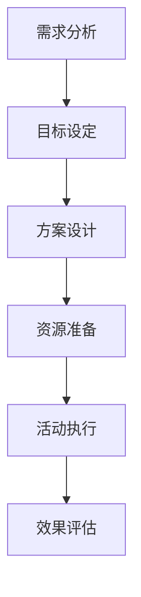

# 电商营销活动设计指南

> 远哥说：营销活动是电商运营的核心手段之一，通过不同类型的活动来实现商业目标。本文将从产品经理的视角，系统地介绍各类营销活动的设计方法。

## 一、营销活动概述

### 1.1 活动定义
营销活动是电商平台为了实现特定商业目标，在特定时间段内，面向目标用户群体开展的一系列营销行为的集合。

### 1.2 活动目标
```
核心目标：
1. 商业目标
   - GMV提升：提升平台交易额
   - 用户增长：获取新用户/活跃老用户
   - 品牌建设：提升品牌知名度和美誉度

2. 运营目标
   - 流量提升：提升平台访问量和停留时间
   - 转化提升：提升下单转化率
   - 复购提升：提升用户复购率

3. 生态目标
   - 商家发展：帮助商家成长
   - 供应链优化：优化供应链效率
   - 生态共赢：实现平台生态共赢
```

## 二、活动类型

### 2.1 折扣类活动
| 活动类型 | 活动形式 | 适用场景 | 关键指标 |
|---------|----------|----------|----------|
| 限时折扣 | 在限定时间内对特定商品进行折扣 | 清库存、提升转化 | 折扣力度、转化率 |
| 满减优惠 | 满足一定金额后给予减免 | 提升客单价 | 客单价、使用率 |
| 优惠券 | 发放不同类型的优惠券 | 促活、拉新 | 领取率、使用率 |
| 秒杀 | 超低价格限量销售 | 引流、造势 | 售罄率、引流量 |

### 2.2 主题类活动
```
活动类型：
1. 节日活动
   - 传统节日：春节、中秋等
   - 洋节：圣诞节、情人节等
   - 购物节：双11、618等

2. 场景活动
   - 换季活动：春夏换新等
   - 生活场景：开学季、毕业季等
   - 特色场景：亲子、宠物等

3. 品类活动
   - 品类促销：美妆节、服装节等
   - 跨品类：生活节、时尚节等
   - 新品类：新品首发等
```

### 2.3 互动类活动
| 活动类型 | 活动形式 | 参与机制 | 奖励方式 |
|---------|----------|----------|----------|
| 签到打卡 | 每日签到获得奖励 | 连续打卡 | 积分、优惠券 |
| 抽奖活动 | 抽取随机奖品 | 消费抽奖 | 商品、红包 |
| 游戏互动 | 趣味游戏玩法 | 游戏闯关 | 虚拟道具、优惠 |
| 社交裂变 | 邀请好友参与 | 分享传播 | 额外奖励 |

## 三、活动设计

### 3.1 设计流程


### 3.2 设计要点
```
核心要点：
1. 目标明确
   - 设定清晰的活动目标
   - 制定可衡量的指标
   - 明确目标用户群体

2. 玩法设计
   - 简单易懂的规则
   - 有趣的参与体验
   - 合理的奖励机制

3. 资源配置
   - 商品资源储备
   - 营销资源支持
   - 技术资源保障

4. 风险控制
   - 活动规则合规
   - 库存管理优化
   - 防刷单机制
```

## 四、活动运营

### 4.1 运营策略
| 阶段 | 策略重点 | 执行要点 | 效果评估 |
|------|----------|----------|----------|
| 预热期 | 造势引流 | 预热宣传、资源储备 | 关注度、预约量 |
| 上线期 | 转化促活 | 流量运营、实时监控 | 转化率、GMV |
| 尾声期 | 口碑传播 | 复盘总结、用户反馈 | 复购率、NPS |

### 4.2 数据分析
```
分析维度：
1. 流量分析
   - 访问量
   - 停留时间
   - 跳出率
   - 转化率

2. 用户分析
   - 新老用户比
   - 用户画像
   - 参与度
   - 复购率

3. 商品分析
   - 销量排名
   - 品类分布
   - 价格带
   - 毛利率
```

## 五、案例分析

### 5.1 案例一：天猫双11
```
案例要点：
1. 活动特点
   - 全品类参与
   - 多阶段设计
   - 玩法创新
   - 规模巨大

2. 成功经验
   - 长期规划
   - 资源整合
   - 技术支撑
   - 生态共赢

3. 注意事项
   - 系统稳定性
   - 库存管理
   - 物流配送
   - 客服支持
```

### 5.2 案例二：拼多多百亿补贴
| 维度 | 内容 | 经验 | 启示 |
|------|------|------|------|
| 定位 | 高性价比 | 差异化竞争 | 找准突破点 |
| 策略 | 持续补贴 | 长期投入 | 战略定力 |
| 效果 | 用户增长 | 规模效应 | 价值闭环 |
| 挑战 | 盈利压力 | 平衡取舍 | 节奏把控 |

## 六、经验总结

### 6.1 成功要素
```
关键因素：
1. 战略层面
   - 目标明确
   - 定位准确
   - 资源匹配
   - 执行到位

2. 战术层面
   - 玩法创新
   - 用户体验
   - 技术支撑
   - 运营效率

3. 管理层面
   - 团队协同
   - 资源整合
   - 风险控制
   - 效果评估
```

### 6.2 常见问题
| 问题类型 | 具体表现 | 解决方案 | 预防措施 |
|----------|----------|----------|----------|
| 规则设计 | 规则复杂 | 简化规则 | 用户测试 |
| 系统稳定 | 访问压力 | 技术优化 | 压力测试 |
| 库存管理 | 缺货超卖 | 预警机制 | 库存预估 |
| 用户体验 | 投诉反馈 | 及时响应 | 体验优化 |

## 七、未来趋势

### 7.1 发展方向
```
趋势预测：
1. 技术驱动
   - 智能化运营
   - 精准化营销
   - 个性化推荐
   - 自动化执行

2. 模式创新
   - 社交电商
   - 直播电商
   - 内容电商
   - 新零售融合

3. 用户需求
   - 体验升级
   - 服务升级
   - 场景升级
   - 价值升级
```

### 7.2 应对策略
| 方向 | 策略 | 行动 | 目标 |
|------|------|------|------|
| 数字化 | 数据驱动 | 建设数据中台 | 精准运营 |
| 智能化 | AI赋能 | 应用智能算法 | 效率提升 |
| 生态化 | 开放协同 | 构建生态体系 | 共创共赢 |
| 创新化 | 模式创新 | 探索新模式 | 持续增长 |