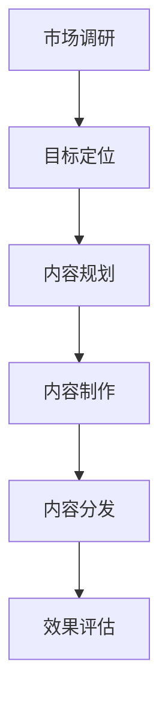

# 电商内容策划指南

> 远哥说：内容策划是电商运营的重要组成部分，通过优质的内容来吸引用户、传递价值、促进转化。本文将系统介绍电商内容策划的方法论。

## 一、内容策划概述

### 1.1 定义与价值
核心价值：
1. 用户价值
   - 信息获取：帮助用户获取商品信息
   - 决策辅助：辅助用户做出购买决策
   - 体验提升：提供良好的内容体验

2. 平台价值
   - 流量获取：通过内容获取流量
   - 用户转化：促进用户购买转化
   - 品牌建设：提升平台品牌形象

3. 商家价值
   - 商品曝光：提升商品曝光度
   - 销量提升：带动商品销量
   - 品牌营销：强化商家品牌

### 1.2 内容形式
| 形式 | 特点 | 适用场景 | 效果评估 |
|------|------|----------|----------|
| 图文 | 直观详细 | 商品详情、种草 | 阅读量、转化率 |
| 短视频 | 生动有趣 | 商品展示、种草 | 播放量、互动率 |
| 直播 | 实时互动 | 商品讲解、答疑 | 观看量、成交额 |
| 社区 | 用户交互 | 经验分享、评测 | 互动量、种草率 |

## 二、策划方法论

### 2.1 内容策划流程

### 2.2 内容策划框架
核心框架：
1. 目标定位
   - 目标用户画像
   - 内容定位策略
   - 传播目标设定
   - 效果目标设定

2. 内容规划
   - 主题规划
   - 形式规划
   - 节奏规划
   - 资源规划

3. 内容制作
   - 选题策划
   - 内容创作
   - 质量把控
   - 优化迭代

4. 内容分发
   - 渠道策略
   - 时间策略
   - 推广策略
   - 互动策略

## 三、内容选题

### 3.1 选题维度
| 维度 | 说明 | 示例 | 注意点 |
|------|------|------|--------|
| 热点 | 结合热点话题 | 节日、事件 | 及时性、相关性 |
| 痛点 | 解决用户问题 | 使用教程、选购指南 | 实用性、针对性 |
| 兴趣 | 迎合用户兴趣 | 潮流、趋势 | 趣味性、共鸣感 |
| 专业 | 提供专业知识 | 评测、解析 | 专业性、权威性 |

### 3.2 选题策略
策略要点：
1. 市场导向
   - 市场热点分析
   - 竞品内容分析
   - 用户需求分析
   - 数据趋势分析

2. 用户导向
   - 用户痛点挖掘
   - 用户兴趣洞察
   - 用户反馈收集
   - 用户行为分析

3. 商业导向
   - 商品特点分析
   - 销售目标分析
   - 营销节点分析
   - ROI效果分析

## 四、内容制作

### 4.1 制作标准
标准要求：
1. 内容质量
   - 真实性：内容真实可信
   - 专业性：专业准确到位
   - 实用性：实用有价值
   - 创新性：有创新亮点

2. 表现形式
   - 结构清晰：层次分明
   - 重点突出：核心明确
   - 风格统一：形式统一
   - 互动性强：引导互动

3. 品牌调性
   - 符合定位：与品牌一致
   - 价值观：传递正确价值
   - 独特性：形成特色
   - 一致性：保持统一

### 4.2 制作流程
| 阶段 | 工作内容 | 质量要求 | 输出成果 |
|------|----------|----------|----------|
| 策划 | 选题研究、大纲设计 | 方向准确、结构完整 | 内容大纲 |
| 创作 | 内容撰写、素材制作 | 质量优秀、形式合适 | 内容初稿 |
| 审核 | 内容审核、修改优化 | 准确规范、优化完善 | 终稿成果 |
| 发布 | 内容发布、效果跟踪 | 及时准确、数据完整 | 发布结果 |

## 五、内容运营

### 5.1 运营策略
策略框架：
1. 内容分发
   - 渠道选择
   - 时间规划
   - 形式匹配
   - 资源配置

2. 互动运营
   - 评论管理
   - 问答互动
   - 活动策划
   - 社群运营

3. 数据运营
   - 数据监控
   - 效果分析
   - 优化改进
   - 策略调整

### 5.2 效果评估
| 维度 | 指标 | 目标 | 改进方向 |
|------|------|------|----------|
| 传播 | 阅读量、互动量 | 扩大影响 | 内容优化 |
| 转化 | 点击率、转化率 | 提升转化 | 链路优化 |
| 互动 | 评论量、分享量 | 提升互动 | 互动优化 |
| 复购 | 复购率、忠诚度 | 提升留存 | 服务优化 |

## 六、案例分析

### 6.1 案例一：小红书种草笔记
案例分析：
1. 成功要素
   - 真实体验分享
   - 专业详细测评
   - 优质图文展示
   - 强互动氛围

2. 经验启示
   - 重视用户体验
   - 保持内容真实
   - 注重专业性
   - 强化互动性

### 6.2 案例二：淘宝直播带货
| 维度 | 做法 | 效果 | 启示 |
|------|------|------|------|
| 内容 | 专业讲解+互动 | 信任感强 | 重视专业性 |
| 形式 | 直播+短视频 | 传播效果好 | 形式多样化 |
| 转化 | 优惠+氛围 | 转化率高 | 注重转化率 |
| 运营 | 数据+迭代 | 持续增长 | 重视数据 |

## 七、发展趋势

### 7.1 趋势展望
发展趋势：
1. 内容形式
   - 视频化：短视频主导
   - 直播化：直播常态化
   - 社交化：社交传播
   - 智能化：AI创作

2. 运营方式
   - 数据驱动：精准运营
   - 算法分发：智能分发
   - 社群运营：深度运营
   - 私域运营：精细运营

3. 商业模式
   - 内容电商：内容带货
   - 社交电商：社交裂变
   - 直播电商：直播成交
   - 新零售：线上线下

### 7.2 应对策略
| 方向 | 策略 | 行动 | 目标 |
|------|------|------|------|
| 内容 | 提升质量 | 优化创作 | 内容价值 |
| 技术 | 运用新技术 | 技术赋能 | 效率提升 |
| 运营 | 精细化运营 | 数据驱动 | 效果提升 |
| 商业 | 模式创新 | 探索创新 | 价值增长 |