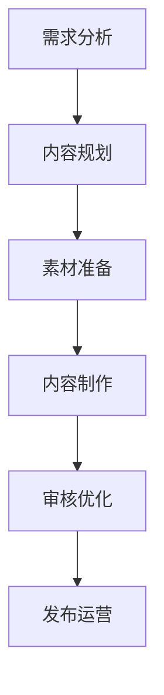

# 电商图文内容设计指南

> 远哥说：图文内容是电商平台最基础和重要的内容形式，好的图文内容可以有效展示商品信息、传递品牌价值、促进用户转化。本文将详细介绍电商图文内容的设计方法。

## 一、图文内容概述

### 1.1 定义与价值
核心价值：
1. 商品展示
   - 信息展示：完整展示商品信息
   - 细节呈现：展示商品细节特点
   - 场景演示：展示商品使用场景

2. 用户体验
   - 信息获取：便于获取商品信息
   - 视觉体验：提供良好视觉体验
   - 决策辅助：辅助购买决策

3. 营销转化
   - 吸引注意：吸引用户关注
   - 引导互动：促进用户互动
   - 促进转化：推动购买转化

### 1.2 内容形式
| 形式 | 特点 | 适用场景 | 效果评估 |
|------|------|----------|----------|
| 商品详情 | 完整详细 | 商品展示页 | 浏览量、转化率 |
| 营销图文 | 吸引有趣 | 活动推广 | 点击率、参与率 |
| 种草文章 | 真实专业 | 商品推荐 | 阅读量、种草率 |
| 评测内容 | 专业客观 | 商品评测 | 信任度、分享率 |

## 二、设计方法论

### 2.1 设计流程

### 2.2 设计框架
设计要点：
1. 内容规划
   - 目标定位
   - 内容框架
   - 风格定调
   - 亮点设计

2. 视觉设计
   - 版式设计
   - 色彩搭配
   - 图片处理
   - 文字排版

3. 文案创作
   - 标题设计
   - 内容撰写
   - 卖点提炼
   - 风格统一

## 三、商品详情页设计

### 3.1 页面结构
| 模块 | 内容 | 设计要点 | 注意事项 |
|------|------|----------|----------|
| 主图 | 商品展示图 | 清晰完整、细节展示 | 真实还原 |
| 信息 | 基础信息 | 完整准确、重点突出 | 易于获取 |
| 详情 | 商品详情 | 系统全面、层次分明 | 结构清晰 |
| 评价 | 用户评价 | 真实客观、有价值 | 及时更新 |

### 3.2 设计要点
核心要点：
1. 主图设计
   - 图片质量：高清专业
   - 角度选择：多角度展示
   - 细节呈现：重点细节
   - 场景搭配：实际场景

2. 信息展示
   - 价格信息：清晰醒目
   - 规格参数：完整准确
   - 服务承诺：明确清晰
   - 购买提示：重要提醒

3. 详情设计
   - 产品介绍：系统全面
   - 功能展示：清晰直观
   - 使用说明：详细易懂
   - 注意事项：明确提示

## 四、营销图文设计

### 4.1 设计原则
设计原则：
1. 视觉原则
   - 吸引力：视觉冲击
   - 美观性：精美设计
   - 一致性：风格统一
   - 识别性：品牌特色

2. 内容原则
   - 真实性：内容真实
   - 价值性：信息有价值
   - 互动性：引导互动
   - 转化性：促进转化

3. 营销原则
   - 目标性：明确目标
   - 策略性：策略清晰
   - 效果性：注重效果
   - 可测性：数据可测

### 4.2 设计技巧
| 维度 | 技巧 | 示例 | 效果 |
|------|------|------|------|
| 标题 | 吸引注意 | 热点+痛点 | 点击率高 |
| 开篇 | 引起兴趣 | 故事+场景 | 阅读率高 |
| 内容 | 价值传递 | 干货+案例 | 转化率高 |
| 结尾 | 行动引导 | CTA+互动 | 互动率高 |

## 五、内容制作

### 5.1 图片处理
处理要点：
1. 拍摄规范
   - 设备选择：专业设备
   - 环境要求：标准环境
   - 角度选择：最佳角度
   - 光线控制：合适光线

2. 后期处理
   - 裁剪调整：构图优化
   - 色彩调整：色彩平衡
   - 细节优化：瑕疵处理
   - 特效添加：适当特效

3. 规格标准
   - 尺寸规范：符合规范
   - 格式要求：标准格式
   - 质量控制：清晰度高
   - 大小控制：适当大小

### 5.2 文案创作
| 环节 | 要点 | 技巧 | 示例 |
|------|------|------|------|
| 选题 | 价值点 | 痛点+解决 | 如何选择 |
| 结构 | 层次感 | 总分+递进 | 三要素法 |
| 表达 | 易理解 | 简洁+生动 | 比喻类比 |
| 优化 | 提升质 | 修改+打磨 | 多次优化 |

## 六、质量管理

### 6.1 质量标准
标准体系：
1. 内容标准
   - 准确性：信息准确
   - 完整性：内容完整
   - 规范性：格式规范
   - 时效性：及时更新

2. 视觉标准
   - 美观性：设计精美
   - 专业性：制作专业
   - 统一性：风格统一
   - 创新性：创意创新

3. 营销标准
   - 转化性：促进转化
   - 互动性：引导互动
   - 传播性：易于传播
   - 价值性：创造价值

### 6.2 审核流程
| 环节 | 内容 | 标准 | 负责人 |
|------|------|------|--------|
| 自审 | 内容检查 | 质量要求 | 创作者 |
| 互审 | 团队审核 | 专业标准 | 团队成员 |
| 终审 | 最终确认 | 发布标准 | 负责人 |
| 复审 | 效果检查 | 优化标准 | 运营者 |

## 七、效果评估

### 7.1 评估指标
指标体系：
1. 流量指标
   - 浏览量：页面访问
   - 停留时间：阅读时长
   - 跳出率：页面跳出
   - 分享量：传播效果

2. 转化指标
   - 点击率：链接点击
   - 转化率：购买转化
   - 收藏率：商品收藏
   - 复购率：二次购买

3. 互动指标
   - 评论量：评论数量
   - 点赞量：认可程度
   - 收藏量：保存数量
   - 分享量：传播数量

### 7.2 优化策略
| 问题 | 分析 | 策略 | 效果 |
|------|------|------|------|
| 流量低 | 吸引力不足 | 优化标题内容 | 提升流量 |
| 转化低 | 价值传递弱 | 强化价值点 | 提升转化 |
| 互动少 | 互动性不强 | 加强引导 | 提升互动 |
| 体验差 | 质量不达标 | 提升质量 | 提升体验 |

## 八、发展趋势

### 8.1 趋势分析
发展趋势：
1. 内容形式
   - 视频化：短视频融合
   - 互动化：互动更强
   - 社交化：社交属性
   - 智能化：AI应用

2. 创作方式
   - 专业化：更专业
   - 工具化：更便捷
   - 协同化：更高效
   - 数据化：更精准

3. 应用场景
   - 场景化：更丰富
   - 个性化：更精准
   - 实时化：更及时
   - 体验化：更优质

### 8.2 应对策略
| 方向 | 策略 | 行动 | 目标 |
|------|------|------|------|
| 内容 | 提质增效 | 质量提升 | 竞争力 |
| 技术 | 工具赋能 | 效率提升 | 生产力 |
| 运营 | 数据驱动 | 精准优化 | 转化率 |
| 创新 | 模式创新 | 持续创新 | 领先性 |