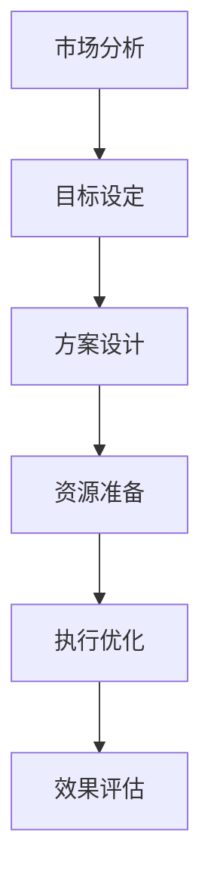
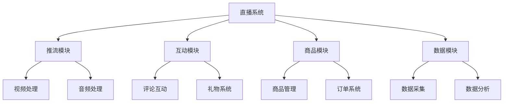

# 电商直播带货指南

> 远哥说：直播带货作为新兴的电商营销方式，已经成为重要的销售渠道。本文将从产品经理的视角，系统介绍直播带货的设计和运营方法。

## 一、直播带货概述

### 1.1 定义与价值
核心价值：
1. 用户价值
   - 沉浸体验：直观的商品展示
   - 互动交流：实时的问答互动
   - 优惠福利：专属的优惠权益
   - 决策辅助：专业的购物建议

2. 平台价值
   - 流量获取：获取优质流量
   - 转化提升：提高转化效率
   - 品牌建设：提升品牌影响
   - 生态完善：完善平台生态

3. 商家价值
   - 销量提升：快速提升销量
   - 库存清理：高效清理库存
   - 品牌推广：强化品牌形象
   - 用户积累：积累忠实用户

### 1.2 直播形式
| 类型 | 特点 | 适用场景 | 效果评估 |
|------|------|----------|----------|
| 达人直播 | 粉丝基础大 | 品牌推广 | 观看量、转化率 |
| 商家直播 | 专业性强 | 商品销售 | 销量、复购率 |
| 品牌直播 | 权威性高 | 新品发布 | 品牌声量、传播度 |
| 活动直播 | 互动性强 | 节日促销 | 参与度、GMV |

## 二、直播策划

### 2.1 策划流程

### 2.2 策划框架
策划要点：
1. 目标设定
   - 销售目标：GMV目标
   - 流量目标：观看人数
   - 转化目标：转化率
   - 品牌目标：声量提升

2. 内容规划
   - 主题设计：直播主题
   - 脚本设计：直播脚本
   - 互动设计：互动环节
   - 节奏把控：直播节奏

3. 资源配置
   - 商品资源：货品储备
   - 主播资源：主播选择
   - 技术资源：设备支持
   - 营销资源：推广资源

## 三、直播运营

### 3.1 前期准备
| 环节 | 工作内容 | 关键点 | 检查项 |
|------|----------|--------|--------|
| 选品 | 商品筛选 | 性价比、爆款 | 库存、价格 |
| 定价 | 价格策略 | 优惠力度 | 利润、竞品 |
| 预热 | 活动预热 | 预约转化 | 预约量 |
| 培训 | 人员培训 | 专业性 | 话术、知识 |

### 3.2 直播执行
执行要点：
1. 开播准备
   - 设备调试：确保稳定
   - 商品上架：顺序准备
   - 人员就位：分工明确
   - 系统检查：功能正常

2. 直播控制
   - 节奏把控：合理节奏
   - 互动管理：及时互动
   - 危机处理：快速响应
   - 数据监控：实时跟踪

3. 效果优化
   - 实时调整：及时优化
   - 资源调配：灵活调配
   - 策略优化：动态优化
   - 问题处理：及时处理

## 四、商品管理

### 4.1 选品策略
选品维度：
1. 商品维度
   - 性价比：高性价比
   - 品质：优质可靠
   - 爆款：爆款潜力
   - 利润：合理利润

2. 市场维度
   - 需求：市场需求
   - 竞争：竞争分析
   - 趋势：市场趋势
   - 时机：上市时机

3. 用户维度
   - 偏好：用户喜好
   - 价格：承受能力
   - 场景：使用场景
   - 反馈：用户反馈

### 4.2 商品运营
| 环节 | 策略 | 方法 | 效果 |
|------|------|------|------|
| 定价 | 差异化定价 | 专属优惠 | 价格优势 |
| 陈列 | 节奏化陈列 | 爆款节奏 | 带货效果 |
| 库存 | 动态化管理 | 实时调配 | 库存优化 |
| 物流 | 高效化配送 | 快速发货 | 服务体验 |

## 五、主播管理

### 5.1 主播体系
体系构建：
1. 主播类型
   - 达人主播：粉丝基础
   - 商家主播：专业性强
   - 素人主播：真实接地
   - 明星主播：影响力大

2. 能力要求
   - 专业能力：产品知识
   - 表达能力：语言表达
   - 互动能力：互动技巧
   - 应变能力：突发处理

3. 培训体系
   - 基础培训：基本技能
   - 专业培训：专业知识
   - 实战培训：实战演练
   - 进阶培训：能力提升

### 5.2 绩效管理
| 维度 | 指标 | 标准 | 激励 |
|------|------|------|------|
| 销售 | GMV | 目标达成 | 销售提成 |
| 流量 | 观看量 | 增长率 | 流量奖励 |
| 互动 | 互动率 | 参与度 | 互动奖励 |
| 服务 | 满意度 | 评分标准 | 服务奖励 |

## 六、数据分析

### 6.1 核心指标
指标体系：
1. 流量指标
   - 观看人数：总观看
   - 峰值人数：最高峰值
   - 停留时长：平均时长
   - 互动人数：互动总量

2. 转化指标
   - 点击率：商品点击
   - 转化率：购买转化
   - 客单价：平均客单
   - GMV：总成交额

3. 互动指标
   - 互动率：互动参与
   - 点赞数：认可程度
   - 评论数：互动深度
   - 分享数：传播效果

### 6.2 优化策略
| 问题 | 分析 | 策略 | 效果 |
|------|------|------|------|
| 流量低 | 引流不足 | 加强推广 | 提升流量 |
| 转化低 | 卖点不强 | 优化话术 | 提升转化 |
| 互动少 | 互动不够 | 强化互动 | 提升互动 |
| 复购低 | 服务不佳 | 提升服务 | 提升复购 |

## 七、技术支持

### 7.1 技术架构

### 7.2 技术要求
| 模块 | 功能 | 要求 | 保障 |
|------|------|------|------|
| 推流 | 视频推流 | 稳定流畅 | 带宽保障 |
| 互动 | 实时互动 | 即时响应 | 系统优化 |
| 商品 | 商品展示 | 快速同步 | 缓存优化 |
| 数据 | 数据分析 | 实时准确 | 监控预警 |

## 八、风险控制

### 8.1 风险识别
风险类型：
1. 内容风险
   - 合规风险：内容合规
   - 质量风险：商品质量
   - 价格风险：价格争议
   - 服务风险：服务承诺

2. 技术风险
   - 系统风险：系统稳定
   - 网络风险：网络质量
   - 安全风险：数据安全
   - 支付风险：支付安全

3. 运营风险
   - 库存风险：库存管理
   - 物流风险：配送及时
   - 售后风险：服务保障
   - 声誉风险：品牌形象

### 8.2 应对策略
| 风险 | 预防 | 处理 | 效果 |
|------|------|------|------|
| 内容 | 审核机制 | 快速处理 | 降低风险 |
| 技术 | 预案准备 | 及时响应 | 保障稳定 |
| 运营 | 制度规范 | 流程把控 | 规范运营 |
| 声誉 | 监控预警 | 危机公关 | 维护形象 |

## 九、发展趋势

### 9.1 趋势分析
发展趋势：
1. 内容形式
   - 场景化：场景多元
   - 互动化：互动加强
   - 社交化：社交融合
   - 智能化：AI应用

2. 技术创新
   - 5G应用：高速稳定
   - AI赋能：智能辅助
   - VR/AR：沉浸体验
   - 大数据：精准营销

3. 商业模式
   - 私域化：私域运营
   - 品牌化：品牌升级
   - 专业化：专业分工
   - 生态化：生态协同

### 9.2 应对策略
| 方向 | 策略 | 行动 | 目标 |
|------|------|------|------|
| 内容 | 创新升级 | 内容创新 | 竞争力 |
| 技术 | 技术赋能 | 技术应用 | 效率提升 |
| 运营 | 精细运营 | 数据驱动 | 效果优化 |
| 生态 | 生态协同 | 资源整合 | 价值共创 |