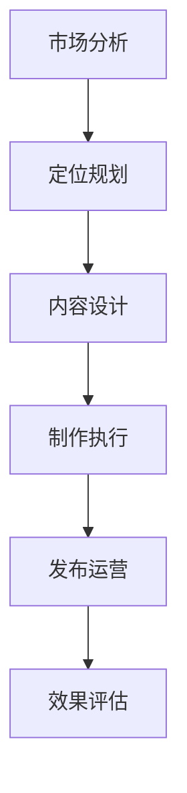

# 电商短视频营销指南

> 远哥说：短视频已经成为电商营销的重要形式，通过生动有趣的视频内容来吸引用户、传递价值、促进转化。本文将系统介绍电商短视频营销的方法论。

## 一、短视频营销概述

### 1.1 定义与价值
核心价值：
1. 用户价值
   - 内容价值：获取有价值信息
   - 娱乐价值：获得娱乐体验
   - 社交价值：参与社交互动
   - 购物价值：辅助购物决策

2. 平台价值
   - 流量价值：获取优质流量
   - 转化价值：提升转化效率
   - 品牌价值：提升品牌影响
   - 生态价值：完善平台生态

3. 商家价值
   - 营销价值：提升营销效果
   - 品牌价值：强化品牌形象
   - 销售价值：促进商品销售
   - 用户价值：积累忠实用户

### 1.2 内容形式
| 形式 | 特点 | 适用场景 | 效果评估 |
|------|------|----------|----------|
| 种草视频 | 真实体验 | 商品推荐 | 种草转化率 |
| 测评视频 | 专业解析 | 商品评测 | 专业信任度 |
| 创意视频 | 有趣吸睛 | 品牌推广 | 传播互动度 |
| 教程视频 | 实用指导 | 使用教学 | 实用价值度 |

## 二、内容策划

### 2.1 策划流程

### 2.2 策划框架
策划要点：
1. 目标定位
   - 营销目标：销售转化
   - 品牌目标：形象提升
   - 用户目标：用户增长
   - 传播目标：声量提升

2. 内容规划
   - 主题规划：内容主题
   - 系列规划：内容系列
   - 创意规划：创意亮点
   - 节奏规划：发布节奏

3. 资源配置
   - 人员配置：团队组建
   - 设备配置：硬件支持
   - 场地配置：拍摄场地
   - 预算配置：资金支持

## 三、内容制作

### 3.1 制作流程
| 环节 | 工作内容 | 关键点 | 输出物 |
|------|----------|--------|--------|
| 策划 | 内容策划 | 创意性 | 拍摄脚本 |
| 拍摄 | 视频拍摄 | 专业性 | 原始素材 |
| 剪辑 | 后期制作 | 精致性 | 成片作品 |
| 审核 | 内容审核 | 合规性 | 发布版本 |

### 3.2 制作要点
制作要点：
1. 拍摄规范
   - 设备选择：专业设备
   - 场景布置：场景搭建
   - 灯光控制：灯光效果
   - 声音控制：音频质量

2. 剪辑技巧
   - 节奏把控：视频节奏
   - 特效运用：视觉效果
   - 音乐配合：音乐效果
   - 字幕添加：文字说明

3. 优化提升
   - 画面优化：画面质量
   - 音频优化：声音质量
   - 特效优化：效果提升
   - 细节优化：细节完善

## 四、内容运营

### 4.1 发布策略
策略要点：
1. 平台选择
   - 主流平台：抖音、快手
   - 垂直平台：小红书等
   - 自有平台：官方平台
   - 社交平台：微信视频号

2. 时间策略
   - 发布时间：黄金时段
   - 发布频率：合理频次
   - 发布间隔：适当间隔
   - 节点把控：重要节点

3. 互动策略
   - 评论互动：及时回复
   - 话题互动：话题参与
   - 活动互动：活动策划
   - 用户互动：粉丝维护

### 4.2 推广策略
| 渠道 | 方式 | 资源 | 效果 |
|------|------|------|------|
| 平台推广 | 平台广告 | 广告预算 | 快速曝光 |
| KOL合作 | 达人合作 | 达人资源 | 精准触达 |
| 社群营销 | 社群分享 | 社群资源 | 口碑传播 |
| 私域运营 | 私域引流 | 私域池 | 持续转化 |

## 五、数据分析

### 5.1 核心指标
指标体系：
1. 内容指标
   - 播放量：视频播放
   - 完播率：完整观看
   - 互动率：互动参与
   - 转发量：传播效果

2. 用户指标
   - 粉丝量：粉丝增长
   - 活跃度：互动活跃
   - 留存率：用户留存
   - 转化率：购买转化

3. 商业指标
   - GMV：销售额
   - ROI：投入产出
   - 客单价：单客价值
   - 复购率：二次购买

### 5.2 优化策略
| 问题 | 分析 | 策略 | 效果 |
|------|------|------|------|
| 播放低 | 吸引力弱 | 优化封面标题 | 提升播放 |
| 完播低 | 内容不佳 | 提升内容质量 | 提升完播 |
| 互动少 | 互动性弱 | 加强互动引导 | 提升互动 |
| 转化低 | 链路不畅 | 优化转化路径 | 提升转化 |

## 六、品牌建设

### 6.1 品牌策略
策略框架：
1. 定位策略
   - 品牌定位：品牌特色
   - 调性设定：内容调性
   - 风格统一：视觉风格
   - 价值传递：品牌价值

2. 内容策略
   - 系列内容：内容规划
   - 创意表达：创意设计
   - 话题创建：话题策划
   - 互动设计：互动方式

3. 传播策略
   - 渠道规划：传播渠道
   - 资源整合：资源调配
   - 节点把控：传播节点
   - 效果追踪：传播效果

### 6.2 执行要点
| 环节 | 要点 | 方法 | 效果 |
|------|------|------|------|
| 定位 | 差异化 | 特色打造 | 品牌识别 |
| 内容 | 系统化 | 体系构建 | 内容认知 |
| 传播 | 整合化 | 资源整合 | 传播效果 |
| 互动 | 持续化 | 互动维护 | 品牌口碑 |

## 七、团队管理

### 7.1 团队构建
团队架构：
1. 岗位设置
   - 策划岗：内容策划
   - 拍摄岗：视频拍摄
   - 剪辑岗：后期制作
   - 运营岗：内容运营

2. 能力要求
   - 专业能力：岗位技能
   - 创意能力：创意思维
   - 执行能力：工作执行
   - 协作能力：团队配合

3. 培训体系
   - 入职培训：基础知识
   - 专业培训：岗位技能
   - 创意培训：创意提升
   - 团建活动：团队建设

### 7.2 管理机制
| 维度 | 机制 | 方法 | 效果 |
|------|------|------|------|
| 目标 | OKR管理 | 目标分解 | 目标达成 |
| 协作 | 敏捷管理 | 高效协作 | 效率提升 |
| 激励 | 绩效管理 | 绩效激励 | 团队活力 |
| 文化 | 文化建设 | 文化认同 | 团队凝聚 |

## 八、发展趋势

### 8.1 趋势分析
发展趋势：
1. 内容趋势
   - 垂直化：专业细分
   - 场景化：场景丰富
   - 互动化：互动加强
   - 个性化：个性突出

2. 技术趋势
   - AI应用：智能创作
   - AR/VR：虚拟现实
   - 直播融合：直播电商
   - 数据驱动：精准营销

3. 商业趋势
   - 私域化：私域运营
   - 社交化：社交电商
   - 品牌化：品牌升级
   - 生态化：生态协同

### 8.2 应对策略
| 方向 | 策略 | 行动 | 目标 |
|------|------|------|------|
| 内容 | 创新升级 | 内容创新 | 竞争力 |
| 技术 | 工具赋能 | 技术应用 | 效率提升 |
| 运营 | 精细运营 | 数据驱动 | 效果优化 |
| 生态 | 生态协同 | 资源整合 | 价值共创 |

## 九、案例分析

### 9.1 案例一：完美日记
案例分析：
1. 成功要素
   - 内容策略：美妆种草
   - 达人合作：KOL矩阵
   - 私域运营：私域引流
   - 品牌建设：国货崛起

2. 经验启示
   - 内容为王：优质内容
   - 矩阵布局：资源整合
   - 私域运营：用户沉淀
   - 品牌升级：价值提升

### 9.2 案例二：三顿半
| 维度 | 策略 | 效果 | 启示 |
|------|------|------|------|
| 内容 | 咖啡文化 | 专业认可 | 深耕垂直 |
| 调性 | 生活方式 | 圈层认同 | 价值共鸣 |
| 私域 | 用户运营 | 粉丝转化 | 用户经营 |
| 品牌 | 调性塑造 | 品牌溢价 | 品牌价值 |