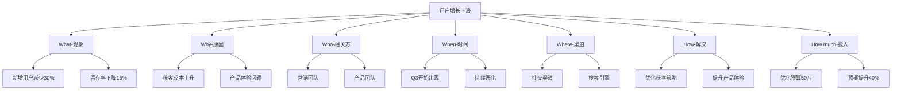

# 5W2H分析法：产品经理的问题分析利器

## 一、什么是5W2H分析法？

5W2H分析法是一种科学的思维方法，通过回答7个基本问题来全面分析和解决问题：
- What（是什么）：问题或目标是什么
- Why（为什么）：为什么要这样做
- Who（谁）：相关人员是谁
- When（何时）：何时开始、何时结束
- Where（何处）：在哪里进行
- How（如何）：如何进行
- How much（多少）：需要多少成本或资源

## 二、5W2H在产品工作中的应用

### 2.1 需求分析场景

以下是使用5W2H分析法评估一个社交产品新功能"短视频直播"的案例：

#### 案例分析：社交产品新增短视频直播功能

1. **What（是什么）**
   - 在现有社交平台中增加短视频直播功能
   - 支持实时互动、礼物打赏、弹幕互动等核心功能
   - 提供直播回放和视频剪辑能力

2. **Why（为什么）**
   - 市场趋势：短视频直播成为主流社交方式
   - 用户需求：根据调研，60%用户希望有更丰富的互动方式
   - 商业价值：打造新的变现渠道，预期提升平台收入30%

3. **Who（谁）**
   - 目标用户：18-35岁的年轻用户群体
   - 关键角色：
     * 内容创作者（主播）
     * 观众（普通用户）
     * 运营团队
     * 技术团队

4. **When（何时）**
   - 项目时间线：
     * 需求调研：2周
     * 功能开发：8周
     * 内测优化：2周
     * 正式上线：预计Q2初
   - 重要时间节点：避开竞品大型活动期，选择用户活跃度高的时间段

5. **Where（何处）**
   - 功能入口：App首页顶部导航栏
   - 应用场景：
     * 用户日常社交互动
     * 特定话题直播
     * 品牌营销活动

6. **How（如何）**
   - 技术实现：
     * 采用RTMP协议实现低延迟直播
     * 使用CDN加速保证流畅度
     * 实现AI内容审核保证内容安全
   - 运营策略：
     * 邀请KOL进行首发内容创作
     * 设计激励机制吸引优质创作者
     * 制定完善的内容运营规范

7. **How much（多少）**
   - 开发成本：约50万（包含服务器、CDN等基础设施）
   - 运营成本：首期运营预算30万
   - 预期收益：
     * 月活提升20%
     * 用户停留时长提升30%
     * 平台营收提升25%

### 2.2 问题诊断场景

#### 案例：用户增长下滑问题诊断

## 三、5W2H分析法的最佳实践

### 3.1 使用技巧

1. **循序渐进**
   - 按照逻辑顺序依次分析
   - 每个维度要具体和量化
   - 注意各维度之间的关联性

2. **重点把握**
   - What和Why是核心问题
   - How和How much是解决方案
   - Who、When、Where是执行要素

3. **常见误区**
   - 分析过于表面
   - 缺乏数据支持
   - 忽略可行性验证

### 3.2 分析模板

提供一个通用的5W2H分析模板：

| 维度 | 关键问题 | 分析要点 |
|------|----------|----------|
| What | 目标是什么？ | • 具体目标\n• 预期效果\n• 衡量标准 |
| Why | 为什么要做？ | • 业务价值\n• 用户价值\n• 市场机会 |
| Who | 相关方是谁？ | • 目标用户\n• 干系人\n• 执行团队 |
| When | 何时执行？ | • 时间节点\n• 里程碑\n• 关键节点 |
| Where | 在哪执行？ | • 应用场景\n• 使用环境\n• 渠道选择 |
| How | 如何实现？ | • 实现方案\n• 执行步骤\n• 保障措施 |
| How much | 投入产出？ | • 资源投入\n• 预期收益\n• ROI分析 |

## 四、实战练习

### 练习一：电商APP购物车优化

尝试使用5W2H方法分析以下场景：
"发现购物车商品加购率高，但转化率低，需要优化购物车功能"

**参考分析框架：**
1. What：购物车转化率低的具体表现是什么？
2. Why：造成这个问题的原因是什么？
3. Who：影响了哪些用户群体？
4. When：什么时候开始出现这个问题？
5. Where：在哪些场景下最明显？
6. How：如何解决这个问题？
7. How much：需要投入多少资源，预期收益如何？

### 练习二：新功能评估

针对"是否要增加社交分享功能"进行5W2H分析，重点关注：
- 用户需求验证
- 技术可行性
- 运营策略
- 投入产出比

## 五、总结

5W2H分析法是产品经理必备的分析工具，它能帮助我们：
1. 全面理解问题本质
2. 系统规划解决方案
3. 有效控制执行过程
4. 准确评估投入产出

在实际工作中，要根据具体场景灵活运用，结合数据分析、用户研究等方法，做出更科学的决策。