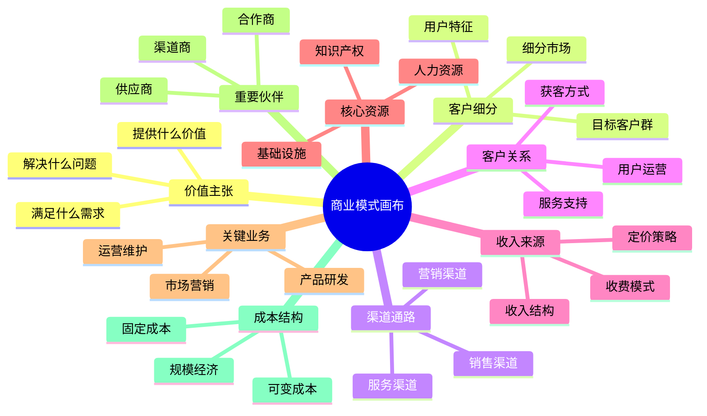
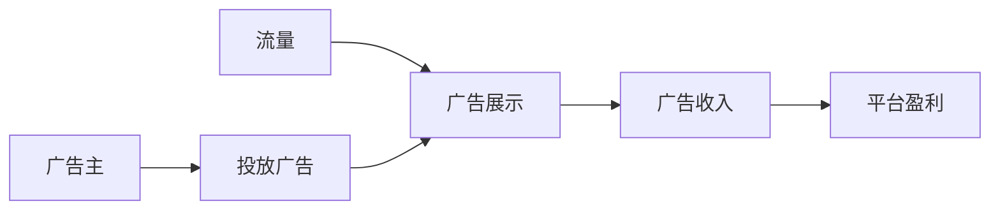
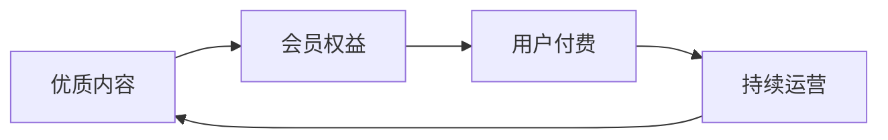
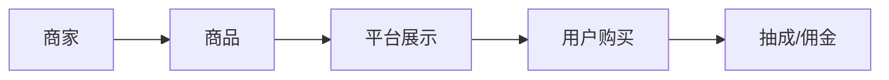
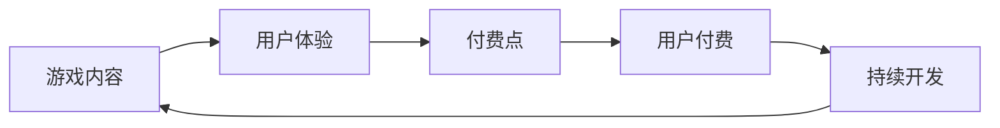
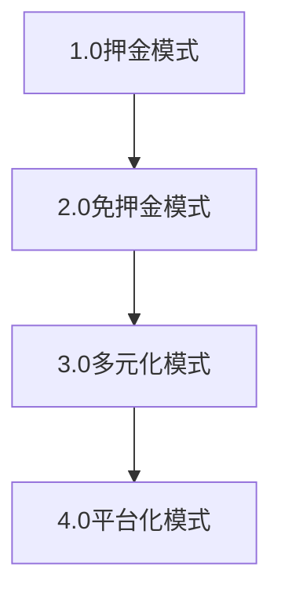

# 商业模式分析：产品变现与价值实现的指南

## 一、商业模式的本质

### 1.1 什么是商业模式？

商业模式是一个组织创造、传递和获取价值的基本原理。它描述了：
1. 如何为客户创造价值
2. 如何将价值传递给客户
3. 如何从中获取收益

### 1.2 商业模式画布



## 二、主流商业模式分析

### 2.1 互联网产品常见商业模式

#### 1. 广告模式


**案例分析：今日头条**
- 变现方式：信息流广告、开屏广告
- 优势：用户基数大，算法精准
- 挑战：广告体验与内容体验的平衡

#### 2. 会员订阅模式


**案例分析：腾讯视频**
- 变现方式：VIP会员、超级会员
- 优势：收入稳定，用户粘性强
- 挑战：内容成本高，同质化严重

#### 3. 电商模式


**案例分析：小红书**
- 变现方式：佣金抽成、广告收入
- 优势：变现路径清晰，场景自然
- 挑战：物流配送、售后服务

#### 4. 游戏模式


**案例分析：王者荣耀**
- 变现方式：道具销售、皮肤销售
- 优势：付费意愿强，ARPU值高
- 挑战：用户获取成本高，生命周期管理

### 2.2 商业模式创新方向

1. **平台化创新**
   - 连接供需两端
   - 建立生态体系
   - 实现网络效应

2. **社区化创新**
   - 用户内容生产
   - 社交关系链
   - 口碑传播

3. **场景化创新**
   - 场景整合
   - 服务延伸
   - 体验升级

## 三、商业模式分析方法

### 3.1 分析框架

#### 1. 价值分析
- 客户价值
- 商业价值
- 社会价值

#### 2. 可行性分析
- 技术可行性
- 运营可行性
- 财务可行性

#### 3. 竞争分析
- 市场格局
- 竞争优势
- 进入壁垒

### 3.2 评估维度

| 维度 | 关键指标 | 评估方法 |
|------|----------|----------|
| 盈利能力 | • ROI\n• 毛利率\n• 净利率 | • 财务分析\n• 成本核算\n• 收入预测 |
| 成长性 | • 用户增长率\n• 收入增长率\n• 市场份额 | • 趋势分析\n• 市场研究\n• 竞品对标 |
| 可持续性 | • 用户粘性\n• 竞争壁垒\n• 资源优势 | • 数据分析\n• 竞争分析\n• 资源评估 |

## 四、商业模式设计实践

### 4.1 设计流程

1. **市场调研**
   - 用户需求分析
   - 竞品模式研究
   - 市场机会评估

2. **模式设计**
   - 价值主张设计
   - 盈利模式设计
   - 运营模式设计

3. **可行性验证**
   - 小规模测试
   - 数据分析
   - 方案优化

4. **规模化实施**
   - 资源配置
   - 团队建设
   - 市场推广

### 4.2 案例分析：共享单车商业模式

#### 背景介绍
共享单车作为新型出行方式，重构了城市短途出行场景

#### 商业模式分析

1. **价值主张**
   - 解决最后一公里出行
   - 绿色环保的出行方式
   - 便捷的使用体验

2. **收入来源**
   - 骑行收费
   - 押金收益
   - 广告收入

3. **成本结构**
   - 车辆制造成本
   - 运维成本
   - 获客成本

4. **关键成功要素**
   - 规模效应
   - 运营效率
   - 用户体验

#### 模式演进


## 五、商业模式优化与创新

### 5.1 优化方向

1. **效率提升**
   - 成本优化
   - 流程优化
   - 资源整合

2. **体验升级**
   - 产品优化
   - 服务升级
   - 场景拓展

3. **价值延伸**
   - 业务扩展
   - 服务创新
   - 生态构建

### 5.2 创新策略

1. **商业模式创新矩阵**

| 创新维度 | 创新方向 | 案例 
|----------|----------|------
| 价值创新 | 新需求挖掘 | 抖音直播带货 
| 模式创新 | 新模式探索 | 社区团购 
| 技术创新 | 新技术应用 | 区块链支付 
| 场景创新 | 新场景开发 | 智慧零售 

2. **创新路径**
   ```mermaid
   graph LR
       A[需求洞察] --> B[模式创新]
       B --> C[市场验证]
       C --> D[持续优化]
       D --> A
   ```

## 六、实战练习

### 练习一：设计一个教育产品的商业模式

要求：
1. 明确目标用户群
2. 设计核心价值主张
3. 规划收入来源
4. 分析成本结构
5. 评估可行性

### 练习二：分析一个失败商业模式案例

步骤：
1. 描述商业模式
2. 分析失败原因
3. 总结经验教训
4. 提出优化建议
5. 探讨创新方向

## 七、总结

商业模式分析与设计是产品成功的关键，需要：
1. 深入理解用户需求
2. 准确把握市场机会
3. 合理设计盈利模式
4. 持续优化和创新
5. 保持竞争力

成功的商业模式应该：
- 创造真实价值
- 具有可持续性
- 保持竞争优势
- 能够规模化
- 持续创新进化