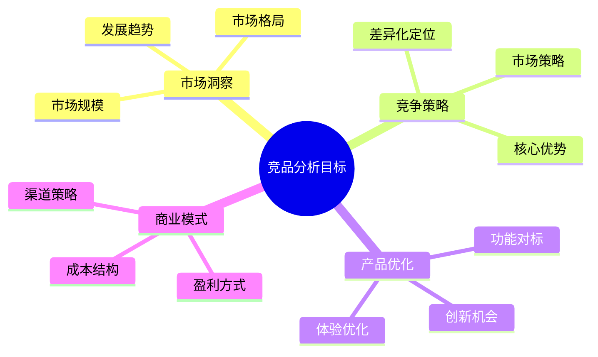

# 竞品分析：产品经理的战略洞察工具

## 一、竞品分析的意义与目标

### 1.1 为什么要做竞品分析？

竞品分析是产品策略制定的重要依据，能够帮助我们：
1. 了解市场格局和竞争态势
2. 发现产品差异化机会
3. 避免重复竞品错误
4. 找到市场蓝海机会

### 1.2 竞品分析的核心目标



## 二、竞品分析的方法论

### 2.1 竞品分析框架

#### RAID分析法

1. **Research（研究）**
   - 市场研究
   - 用户调研
   - 数据分析

2. **Analyze（分析）**
   - 功能对比
   - 优劣势分析
   - 商业模式解析

3. **Insight（洞察）**
   - 趋势判断
   - 机会识别
   - 风险预警

4. **Decision（决策）**
   - 策略制定
   - 行动计划
   - 资源配置

### 2.2 竞品分析维度

| 维度 | 分析要点 | 数据来源 |
|------|----------|----------|
| 产品定位 | • 目标用户\n• 核心价值\n• 品牌调性 | • 官网介绍\n• 产品文案\n• 用户反馈 |
| 功能特性 | • 核心功能\n• 差异化功能\n• 技术实现 | • 产品体验\n• 技术分析\n• 专利文献 |
| 用户体验 | • 交互设计\n• 视觉风格\n• 用户评价 | • 实际体验\n• 用户评论\n• ASO分析 |
| 商业模式 | • 盈利方式\n• 成本结构\n• 渠道策略 | • 财报数据\n• 市场研报\n• 新闻报道 |
| 运营策略 | • 获客方式\n• 活动策划\n• 用户运营 | • 社交媒体\n• 运营活动\n• 数据监测 |

## 三、竞品分析实战案例

### 3.1 短视频平台竞品分析案例

#### 案例背景
某短视频平台计划进行产品升级，需要对主要竞品进行全面分析

#### 分析框架

1. **市场概况**
   ```
   市场规模：2023年短视频市场规模达8000亿
   用户规模：月活用户超8亿
   增长态势：年增长率维持在25%以上
   ```

2. **竞品对比分析**

   | 维度 | 竞品A | 竞品B | 竞品C |
   |------|-------|-------|-------|
   | 月活用户 | 7亿+ | 5亿+ | 3亿+ |
   | 用户画像 | Z世代为主 | 泛娱乐人群 | 垂直领域 |
   | 核心功能 | 短视频+直播 | 视频+社交 | 专业内容 |
   | 变现方式 | 直播+广告 | 会员+广告 | 付费课程 |

3. **差异化分析**
   
   ```mermaid
   pie title 核心竞争力分布
       "内容生态" : 40
       "技术能力" : 25
       "用户基础" : 20
       "商业变现" : 15
   ```

4. **SWOT分析**

   ```mermaid
   graph TB
       S[优势Strengths]
       W[劣势Weaknesses]
       O[机会Opportunities]
       T[威胁Threats]
       
       S --> S1[技术领先]
       S --> S2[用户基数大]
       W --> W1[获客成本高]
       W --> W2[变现能力弱]
       O --> O1[新兴市场]
       O --> O2[技术创新]
       T --> T1[政策风险]
       T --> T2[竞争加剧]
   ```

### 3.2 竞品分析报告模板

#### 1. 执行摘要
- 分析目的
- 核心发现
- 关键建议

#### 2. 市场分析
- 市场规模
- 竞争格局
- 发展趋势

#### 3. 竞品详细分析
- 产品定位
- 功能特性
- 用户体验
- 商业模式
- 运营策略

#### 4. 对标分析
- 优势分析
- 差距分析
- 机会点分析

#### 5. 建议与规划
- 战略建议
- 战术建议
- 执行计划

## 四、竞品分析工具箱

### 4.1 数据采集工具

1. **市场数据**
   - App Annie：应用市场数据
   - SimilarWeb：网站流量数据
   - QuestMobile：移动互联网数据

2. **用户数据**
   - 应用商店评论
   - 社交媒体提及
   - 用户调研报告

3. **技术分析**
   - 抓包工具
   - 性能监测
   - 代码分析

### 4.2 分析方法工具

1. **战略分析**
   - SWOT分析
   - 波特五力模型
   - 价值曲线分析

2. **用户分析**
   - 用户画像
   - 使用场景
   - 需求分析

3. **功能分析**
   - 功能清单
   - 信息架构
   - 交互流程

## 五、竞品分析的注意事项

### 5.1 分析误区

1. **数据陷阱**
   - 过度依赖单一数据源
   - 忽视数据时效性
   - 数据解读片面

2. **认知偏差**
   - 过度关注表象
   - 主观臆断
   - 确认偏误

3. **方法误区**
   - 照搬竞品功能
   - 忽视场景差异
   - 缺乏创新思维

### 5.2 最佳实践

1. **保持客观中立**
   - 多维度数据验证
   - 避免主观臆断
   - 理性分析判断

2. **注重实操验证**
   - 亲身体验产品
   - 收集一手数据
   - 验证关键假设

3. **持续跟踪更新**
   - 建立监控机制
   - 定期更新分析
   - 及时调整策略

## 六、实战练习

### 练习一：社交产品竞品分析

选择3个主流社交产品，从以下维度进行分析：
1. 用户群体画像
2. 核心功能对比
3. 商业模式分析
4. 运营策略研究
5. 产品优劣势总结

### 练习二：新产品机会分析

基于竞品分析，探索新产品机会：
1. 市场空白点分析
2. 用户痛点识别
3. 差异化策略设计
4. 商业可行性评估
5. 风险因素分析

## 七、总结

竞品分析是产品经理的基础能力，需要：
1. 系统的分析框架
2. 科学的研究方法
3. 持续的学习更新
4. 战略性思维
5. 创新性思维

通过持续的竞品分析，我们能够：
- 准确把握市场机会
- 制定有效竞争策略
- 持续优化产品体验
- 实现商业目标