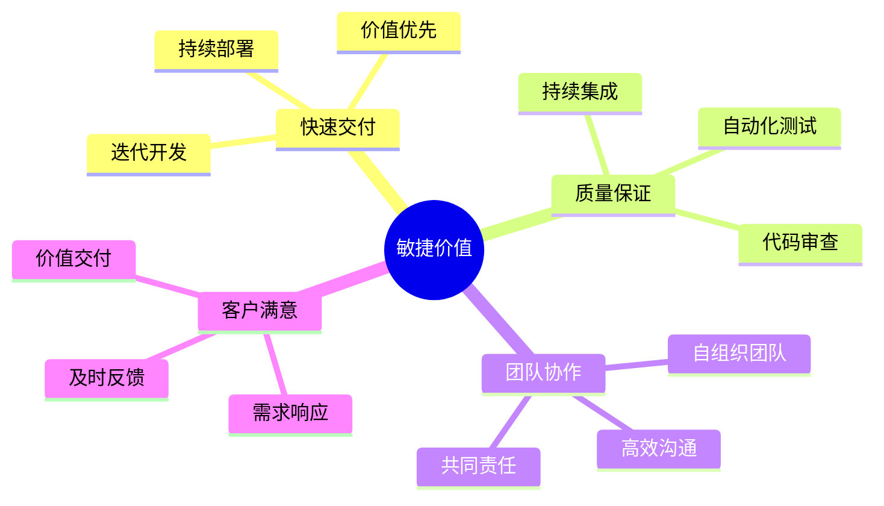
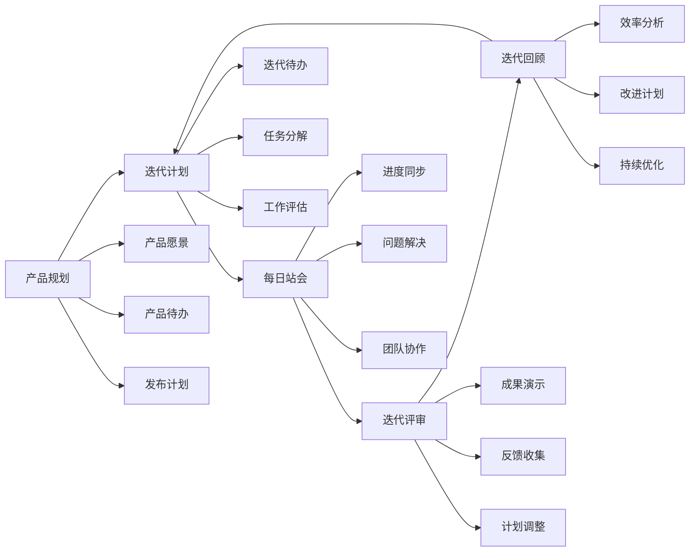
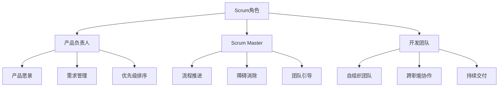
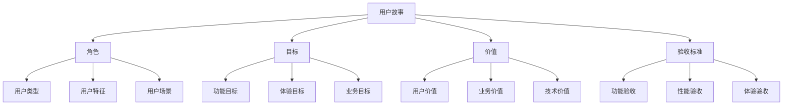

# 敏捷开发：灵活高效的项目管理方法

## 一、敏捷开发概述

### 1.1 什么是敏捷开发？

敏捷开发（Agile Development）是一种以人为核心、迭代、循序渐进的开发方法，主要特点包括：
- 快速迭代
- 持续交付
- 响应变化
- 团队协作

### 1.2 敏捷开发的价值



## 二、敏捷开发方法论

### 2.1 敏捷宣言

1. **核心价值观**
   - 个体和互动高于流程和工具
   - 工作的软件高于详尽的文档
   - 客户合作高于合同谈判
   - 响应变化高于遵循计划

2. **十二条原则**
   ```markdown
   1. 最高优先级是通过持续不断地及早交付有价值的软件使客户满意
   2. 欢迎需求变化，即使在开发后期也欢迎
   3. 经常性地交付可工作的软件，周期从几周到几个月
   4. 业务人员和开发人员必须相互合作
   5. 激励个体，信任他们，提供支持环境
   6. 面对面的沟通是最有效的沟通方式
   7. 可工作的软件是进度的首要度量标准
   8. 可持续开发，保持稳定的步调
   9. 持续关注技术卓越和良好设计
   10. 简单性至关重要
   11. 最好的架构、需求和设计来自自组织团队
   12. 定期反思如何提高团队效率
   ```

### 2.2 敏捷开发流程



## 三、敏捷开发实践

### 3.1 Scrum框架

1. **角色定义**


2. **工件管理**
   ```markdown
   1. 产品待办列表（Product Backlog）
      - 用户故事
      - 功能特性
      - 技术需求
      - 改进项目
   
   2. 迭代待办列表（Sprint Backlog）
      - 迭代目标
      - 任务分解
      - 工作量估算
      - 进度跟踪
   
   3. 产品增量（Increment）
      - 可工作软件
      - 完成标准
      - 验收标准
      - 发布计划
   ```

### 3.2 敏捷实践技术

1. **用户故事**


2. **看板管理**
   ```markdown
   1. 看板列设置
      - 待办
      - 进行中
      - 评审中
      - 已完成
   
   2. 工作流管理
      - WIP限制
      - 拉动原则
      - 瓶颈识别
      - 流程优化
   
   3. 可视化管理
      - 任务状态
      - 团队负载
      - 进度监控
      - 问题跟踪
   ```

## 四、敏捷团队建设

### 4.1 团队组织

1. **团队特征**
   - 自组织性
   - 跨职能性
   - 高效协作
   - 持续学习

2. **团队规模**
   - 核心团队：5-9人
   - 扩展团队：2-3个Scrum团队
   - 团队分工：跨职能合作

### 4.2 团队协作

1. **沟通方式**
   ```mermaid
   graph TD
       A[团队沟通] --> B[日常沟通]
       A --> C[会议沟通]
       A --> D[工具沟通]
       A --> E[文档沟通]
       
       B --> B1[面对面交流]
       B --> B2[即时消息]
       B --> B3[非正式会议]
       
       C --> C1[站会]
       C --> C2[评审会]
       C --> C3[回顾会]
       
       D --> D1[协作工具]
       D --> D2[开发工具]
       D --> D3[沟通工具]
       
       E --> E1[需求文档]
       E --> E2[设计文档]
       E --> E3[会议记录]
   ```

## 五、敏捷工具与实践

### 5.1 敏捷工具

1. **项目管理工具**
   - JIRA
   - Trello
   - Azure DevOps
   - Monday

2. **协作工具**
   - Confluence
   - Wiki
   - Notion
   - Teams

### 5.2 实践要点

1. **需求管理**
   - 用户故事
   - 优先级排序
   - 迭代计划
   - 验收标准

2. **开发管理**
   - 持续集成
   - 自动化测试
   - 代码审查
   - 持续部署

## 六、敏捷转型实践

### 6.1 转型策略

1. **准备阶段**
   - 评估现状
   - 设定目标
   - 制定计划
   - 团队培训

2. **实施阶段**
   - 试点项目
   - 逐步推广
   - 持续改进
   - 文化建设

### 6.2 常见问题

1. **团队问题**
   - 角色认知
   - 职责划分
   - 协作方式
   - 文化适应

2. **流程问题**
   - 流程执行
   - 工具使用
   - 文档管理
   - 质量保证

## 七、总结

敏捷开发需要注意：
1. 以人为本
2. 持续改进
3. 价值导向
4. 团队协作
5. 快速响应

成功的敏捷实践应该：
- 适应团队
- 符合业务
- 持续优化
- 创造价值
- 促进创新