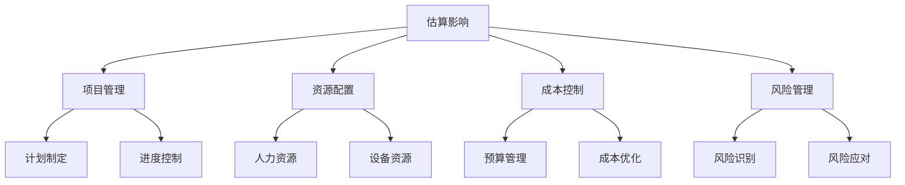
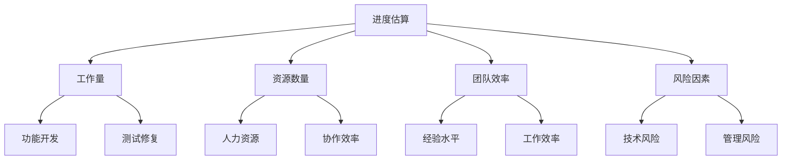

# 项目估算指南

> 远哥说：项目估算是产品经理的一项重要技能，准确的估算能够帮助我们更好地规划资源、控制进度。这里我结合实际经验，和大家分享一下项目估算的方法和技巧。

## 一、估算的重要性

### 1.1 为什么要估算
```
对项目的意义：
- 合理分配资源
- 制定项目计划
- 控制项目风险
- 管理相关方预期

对团队的意义：
- 明确工作量
- 合理安排任务
- 提高工作效率
- 减少加班压力
```

### 1.2 估算的影响


## 二、估算的方法

### 2.1 常用估算方法
| 方法 | 特点 | 适用场景 | 注意事项 |
|------|------|----------|----------|
| 类比法 | 参考历史经验 | 相似项目 | 项目差异性 |
| 专家判断 | 依靠专家经验 | 创新项目 | 专家可靠性 |
| 参数法 | 使用统计数据 | 标准化项目 | 参数准确性 |
| 自下而上 | 细化后汇总 | 复杂项目 | 工作量大 |

### 2.2 估算技巧
> 远哥说：估算不是猜测，而是要基于数据和经验进行科学的判断。

```
估算步骤：
1. 收集信息
   - 需求文档
   - 历史数据
   - 团队能力
   - 资源情况

2. 分解任务
   - 功能模块
   - 技术组件
   - 测试项目
   - 部署环节

3. 评估工作量
   - 开发工作量
   - 测试工作量
   - 部署工作量
   - 管理工作量

4. 考虑因素
   - 技术难度
   - 团队经验
   - 沟通成本
   - 风险缓冲
```

## 三、工作量估算

### 3.1 开发工作量
```
估算维度：
- 功能复杂度
- 技术难度
- 代码量
- 测试需求

影响因素：
1. 团队经验
2. 技术栈熟悉度
3. 开发规范性
4. 复用程度
```

### 3.2 案例分析
> 远哥说：我来分享一个电商项目的估算案例。

| 模块 | 功能点 | 复杂度 | 工作量(人天) | 备注 |
|------|--------|---------|---------------|------|
| 商品 | 列表展示 | 中 | 5 | 含筛选、排序 |
| 商品 | 详情页面 | 高 | 8 | 含规格选择 |
| 购物车 | 基础功能 | 中 | 6 | 增删改查 |
| 订单 | 下单流程 | 高 | 10 | 含支付流程 |
| 用户 | 个人中心 | 低 | 4 | 基础信息 |

## 四、进度估算

### 4.1 估算要素


### 4.2 估算公式
```
基本公式：
项目工期 = 工作量 / (资源数量 × 效率系数)

效率系数考虑因素：
- 团队协作：0.7-0.9
- 新技术应用：0.6-0.8
- 需求不确定：0.7-0.9
- 外部依赖：0.8-0.9

实际案例：
某功能开发
- 估算工作量：10人天
- 开发人数：2人
- 效率系数：0.8
实际工期 = 10 / (2 × 0.8) = 6.25天
```

## 五、成本估算

### 5.1 成本构成
```
人力成本：
- 开发人员
- 测试人员
- 运维人员
- 项目管理

设备成本：
1. 开发设备
2. 测试设备
3. 服务器
4. 办公设备

其他成本：
- 软件授权
- 云服务
- 第三方服务
- 办公场地
```

### 5.2 估算方法
| 成本类型 | 估算方法 | 计算公式 | 注意事项 |
|----------|----------|----------|----------|
| 人力成本 | 工时核算 | 工时×单价 | 考虑福利 |
| 设备成本 | 直接计算 | 数量×单价 | 考虑折旧 |
| 服务成本 | 询价对比 | 服务价格 | 考虑增长 |
| 管理成本 | 比例估算 | 总成本×比例 | 控制比例 |

## 六、风险估算

### 6.1 风险识别
> 远哥说：项目估算要预留风险缓冲，但不是越多越好，要根据实际情况来定。

```
常见风险：
- 需求变更
- 技术难题
- 人员变动
- 外部依赖

风险等级：
1. 高风险：影响大
2. 中风险：影响中
3. 低风险：影响小
```

### 6.2 风险应对
| 风险类型 | 影响程度 | 缓冲系数 | 应对策略 |
|----------|----------|----------|----------|
| 需求不明 | 高 | 1.5-2.0 | 加强沟通 |
| 技术创新 | 高 | 1.3-1.5 | 提前预研 |
| 团队新手 | 中 | 1.2-1.3 | 配备导师 |
| 环境依赖 | 低 | 1.1-1.2 | 提前准备 |

## 七、最佳实践

### 7.1 估算清单
```
基础信息：
□ 项目范围
□ 技术架构
□ 团队情况
□ 时间要求

估算内容：
□ 工作量估算
□ 进度估算
□ 成本估算
□ 风险估算

评审确认：
□ 技术评审
□ 管理评审
□ 客户确认
□ 项目立项
```

### 7.2 注意事项
> 远哥说：这些年做项目估算，我总结了几点经验：

```
估算原则：
1. 科学性
   - 基于数据
   - 参考历史
   - 多方验证
   - 持续优化

2. 合理性
   - 考虑风险
   - 预留缓冲
   - 分阶段估算
   - 动态调整

3. 可行性
   - 团队能力
   - 资源约束
   - 时间限制
   - 成本控制
```

## 八、常见问题

### 8.1 估算误区
```
常见误区：
- 过于乐观
- 忽视风险
- 经验主义
- 不留缓冲

改进方法：
1. 多方论证
2. 合理预留
3. 及时调整
4. 持续优化
```

### 8.2 优化建议
| 问题 | 表现 | 原因 | 解决方案 |
|------|------|------|----------|
| 估算偏差 | 实际超出 | 考虑不全 | 完善方法 |
| 资源冲突 | 人力不足 | 规划不当 | 优化配置 |
| 进度延误 | 无法按期 | 风险发生 | 及时调整 |
| 成本超支 | 预算不足 | 控制不力 | 加强管理 |

## 九、工具推荐

### 9.1 估算工具
```
项目管理工具：
- Microsoft Project
- 禅道
- JIRA
- Redmine

估算辅助工具：
1. Excel模板
2. 在线计算器
3. 估算模型
4. 项目档案库
```

### 9.2 使用建议
```
工具选择：
- 适合团队规模
- 易于上手
- 数据可靠
- 可持续使用

使用技巧：
1. 建立模板
2. 积累数据
3. 及时更新
4. 定期分析
```

## 十、总结

> 远哥说：项目估算是一门艺术，需要不断实践和总结。好的估算能让项目更顺利，团队更轻松。

```
关键要点：
1. 方法论
   - 选择合适方法
   - 建立估算体系
   - 持续优化改进

2. 实践经验
   - 积累历史数据
   - 总结最佳实践
   - 建立知识库

3. 团队协作
   - 多方参与
   - 充分沟通
   - 达成共识

4. 持续改进
   - 跟踪实际情况
   - 分析偏差原因
   - 优化估算方法
```
