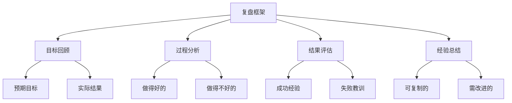

# 项目复盘指南

> 远哥说：项目复盘是一个很重要但经常被忽视的环节。好的复盘能帮助团队总结经验教训，持续改进，让下一个项目做得更好。

## 一、复盘的意义

### 1.1 为什么要复盘
```
对团队的价值：
- 总结经验教训
- 沉淀最佳实践
- 促进团队成长
- 提升执行效率

对个人的价值：
- 经验积累
- 能力提升
- 问题反思
- 持续进步
```

### 1.2 复盘的重要性
> 远哥说：复盘就像照镜子，让我们能够清晰地看到自己的优点和不足。

| 维度 | 作用 | 价值 | 案例 |
|------|------|------|------|
| 流程优化 | 发现流程问题 | 提升效率 | 简化审批流程 |
| 方法改进 | 总结方法论 | 提高质量 | 完善评审机制 |
| 能力提升 | 积累经验 | 团队成长 | 技术分享会 |
| 文化建设 | 形成文化 | 增强凝聚力 | 复盘常态化 |

## 二、复盘的方法

### 2.1 复盘框架


### 2.2 复盘步骤
> 远哥说：复盘不是批评会，而是帮助团队共同进步的机会。

```
准备阶段：
1. 收集数据和材料
2. 整理关键事件
3. 准备复盘提纲
4. 通知相关人员

执行阶段：
- 目标回顾
- 过程分析
- 问题梳理
- 经验总结

跟进阶段：
□ 形成改进计划
□ 分配行动项
□ 跟踪执行情况
□ 验证改进效果
```

## 三、复盘的内容

### 3.1 复盘维度
```
目标维度：
- 目标达成情况
- 偏差原因分析
- 目标设定合理性
- 调整建议

过程维度：
1. 计划执行情况
2. 资源使用情况
3. 团队协作情况
4. 风险管理情况

结果维度：
- 质量达成情况
- 进度达成情况
- 成本控制情况
- 客户满意度
```

### 3.2 案例分享
> 远哥说：我来分享一个电商项目的复盘案例。

```
项目背景：
双11大促技术改造项目

复盘要点：

1. 目标回顾
   预期目标：
   - 系统承载10倍日常流量
   - 订单处理延时<100ms
   - 零故障运行
   
   实际结果：
   - 承载8倍流量
   - 订单延时150ms
   - 出现2次小故障

2. 过程分析
   做得好的：
   - 提前做了充分的压测
   - 建立了完善的监控
   - 团队配合默契
   
   需要改进：
   - 应急预案不够完善
   - 部分场景考虑不足
   - 测试覆盖不够全面

3. 经验总结
   可复制经验：
   - 压测方案
   - 监控体系
   - 团队协作机制
   
   改进建议：
   - 完善应急预案
   - 扩大测试覆盖
   - 优化系统架构
```

## 四、复盘的工具

### 4.1 常用工具
| 工具类型 | 工具名称 | 适用场景 | 使用技巧 |
|----------|----------|----------|----------|
| 会议工具 | 飞书、腾讯会议 | 远程复盘 | 录制会议 |
| 文档工具 | Confluence、语雀 | 经验沉淀 | 模板管理 |
| 分析工具 | Excel、PowerBI | 数据分析 | 可视化 |
| 协作工具 | 石墨、腾讯文档 | 共创编辑 | 实时协作 |

### 4.2 工具使用
```
文档模板：
- 复盘会议纪要
- 项目总结报告
- 经验分享文档
- 改进计划表

可视化方法：
1. 甘特图
2. 燃尽图
3. 数据图表
4. 流程图
```

## 五、复盘会议管理

### 5.1 会议组织
```
会前准备：
- 确定参会人员
- 准备会议材料
- 发送会议邀请
- 布置会议环境

会中管理：
1. 明确会议目标
2. 控制会议节奏
3. 引导积极讨论
4. 记录关键点

会后跟进：
- 整理会议纪要
- 分发行动项
- 跟踪改进计划
- 验证改进效果
```

### 5.2 会议技巧
> 远哥说：复盘会议要营造开放、坦诚的氛围，鼓励大家畅所欲言。

| 环节 | 要点 | 注意事项 | 时间控制 |
|------|------|----------|----------|
| 开场 | 说明目的 | 设定基调 | 5-10分钟 |
| 回顾 | 数据展示 | 客观陈述 | 15-20分钟 |
| 讨论 | 深入分析 | 聚焦重点 | 30-40分钟 |
| 总结 | 达成共识 | 明确方向 | 10-15分钟 |

## 六、最佳实践

### 6.1 复盘清单
```
会前准备：
□ 收集项目数据
□ 整理关键事件
□ 准备分析材料
□ 通知相关人员

会议进行：
□ 目标回顾
□ 过程分析
□ 问题梳理
□ 经验总结

会后跟进：
□ 形成会议纪要
□ 制定改进计划
□ 分配行动项
□ 跟踪执行情况
```

### 6.2 经验分享
> 远哥说：做了这么多年复盘，我总结了几点心得：

```
复盘原则：
1. 客观事实
   - 以数据说话
   - 避免主观臆断
   - 全面了解情况

2. 建设性建议
   - 关注解决方案
   - 避免互相指责
   - 促进团队成长

3. 持续改进
   - 制定改进计划
   - 跟踪执行情况
   - 验证改进效果

4. 知识沉淀
   - 记录经验教训
   - 形成最佳实践
   - 建立知识库
```

## 七、常见问题

### 7.1 复盘误区
```
常见误区：
- 流于形式
- 避重就轻
- 互相推诿
- 缺乏跟进

解决方法：
1. 明确目的
2. 聚焦重点
3. 追求实效
4. 重视执行
```

### 7.2 应对策略
| 问题 | 表现 | 原因 | 解决方案 |
|------|------|------|----------|
| 参与度低 | 发言少 | 氛围不够开放 | 引导讨论 |
| 避重就轻 | 不谈问题 | 怕担责任 | 明确目的 |
| 缺乏行动 | 改进慢 | 执行不到位 | 跟踪督促 |
| 效果不佳 | 问题反复 | 方法不当 | 优化方法 |

## 八、总结

> 远哥说：复盘不是项目的结束，而是新的开始。好的复盘能帮助团队不断进步，让每个人都能从中获得成长。

```
复盘的价值：
1. 团队层面
   - 提升执行效率
   - 优化工作方法
   - 促进团队成长
   - 建立最佳实践

2. 个人层面
   - 积累项目经验
   - 提升专业能力
   - 培养复盘思维
   - 促进自我成长

3. 组织层面
   - 沉淀经验教训
   - 优化管理流程
   - 提升组织能力
   - 形成学习文化
```
