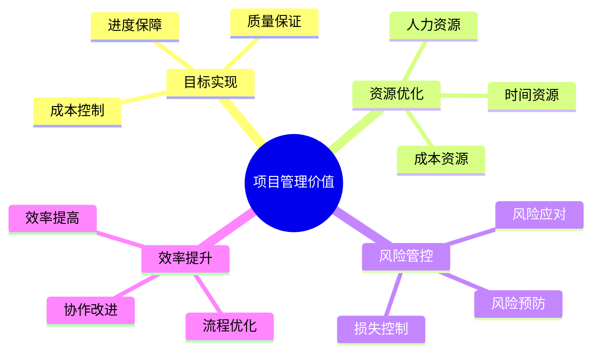
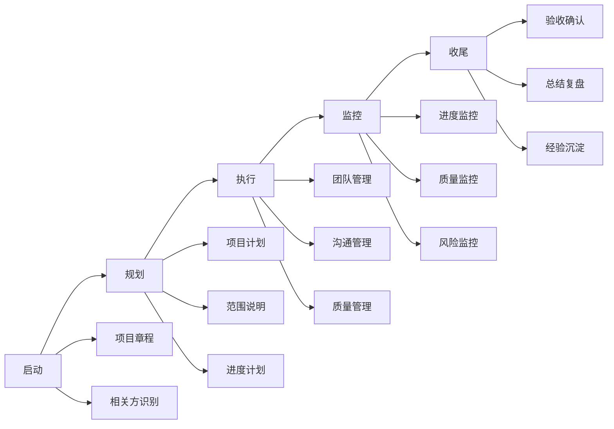
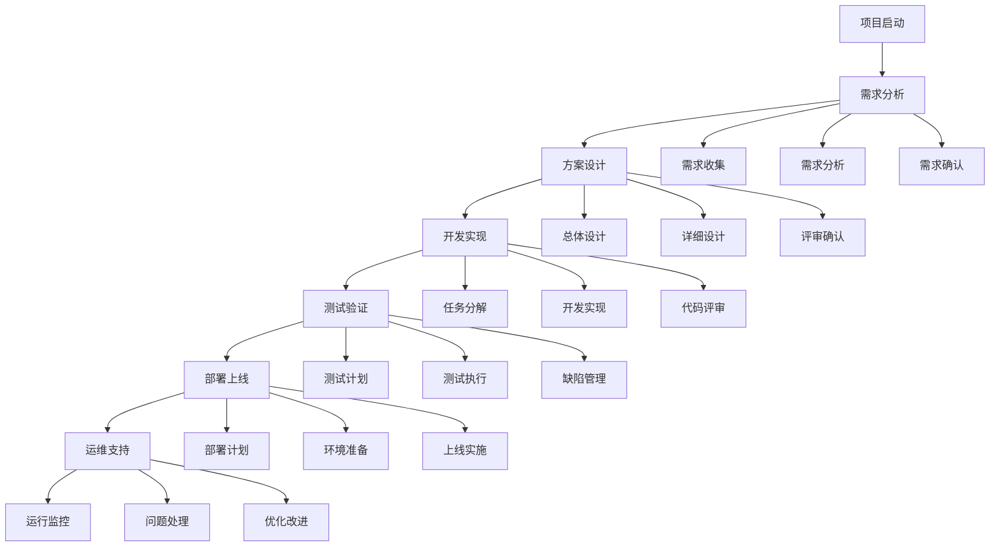
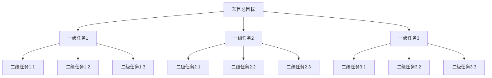
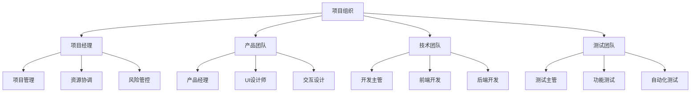
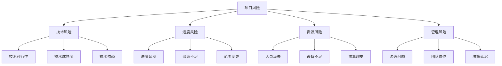

# 项目管理：高效推进产品落地实现

## 一、项目管理概述

### 1.1 什么是项目管理？

项目管理是在有限的资源约束下，运用专门的知识、技能、工具和技术，对项目活动进行管理，以满足项目的要求。主要包括：
- 项目规划
- 进度管理
- 资源管理
- 风险控制

### 1.2 项目管理的价值



## 二、项目管理方法论

### 2.1 管理框架

1. **PMBOK框架**
   - 项目整合管理
   - 项目范围管理
   - 项目进度管理
   - 项目成本管理
   - 项目质量管理
   - 项目资源管理
   - 项目沟通管理
   - 项目风险管理
   - 项目采购管理
   - 项目相关方管理

2. **项目生命周期**


### 2.2 管理流程



## 三、项目管理实践

### 3.1 项目规划

1. **项目章程**
```markdown
1. 项目概述
   - 项目背景
   - 项目目标
   - 项目范围
   - 关键干系人

2. 项目组织
   - 组织结构
   - 角色职责
   - 沟通机制
   - 汇报路线

3. 项目计划
   - 里程碑计划
   - 资源计划
   - 预算计划
   - 风险计划
```

2. **WBS分解**


### 3.2 进度管理

1. **甘特图**
   ```markdown
   项目进度计划示例：
   
   Week1  Week2  Week3  Week4  Week5
   任务1  =====>
   任务2        =====>
   任务3              =========>
   任务4                    =====>
   任务5                          ====>
   
   关键路径：任务1 -> 任务3 -> 任务5
   ```

2. **里程碑计划**
   ```markdown
   1. 阶段一：需求分析（Week 1-2）
      - 需求调研完成
      - 需求文档评审通过
      - 原型设计确认
   
   2. 阶段二：设计开发（Week 3-6）
      - 概要设计完成
      - 详细设计评审
      - 核心功能开发
   
   3. 阶段三：测试部署（Week 7-8）
      - 功能测试完成
      - 性能测试通过
      - 系统正式上线
   ```

## 四、资源管理

### 4.1 人力资源管理

1. **团队组织**


2. **资源分配**
   ```markdown
   1. 人员分配
      - 角色配置
      - 技能要求
      - 工作量分配
      - 协作机制
   
   2. 设备分配
      - 硬件资源
      - 软件资源
      - 环境资源
      - 工具支持
   ```

### 4.2 成本管理

1. **预算管理**
   - 人力成本
   - 设备成本
   - 外包成本
   - 其他成本

2. **成本控制**
   - 预算执行
   - 成本监控
   - 偏差分析
   - 调整优化

## 五、风险管理

### 5.1 风险识别

1. **风险类型**


2. **风险评估**
   ```markdown
   风险评估矩阵：
   
   影响程度    低    中    高
   可能性
   高         中    高    高
   中         低    中    高
   低         低    低    中
   ```

### 5.2 风险应对

1. **应对策略**
   - 规避策略
   - 转移策略
   - 减轻策略
   - 接受策略

2. **应急计划**
   - 预警机制
   - 响应流程
   - 恢复方案
   - 总结改进

## 六、项目收尾

### 6.1 验收管理

1. **验收标准**
   - 功能验收
   - 性能验收
   - 安全验收
   - 文档验收

2. **验收流程**
   - 验收准备
   - 验收测试
   - 问题修复
   - 最终确认

### 6.2 经验总结

1. **项目复盘**
   - 目标达成
   - 过程分析
   - 问题总结
   - 经验提炼

2. **持续改进**
   - 流程优化
   - 方法改进
   - 工具完善
   - 能力提升

## 七、总结

项目管理需要注意：
1. 目标明确
2. 计划周密
3. 执行到位
4. 控制有效
5. 沟通顺畅

成功的项目管理应该：
- 按时交付
- 控制成本
- 保证质量
- 管控风险
- 满足需求