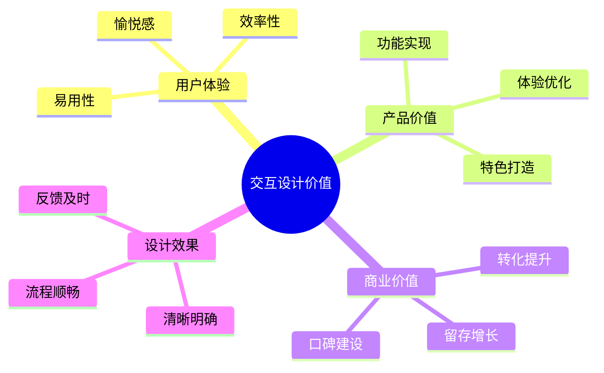
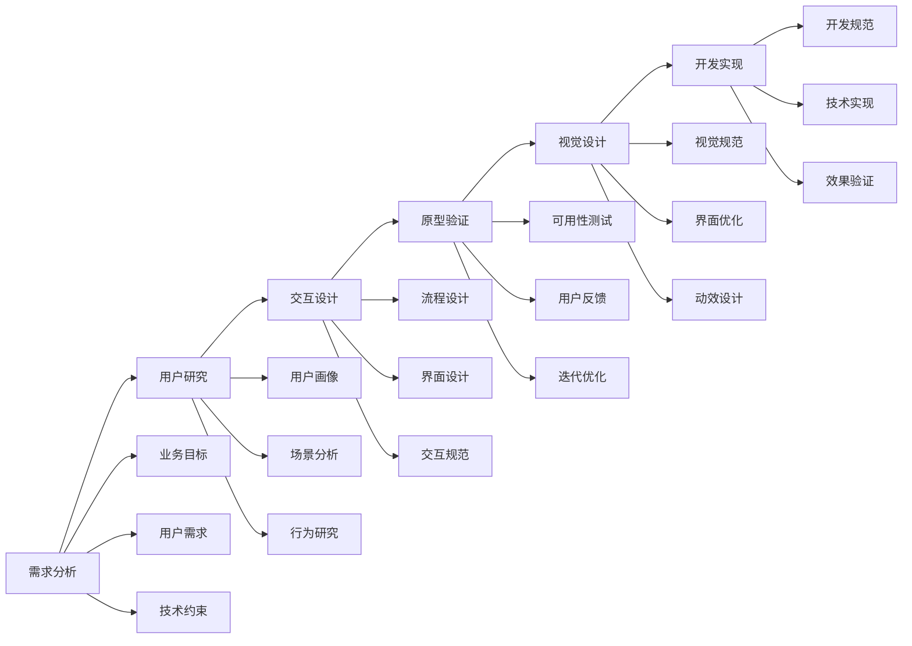
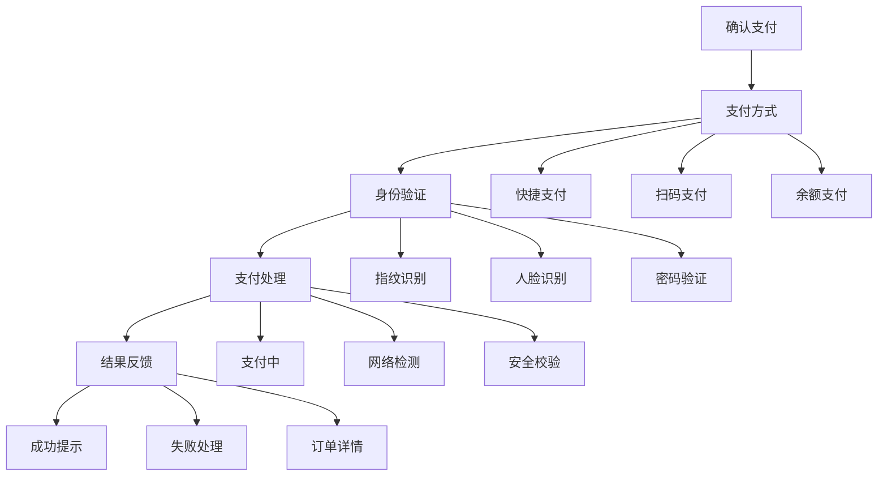

# 交互设计：打造流畅自然的用户体验

## 一、交互设计概述

### 1.1 什么是交互设计？

交互设计（Interaction Design，IxD）是设计产品的行为、操作方式和反馈机制的过程，主要包括：
- 用户行为设计
- 界面交互设计
- 操作流程设计
- 反馈机制设计

### 1.2 交互设计的价值



## 二、交互设计方法论

### 2.1 设计原则

1. **可见性原则**
   - 状态可见
   - 功能明确
   - 操作清晰
   - 反馈直观

2. **反馈原则**
   - 即时反馈
   - 明确提示
   - 状态变化
   - 结果展示

3. **一致性原则**
   - 视觉一致
   - 行为一致
   - 功能一致
   - 体验一致

4. **容错性原则**
   - 防错设计
   - 撤销机制
   - 确认提示
   - 异常处理

### 2.2 设计流程



## 三、交互设计实战案例

### 3.1 移动支付APP交互设计案例

#### 背景
某移动支付APP需要优化支付流程，提升支付成功率和用户体验

#### 设计方案

1. **支付流程优化**


2. **交互细节设计**
   ```markdown
   1. 金额确认
      - 大字体显示
      - 醒目色彩
      - 二次确认
   
   2. 支付方式
      - 快捷切换
      - 记住选择
      - 智能推荐
   
   3. 验证过程
      - 进度提示
      - 失败重试
      - 备选方案
   
   4. 结果反馈
      - 即时提示
      - 动效展示
      - 后续引导
   ```

3. **异常处理设计**
   ```mermaid
   graph TD
       A[异常处理] --> B[网络异常]
       A --> C[验证失败]
       A --> D[支付失败]
       A --> E[系统异常]
       
       B --> B1[重试机制]
       B --> B2[离线模式]
       B --> B3[状态恢复]
       
       C --> C1[重新验证]
       C --> C2[方式切换]
       C --> C3[帮助指引]
       
       D --> D1[原因分析]
       D --> D2[解决方案]
       D --> D3[客服支持]
       
       E --> E1[友好提示]
       E --> E2[备选方案]
       E --> E3[问题反馈]
   ```

### 3.2 交互优化要点

1. **流程优化**
   - 减少步骤
   - 简化操作
   - 智能预设
   - 快捷入口

2. **体验优化**
   - 视觉引导
   - 状态反馈
   - 动效设计
   - 微交互

## 四、交互设计规范与工具

### 4.1 设计规范

1. **界面规范**
   - 布局规则
   - 控件使用
   - 操作方式
   - 反馈机制

2. **交互规范**
   - 手势操作
   - 动效规则
   - 状态转换
   - 异常处理

### 4.2 设计工具

1. **原型工具**
   - Axure RP
   - Sketch
   - Figma
   - Adobe XD

2. **交互工具**
   - Principle
   - Framer
   - ProtoPie
   - Flinto

## 五、交互设计最佳实践

### 5.1 设计策略

1. **以用户为中心**
   - 用户需求
   - 使用场景
   - 行为习惯
   - 体验预期

2. **简单易用**
   - 减少认知负担
   - 降低操作难度
   - 提供明确指引
   - 保持一致性

3. **及时反馈**
   - 操作反馈
   - 状态提示
   - 结果展示
   - 异常处理

### 5.2 设计技巧

1. **视觉引导**
   - 重点突出
   - 层级清晰
   - 视觉流向
   - 注意力引导

2. **交互优化**
   - 减少等待
   - 简化步骤
   - 预防错误
   - 提供帮助

3. **体验提升**
   - 情感设计
   - 微交互
   - 动效反馈
   - 细节打磨

## 六、实战练习

### 练习一：App功能交互设计

任务：设计一个社交APP的核心功能交互
1. 分析用户需求
2. 设计交互流程
3. 制作交互原型
4. 进行用户测试
5. 优化交互方案

### 练习二：交互优化实践

步骤：
1. 发现交互问题
2. 分析问题原因
3. 提出优化方案
4. 验证优化效果
5. 总结设计经验

## 七、总结

交互设计是产品体验的关键，需要：
1. 深入的用户理解
2. 系统的设计方法
3. 严谨的设计规范
4. 持续的优化迭代
5. 良好的团队协作

成功的交互设计应该：
- 简单易用
- 流程顺畅
- 反馈及时
- 体验愉悦
- 价值明确