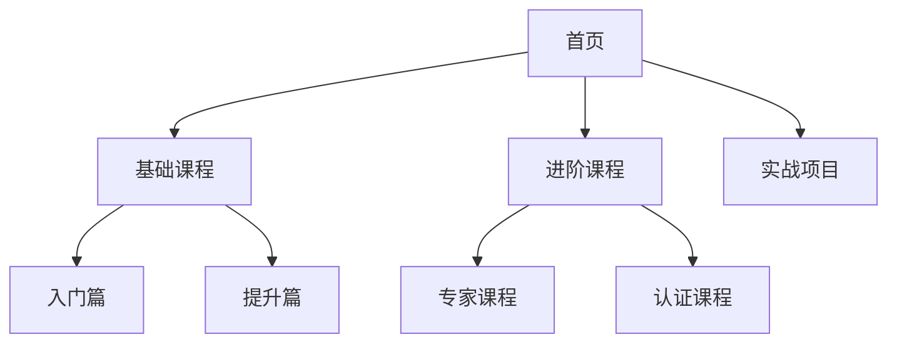

# 信息架构：打造清晰易用的产品结构

> 通过实际案例，深入理解信息架构的原则与方法，帮助你设计出用户体验更好的产品

## 一、什么是信息架构？

信息架构(Information Architecture，简称IA)是对信息进行组织、分类、管理的方法论，目的是让用户能够更容易地找到和使用信息。

### 1.1 信息架构的四大支柱

1. **组织系统**：如何对信息进行分类和组织
2. **标签系统**：如何命名这些信息类别
3. **导航系统**：如何在这些信息间移动
4. **搜索系统**：如何查找信息

### 1.2 为什么信息架构很重要？

**案例：某电商APP改版前后对比**

改版前问题：
- 用户找商品平均需要4-5次点击
- 客服接到大量咨询"商品在哪里"
- 购物车转化率低于行业平均水平20%

改版后效果：
- 找商品路径缩短40%
- 客服咨询量下降50%
- 购物车转化率提升35%

## 二、信息架构设计方法

### 2.1 用户调研：了解用户的思维模式

**实战案例：某在线教育平台的用户调研**

1. **卡片分类法**
```
调研过程：
- 招募20位目标用户
- 准备100张课程卡片
- 请用户自由分类
- 记录分类依据

发现：
- 80%用户倾向按难度分类
- 60%用户会考虑时长
- 40%用户关注应用场景
```

2. **树形测试**


### 2.2 内容分析：梳理信息层级

**案例：电商平台商品分类体系**

| 层级 | 示例 | 原则 |
|-----|------|-----|
| 一级类目 | 数码 | 行业通用分类 |
| 二级类目 | 手机 | 产品大类 |
| 三级类目 | 智能手机 | 具体品类 |
| 四级类目 | 5G手机 | 特征属性 |

### 2.3 结构设计：建立清晰的信息框架

**实战案例：新闻App信息架构设计**

1. **扁平化vs层级化**
```
改版前（层级化）：
首页 -> 分类 -> 子分类 -> 文章列表 -> 文章详情

改版后（扁平化）：
首页(带分类tab) -> 文章列表 -> 文章详情

效果：
- 层级减少40%
- 访问路径缩短50%
- 用户停留时间增加30%
```

2. **导航设计**
```
主导航：
- 要闻
- 视频
- 本地
- 我的

辅助导航：
- 搜索
- 历史
- 收藏
- 分享
```

## 三、信息架构优化实践

### 3.1 常见问题及解决方案

1. **信息冗余**
```
问题：同一信息在多处重复出现
解决：建立信息索引，统一管理

案例：
- 将商品详情统一到PDP页
- 通过链接引用代替复制
```

2. **分类混乱**
```
问题：分类标准不一致
解决：建立分类规则库

案例：
电商类目规则：
- 同一层级用相同维度
- 类目命名要统一
- 避免交叉分类
```

### 3.2 优化效果评估

**案例：某APP信息架构优化项目**

1. **定量指标**
```
- 目标完成时间：-35%
- 操作步骤：-40%
- 错误率：-60%
- 用户满意度：+45%
```

2. **定性反馈**
```
用户访谈摘要：
"现在找东西容易多了"
"分类更符合直觉"
"不用记那么多路径"
```

## 四、信息架构设计工具

### 4.1 常用工具推荐

1. **思维导图工具**
- XMind：层级结构设计
- MindManager：内容组织

2. **原型工具**
- Axure RP：交互原型
- Figma：视觉设计

3. **流程图工具**
- Draw.io：架构图绘制
- Visio：专业流程图

### 4.2 工具使用技巧

**案例：使用Axure设计信息架构**

```
步骤1：创建站点地图
- 使用Sitemap功能
- 建立页面层级

步骤2：设计导航
- 添加全局导航
- 设计面包屑

步骤3：制作原型
- 连接页面
- 添加交互
```

## 五、最佳实践建议

1. **设计原则**
- 遵循用户心智模型
- 保持简单直观
- 提供明确反馈
- 保持一致性

2. **注意事项**
- 定期进行用户测试
- 收集数据反馈
- 持续优化迭代
- 做好版本管理

3. **常见误区**
- 过度分类
- 忽视用户反馈
- 缺乏实际测试
- 照搬竞品方案

