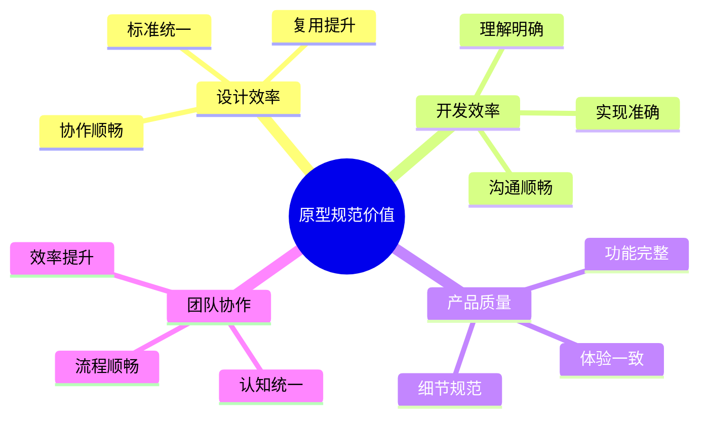
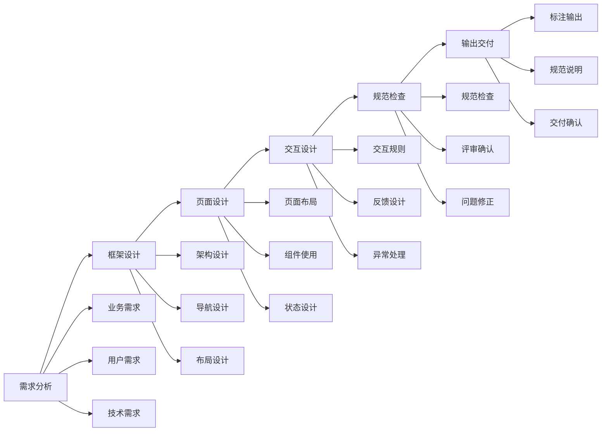
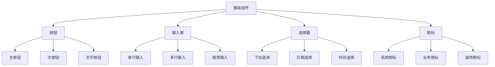
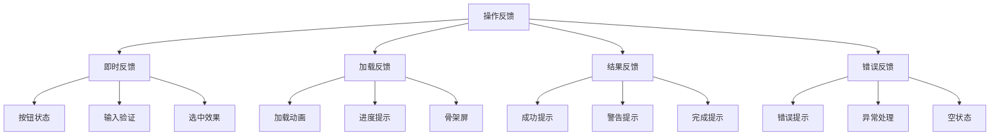

# 原型规范：标准化的产品原型设计指南

## 一、原型规范概述

### 1.1 什么是原型规范？

原型规范是产品原型设计过程中的标准化指导文档，主要包括：
- 原型设计标准
- 组件使用规范
- 交互规则定义
- 标注规范说明

### 1.2 原型规范的价值



## 二、原型设计规范

### 2.1 基本原则

1. **一致性原则**
   - 视觉一致
   - 交互一致
   - 命名一致
   - 标注一致

2. **可用性原则**
   - 清晰易懂
   - 易于使用
   - 便于维护
   - 利于协作

3. **完整性原则**
   - 页面完整
   - 流程完整
   - 状态完整
   - 说明完整

### 2.2 设计流程



## 三、原型规范详细说明

### 3.1 页面布局规范

1. **布局结构**
```markdown
页面结构
├── 顶部导航区
│   ├── Logo区域
│   ├── 导航菜单
│   └── 功能区域
├── 主要内容区
│   ├── 左侧边栏
│   ├── 主内容区
│   └── 右侧边栏
└── 底部信息区
    ├── 版权信息
    ├── 友情链接
    └── 其他信息
```

2. **栅格系统**
```markdown
布局规则：
- 总宽度：1200px
- 列数：12列
- 列宽：80px
- 间距：20px
- 边距：30px

响应式断点：
- 大屏：≥1200px
- 中屏：≥992px
- 小屏：≥768px
- 移动端：<768px
```

### 3.2 组件规范

1. **基础组件**


2. **业务组件**
   ```markdown
   1. 列表组件
      - 基础列表
      - 卡片列表
      - 表格列表
   
   2. 表单组件
      - 基础表单
      - 分步表单
      - 高级表单
   
   3. 弹窗组件
      - 信息弹窗
      - 确认弹窗
      - 操作弹窗
   ```

### 3.3 交互规范

1. **操作反馈**


2. **状态管理**
   ```markdown
   1. 页面状态
      - 加载中
      - 空状态
      - 错误状态
      - 正常状态
   
   2. 组件状态
      - 默认状态
      - 悬停状态
      - 点击状态
      - 禁用状态
   
   3. 数据状态
      - 加载状态
      - 成功状态
      - 失败状态
      - 部分完成
   ```

## 四、标注规范

### 4.1 尺寸标注

1. **基础标注**
   - 组件尺寸
   - 间距标注
   - 边距标注
   - 对齐标注

2. **响应式标注**
   - 断点说明
   - 自适应规则
   - 缩放标准
   - 布局变化

### 4.2 交互标注

1. **状态标注**
   - 默认状态
   - 悬停状态
   - 点击状态
   - 禁用状态

2. **流程标注**
   - 页面流转
   - 数据流转
   - 状态变化
   - 异常处理

## 五、原型规范最佳实践

### 5.1 规范建设

1. **规范体系**
   - 设计原则
   - 规范标准
   - 组件库
   - 样例说明

2. **规范维护**
   - 版本管理
   - 更新机制
   - 问题跟踪
   - 反馈优化

### 5.2 规范应用

1. **设计阶段**
   - 规范遵循
   - 组件复用
   - 标准检查
   - 评审把控

2. **开发阶段**
   - 规范理解
   - 准确实现
   - 问题沟通
   - 效果验证

## 六、实战练习

### 练习一：原型规范制定

任务：制定一个APP产品的原型规范
1. 分析产品特点
2. 定义规范体系
3. 编写规范文档
4. 制作规范样例
5. 验证规范效果

### 练习二：规范应用实践

步骤：
1. 理解规范要求
2. 应用到设计中
3. 检查规范执行
4. 收集使用反馈
5. 持续优化完善

## 七、总结

原型规范是产品设计的基础，需要：
1. 系统的规范体系
2. 完整的规范内容
3. 清晰的使用说明
4. 严格的执行机制
5. 持续的优化完善

成功的原型规范应该：
- 易于理解
- 便于执行
- 利于协作
- 促进效率
- 保证质量