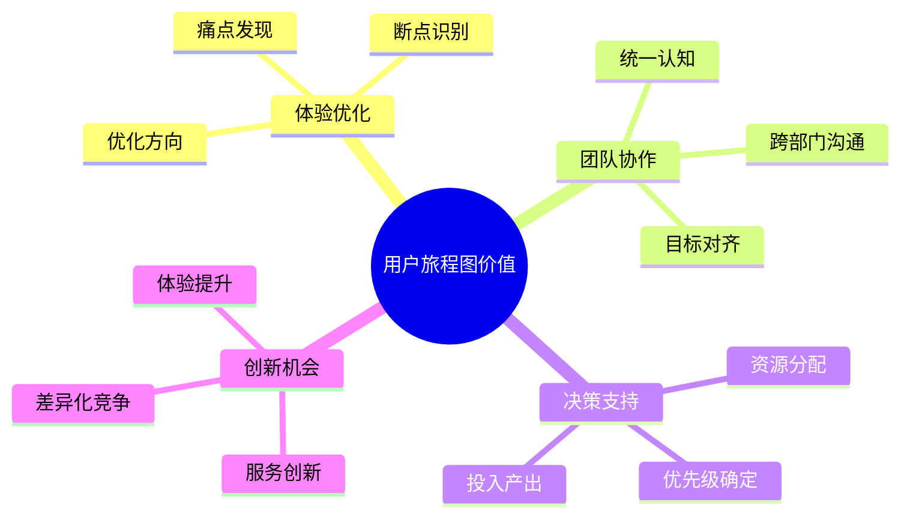
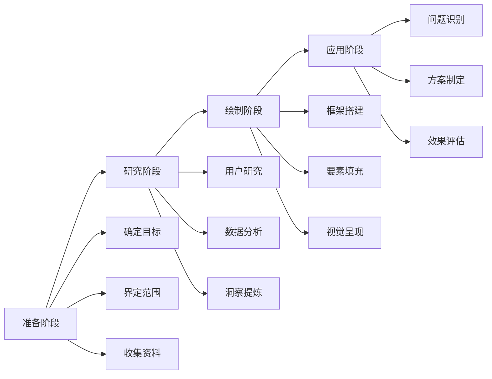
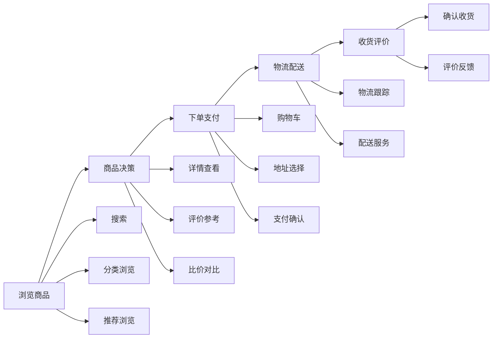
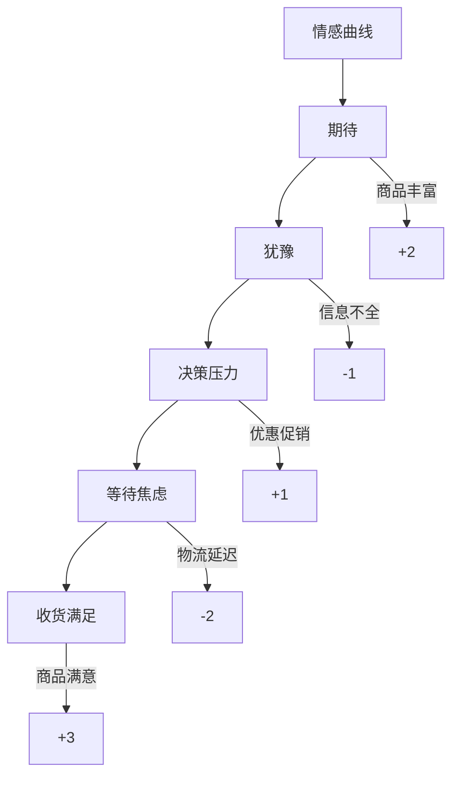

# 用户旅程图：可视化用户体验的利器

## 一、用户旅程图概述

### 1.1 什么是用户旅程图？

用户旅程图（User Journey Map）是一种可视化工具，用于描述用户在使用产品或服务过程中的完整体验，包括：
- 用户行为路径
- 情感变化
- 接触点分析
- 问题识别
- 优化机会

### 1.2 用户旅程图的价值



## 二、用户旅程图方法论

### 2.1 旅程图要素

1. **用户视角**
   - 用户行为
   - 目标需求
   - 期望价值
   - 使用场景

2. **时间维度**
   - 阶段划分
   - 关键节点
   - 时序关系
   - 持续时长

3. **体验维度**
   - 情感变化
   - 满意度
   - 痛点
   - 机会点

4. **接触点**
   - 产品界面
   - 服务渠道
   - 人员互动
   - 环境因素

### 2.2 绘制流程



## 三、用户旅程图实战案例

### 3.1 在线购物APP用户旅程案例

#### 背景
某电商平台需要优化用户购物体验，通过用户旅程图分析现状并找出优化机会

#### 旅程图设计

1. **阶段划分**


2. **情感曲线**


3. **痛点分析**
   ```markdown
   1. 浏览阶段
      - 搜索结果不准确
      - 分类层级复杂
      - 信息展示混乱
   
   2. 决策阶段
      - 商品信息不全
      - 评价真实性
      - 价格透明度
   
   3. 支付阶段
      - 优惠规则复杂
      - 支付流程繁琐
      - 地址管理不便
   
   4. 物流阶段
      - 配送时效不准
      - 物流信息滞后
      - 服务态度问题
   ```

### 3.2 优化方案

1. **体验提升点**
   - 智能搜索优化
   - 信息展示改版
   - 评价体系完善
   - 物流体系升级

2. **解决方案**
   ```mermaid
   graph TD
       A[优化方案] --> B[搜索体验]
       A --> C[信息展示]
       A --> D[支付流程]
       A --> E[物流服务]
       
       B --> B1[算法优化]
       B --> B2[搜索建议]
       B --> B3[筛选优化]
       
       C --> C1[信息架构]
       C --> C2[视觉优化]
       C --> C3[内容分层]
       
       D --> D1[流程简化]
       D --> D2[规则整合]
       D --> D3[体验优化]
       
       E --> E1[预期管理]
       E --> E2[实时追踪]
       E --> E3[服务升级]
   ```

## 四、用户旅程图工具与模板

### 4.1 绘制工具

1. **专业工具**
   - Figma
   - Miro
   - UXPressia
   - Smaply

2. **通用工具**
   - PowerPoint
   - Visio
   - Draw.io
   - XMind

### 4.2 模板示例

#### 1. 基础模板
```markdown
阶段：[前期] -> [中期] -> [后期]
|
行为：用户在每个阶段的具体行为
|
情感：情感曲线变化（-2到+2）
|
接触点：与产品/服务的互动点
|
痛点：问题和困难
|
机会：改进和创新点
```

#### 2. 详细模板
```markdown
### 阶段一：[阶段名称]

用户行为：
- 行为1
- 行为2
- 行为3

情感状态：[评分和描述]

接触点：
- 渠道1
- 渠道2
- 渠道3

痛点：
- 问题1
- 问题2
- 问题3

机会点：
- 优化1
- 优化2
- 优化3
```

## 五、用户旅程图最佳实践

### 5.1 制作要点

1. **用户视角**
   - 真实场景还原
   - 用户需求为本
   - 多维度分析
   - 全流程覆盖

2. **数据支撑**
   - 用户研究数据
   - 行为数据分析
   - 反馈数据整理
   - 运营数据支持

3. **团队协作**
   - 跨部门参与
   - 统一认知
   - 共同优化
   - 持续迭代

### 5.2 应用技巧

1. **场景细分**
   - 用户群体划分
   - 场景特征识别
   - 差异化分析
   - 个性化优化

2. **重点把握**
   - 关键节点识别
   - 核心问题聚焦
   - 优先级排序
   - 资源分配

3. **持续优化**
   - 定期回顾
   - 效果评估
   - 方案调整
   - 持续改进

## 六、实战练习

### 练习一：电商平台用户旅程图

任务：绘制一个电商平台的用户购物旅程图
1. 确定用户群体
2. 划分旅程阶段
3. 识别接触点
4. 分析情感变化
5. 提出优化建议

### 练习二：旅程图优化实践

步骤：
1. 收集用户反馈
2. 分析现有问题
3. 设计优化方案
4. 评估实施效果
5. 持续迭代改进

## 七、总结

用户旅程图是产品优化的重要工具，需要：
1. 系统的方法论
2. 全面的数据支持
3. 深入的用户理解
4. 持续的优化迭代
5. 团队的协同配合

成功的用户旅程图应该：
- 反映真实用户体验
- 发现关键问题
- 指导优化方向
- 促进团队协作
- 推动持续改进