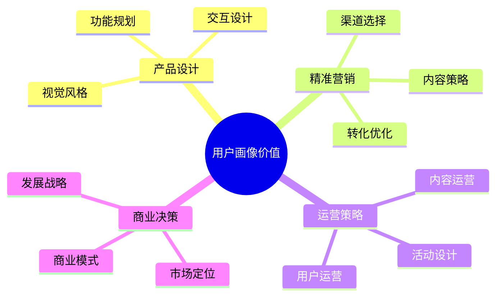
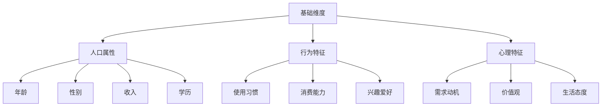

# 用户画像：精准把握目标用户的工具

## 一、用户画像概述

### 1.1 什么是用户画像？

用户画像（User Persona）是通过收集用户数据，对目标用户群体进行分类、分析，并创建典型用户特征的方法。它帮助我们：
- 理解用户特征
- 预测用户行为
- 指导产品设计
- 优化运营策略

### 1.2 用户画像的价值



## 二、用户画像方法论

### 2.1 画像维度

#### 1. 基础维度


#### 2. 行为维度

| 维度 | 指标 | 数据来源 |
|------|------|----------|
| 使用行为 | • 使用频率<br/>• 使用时长<br/>• 使用场景 | • 用户日志<br/>• 行为数据<br/>• 问卷调研 |
| 消费行为 | • 消费金额<br/>• 消费频次<br/>• 产品偏好 | • 交易数据<br/>• 订单记录<br/>• 支付信息 |
| 社交行为 | • 互动频率<br/>• 社交关系<br/>• 内容偏好 | • 社交数据<br/>• 互动记录<br/>• 内容分析 |

### 2.2 画像构建流程

1. **数据收集**
   - 问卷调研
   - 用户访谈
   - 数据分析
   - 行为观察

2. **数据分析**
   - 数据清洗
   - 特征提取
   - 模式识别
   - 聚类分析

3. **画像绘制**
   - 特征描述
   - 行为总结
   - 需求分析
   - 场景还原

4. **画像应用**
   - 产品设计
   - 营销策略
   - 运营优化
   - 服务提升

## 三、用户画像实战案例

### 3.1 在线教育产品用户画像案例

#### 背景
某在线教育平台需要优化产品策略，通过用户画像了解目标用户特征

#### 画像分析

1. **核心用户画像：职场进阶者**
   ```mermaid
   graph TD
       A[职场进阶者] --> B[基础特征]
       A --> C[行为特征]
       A --> D[需求特征]
       A --> E[痛点特征]
       
       B --> B1[25-35岁]
       B --> B2[本科学历]
       B --> B3[一线城市]
       
       C --> C1[工作日晚上学习]
       C --> C2[周末集中学习]
       C --> C3[碎片化学习]
       
       D --> D1[职业技能提升]
       D --> D2[职场竞争力]
       D --> D3[时间灵活性]
       
       E --> E1[时间紧张]
       E --> E2[学习效率低]
       E --> E3[缺乏反馈]
   ```

2. **用户分层**
   ```mermaid
   pie title 用户价值分层
       "高价值用户" : 20
       "中价值用户" : 50
       "低价值用户" : 30
   ```

3. **行为特征分析**
   - 学习时间：工作日晚上19:00-22:00
   - 课程偏好：实用技能类、证书类
   - 付费意愿：中等，愿意为高质量内容付费
   - 学习方式：手机为主，PC为辅

### 3.2 画像应用策略

1. **产品策略**
   - 优化移动端体验
   - 开发碎片化学习功能
   - 增加实时互动功能
   - 提供学习进度追踪

2. **运营策略**
   - 差异化内容推送
   - 个性化学习路径
   - 社群运营支持
   - 激励机制设计

3. **营销策略**
   - 精准投放渠道
   - 场景化营销内容
   - 转化路径优化
   - ROI效果评估

## 四、用户画像工具与方法

### 4.1 数据采集工具

1. **定量工具**
   - 数据统计平台
   - 用户行为跟踪
   - 问卷调研工具

2. **定性工具**
   - 访谈记录
   - 观察日志
   - 用户反馈

3. **数据分析工具**
   - 统计分析软件
   - 可视化工具
   - 机器学习平台

### 4.2 画像模板

#### 1. 基础信息模板

```markdown
### 基础信息
- 姓名：[典型用户名]
- 年龄：[年龄段]
- 职业：[职业信息]
- 收入：[收入水平]
- 教育：[教育程度]
- 所在地：[城市等级]

### 行为特征
- 使用场景：
- 使用频率：
- 消费能力：
- 决策因素：

### 需求痛点
- 核心需求：
- 主要痛点：
- 期望价值：

### 使用习惯
- 使用时间：
- 使用设备：
- 功能偏好：
- 付费意愿：
```

#### 2. 场景还原模板

```markdown
### 场景一：[场景名称]
- 时间：
- 地点：
- 行为：
- 目的：
- 痛点：
- 解决方案：

### 场景二：[场景名称]
...
```

## 五、用户画像的应用场景

### 5.1 产品设计应用

1. **需求分析**
   - 功能规划
   - 优先级排序
   - 体验优化

2. **交互设计**
   - 界面布局
   - 操作流程
   - 视觉风格

3. **功能迭代**
   - 版本规划
   - 功能测试
   - 效果评估

### 5.2 运营策略应用

1. **内容运营**
   - 内容规划
   - 形式创新
   - 投放优化

2. **用户运营**
   - 用户分层
   - 精准触达
   - 转化提升

3. **活动运营**
   - 活动策划
   - 奖励设计
   - 效果评估

## 六、实战练习

### 练习一：构建电商APP用户画像

要求：
1. 设计数据采集方案
2. 确定画像维度
3. 构建典型用户画像
4. 设计应用策略
5. 评估实施效果

### 练习二：用户画像更新迭代

步骤：
1. 收集新数据
2. 分析变化趋势
3. 更新画像特征
4. 调整策略方案
5. 持续优化改进

## 七、总结

用户画像是产品设计和运营的基础工具，需要：
1. 科学的方法论
2. 完整的数据支持
3. 持续的迭代更新
4. 落地的应用价值
5. 可衡量的效果评估

成功的用户画像应该：
- 真实反映用户特征
- 指导产品决策
- 支持运营策略
- 创造商业价值
- 促进持续优化