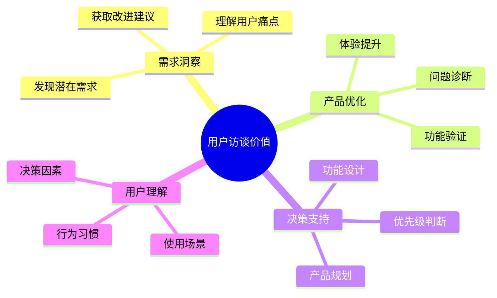
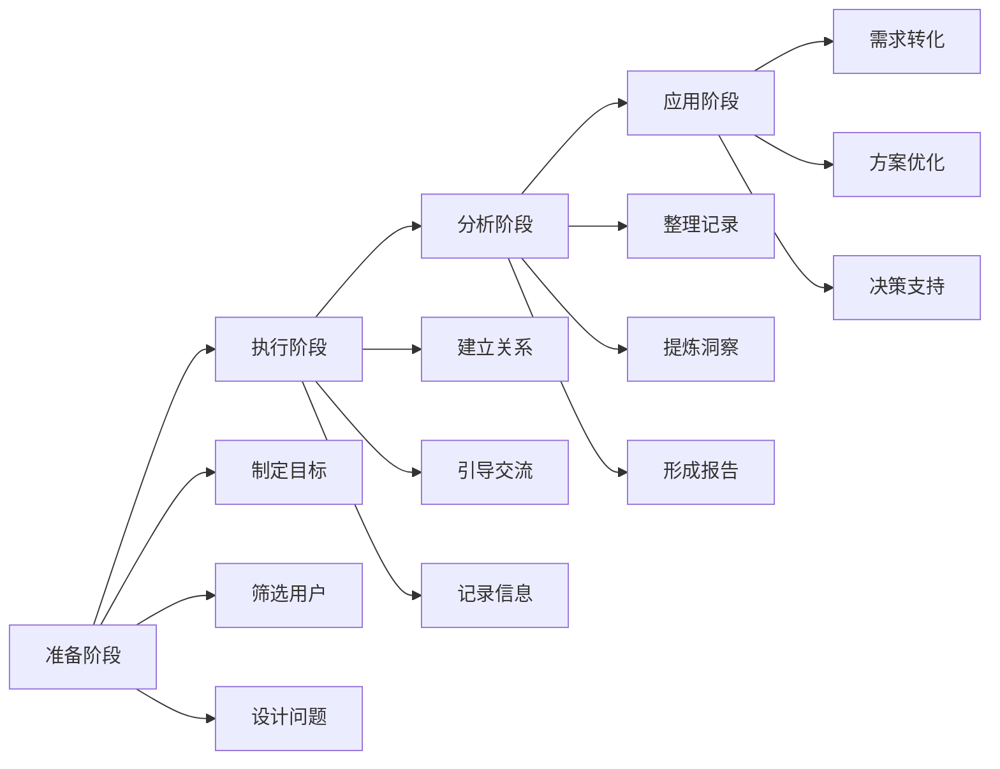

# 用户访谈：深入理解用户的有效工具

## 一、用户访谈概述

### 1.1 什么是用户访谈？

用户访谈是一种定性研究方法，通过与用户进行一对一深度对话，了解用户的：
- 需求和痛点
- 使用行为和习惯
- 态度和观点
- 期望和建议

### 1.2 用户访谈的价值



## 二、用户访谈方法论

### 2.1 访谈类型

1. **探索性访谈**
   - 目的：发现问题和需求
   - 特点：开放式问题为主
   - 适用：产品早期阶段

2. **验证性访谈**
   - 目的：验证假设和方案
   - 特点：结构化问题为主
   - 适用：产品迭代阶段

3. **评估性访谈**
   - 目的：评估产品体验
   - 特点：任务导向
   - 适用：产品测试阶段

### 2.2 访谈流程



## 三、用户访谈实施指南

### 3.1 访谈准备

#### 1. 目标设定
- 明确访谈目的
- 设定具体目标
- 确定关注重点

#### 2. 用户筛选

| 维度 | 筛选标准 | 注意事项 |
|------|----------|----------|
| 用户属性 | • 人口统计特征<br/>• 使用习惯<br/>• 消费能力 | • 覆盖目标群体<br/>• 样本代表性<br/>• 数量适中 |
| 使用程度 | • 核心用户<br/>• 普通用户<br/>• 潜在用户 | • 不同层级覆盖<br/>• 重点关注核心用户<br/>• 兼顾潜在用户 |
| 地理分布 | • 不同城市<br/>• 不同区域<br/>• 线上/线下 | • 考虑地域差异<br/>• 平衡分布<br/>• 便于执行 |

#### 3. 问题设计

1. **问题类型**
   ```mermaid
   pie title 问题类型分布
       "开放式问题" : 50
       "封闭式问题" : 30
       "引导性问题" : 20
   ```

2. **问题结构**
   - 热身问题：建立关系
   - 核心问题：深入了解
   - 延展问题：补充信息
   - 总结问题：验证理解

### 3.2 访谈技巧

1. **建立信任关系**
   - 自我介绍
   - 说明目的
   - 营造轻松氛围

2. **提问技巧**
   - 避免诱导性问题
   - 使用开放式问题
   - 适时追问深入
   - 注意倾听

3. **信息记录**
   - 录音（征得同意）
   - 笔记记录
   - 观察记录
   - 重点标注

## 四、用户访谈案例分析

### 4.1 社交产品用户访谈案例

#### 背景
某社交产品计划优化私信功能，需要了解用户的使用行为和需求

#### 访谈设计

1. **目标用户**
   - 活跃用户：每周使用3次以上
   - 年龄：18-35岁
   - 私信使用频率：中高频

2. **核心问题**
   ```
   Q1：您使用私信功能的场景有哪些？
   Q2：在使用过程中遇到过什么问题？
   Q3：对私信功能有什么改进建议？
   Q4：理想中的私信功能是什么样的？
   ```

3. **访谈发现**
   ```mermaid
   graph TD
       A[核心发现] --> B[使用场景]
       A --> C[痛点问题]
       A --> D[需求期望]
       
       B --> B1[社交沟通]
       B --> B2[信息传递]
       B --> B3[内容分享]
       
       C --> C1[延迟严重]
       C --> C2[功能单一]
       C --> C3[隐私问题]
       
       D --> D1[多媒体互动]
       D --> D2[隐私控制]
       D --> D3[智能推荐]
   ```

### 4.2 访谈结果应用

1. **需求提炼**
   - 核心需求：即时通讯、隐私保护、多媒体互动
   - 潜在需求：社交关系拓展、内容分享便捷性

2. **方案优化**
   - 技术架构优化：提升消息传递速度
   - 功能增强：增加多媒体互动能力
   - 体验优化：简化操作流程

3. **效果验证**
   - 用户反馈
   - 数据监测
   - 持续优化

## 五、常见问题与解决方案

### 5.1 访谈中的常见问题

1. **用户沟通问题**
   - 用户不愿意深入交流
   - 回答过于简单
   - 偏离主题

2. **信息收集问题**
   - 信息记录不完整
   - 重点把握不准
   - 现场干扰多

3. **时间控制问题**
   - 访谈时间过长
   - 节奏把控不当
   - 效率不高

### 5.2 解决策略

1. **提升访谈效果**
   - 事前充分准备
   - 灵活调整问题
   - 善用追问技巧

2. **优化信息收集**
   - 使用录音工具
   - 设计记录模板
   - 及时整理总结

3. **提高访谈效率**
   - 控制访谈时长
   - 把握节奏
   - 聚焦核心问题

## 六、实战练习

### 练习一：设计访谈方案

任务：设计一个电商APP的用户访谈方案
1. 确定访谈目标
2. 设计筛选标准
3. 准备访谈问题
4. 设计记录表格
5. 制定时间计划

### 练习二：模拟访谈实践

步骤：
1. 选择访谈对象
2. 准备访谈材料
3. 进行模拟访谈
4. 总结访谈要点
5. 提炼改进建议

## 七、总结

用户访谈是产品经理的重要技能，需要：
1. 系统的方法论
2. 扎实的实践经验
3. 持续的技能提升
4. 良好的沟通能力
5. 敏锐的观察能力

成功的用户访谈应该：
- 获得有价值的信息
- 建立良好的用户关系
- 支持产品决策
- 促进产品改进
- 提升用户体验