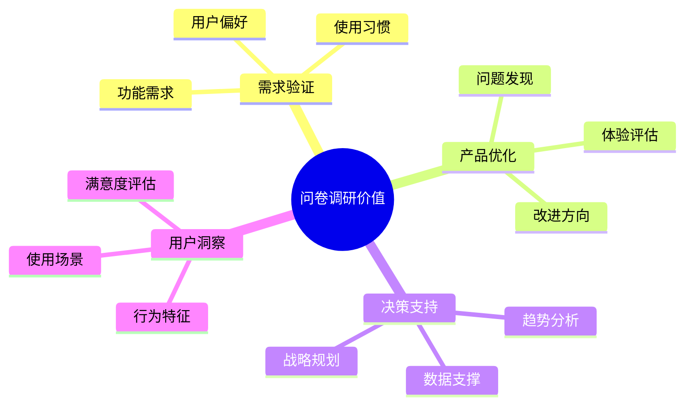
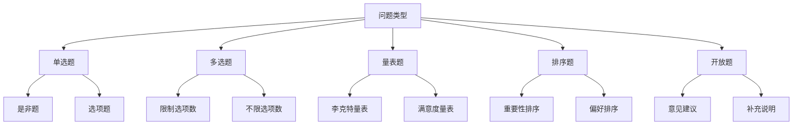

# 问卷调研：科学高效的用户研究方法

## 一、问卷调研概述

### 1.1 什么是问卷调研？

问卷调研是一种通过设计问卷收集用户数据的研究方法，具有以下特点：
- 标准化的数据收集
- 大规模样本获取
- 定量分析支持
- 成本效益较高

### 1.2 问卷调研的价值



## 二、问卷设计方法论

### 2.1 问卷结构

1. **开场白**
   - 调研目的
   - 填写说明
   - 隐私声明
   - 预计时长

2. **筛选问题**
   - 目标用户确认
   - 使用经验验证
   - 基础信息收集

3. **核心问题**
   - 行为调研
   - 态度评估
   - 需求探索
   - 满意度测评

4. **结束语**
   - 感谢语
   - 反馈渠道
   - 奖励说明

### 2.2 问题类型



### 2.3 问卷设计原则

1. **问题设计原则**
   - 明确简洁
   - 避免诱导
   - 逻辑合理
   - 易于理解

2. **选项设计原则**
   - 互斥完备
   - 层次分明
   - 数量适中
   - 表述规范

3. **结构设计原则**
   - 逻辑流畅
   - 难度递进
   - 长度适中
   - 布局清晰

## 三、问卷调研实战案例

### 3.1 移动支付APP用户调研案例

#### 背景
某移动支付APP计划进行产品升级，需要了解用户使用习惯和需求

#### 问卷设计

1. **目标用户筛选**
```markdown
Q1：您是否使用过移动支付APP？
□ 是，经常使用
□ 是，偶尔使用
□ 否，从未使用 [终止问卷]

Q2：您最常使用的支付场景是？[多选]
□ 线下商超支付
□ 网购支付
□ 转账汇款
□ 生活缴费
□ 其他[请注明]
```

2. **使用行为调研**
```markdown
Q3：您平均每周使用移动支付的频率是？
□ 每天多次
□ 每天1-2次
□ 每周3-5次
□ 每周1-2次
□ 不到1次

Q4：您单次支付的金额通常在什么范围？
□ 50元以下
□ 50-200元
□ 201-500元
□ 501-1000元
□ 1000元以上
```

3. **满意度评估**
```markdown
Q5：请对以下功能的满意度进行评分（1-5分）
1. 支付便捷性 [1] [2] [3] [4] [5]
2. 安全性 [1] [2] [3] [4] [5]
3. 优惠活动 [1] [2] [3] [4] [5]
4. 界面友好度 [1] [2] [3] [4] [5]
```

### 3.2 数据分析与应用

1. **数据清洗**
   - 剔除无效样本
   - 处理异常数据
   - 补充缺失值
   - 格式标准化

2. **统计分析**
   ```mermaid
   pie title 用户支付场景分布
       "线下商超" : 40
       "网购支付" : 30
       "转账汇款" : 15
       "生活缴费" : 10
       "其他" : 5
   ```

3. **结论应用**
   - 产品优化方向
   - 功能需求排序
   - 运营策略调整
   - 营销方案制定

## 四、问卷工具与平台

### 4.1 常用问卷平台

1. **免费平台**
   - 问卷星
   - 腾讯问卷
   - 金数据
   - 调查派

2. **付费平台**
   - SurveyMonkey
   - Qualtrics
   - 问卷网
   - ASKFORM

### 4.2 数据分析工具

1. **基础分析**
   - Excel
   - SPSS
   - Python
   - R语言

2. **可视化工具**
   - Tableau
   - PowerBI
   - ECharts
   - DataV

## 五、问卷调研最佳实践

### 5.1 调研准备

1. **目标明确**
   - 确定研究目的
   - 设定调研范围
   - 明确预期结果

2. **样本设计**
   - 确定目标群体
   - 计算样本量
   - 设计抽样方案

3. **资源准备**
   - 时间规划
   - 成本预算
   - 人员分工

### 5.2 实施要点

1. **发放渠道**
   - 社交媒体
   - 用户社群
   - 电子邮件
   - 线下渠道

2. **回收控制**
   - 进度监控
   - 质量把控
   - 异常处理

3. **数据分析**
   - 定量分析
   - 定性分析
   - 交叉分析
   - 对比分析

## 六、实战练习

### 练习一：设计问卷调研方案

任务：设计一个APP用户满意度调研问卷
1. 确定调研目标
2. 设计问卷结构
3. 编写具体问题
4. 设计答题选项
5. 制定实施计划

### 练习二：问卷数据分析

步骤：
1. 数据预处理
2. 描述性统计
3. 相关性分析
4. 结论提炼
5. 报告撰写

## 七、总结

问卷调研是产品经理的重要工具，需要：
1. 科学的设计方法
2. 严谨的实施过程
3. 专业的分析能力
4. 实用的结论输出
5. 持续的优化改进

成功的问卷调研应该：
- 获得有效数据
- 发现真实需求
- 支持决策制定
- 指导产品优化
- 创造实际价值