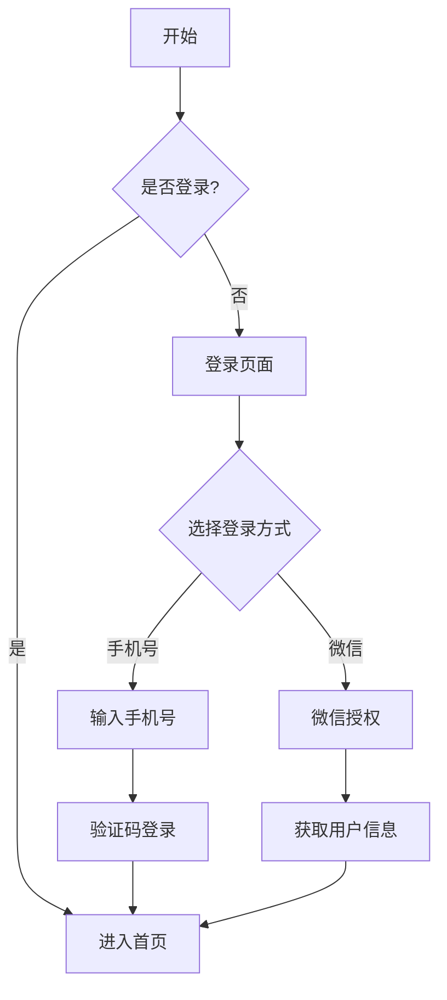

# 交互设计指南

> 产品交互设计的完整指南，包含原则、方法、规范和最佳实践

## 一、交互设计基础

### 1.1 什么是交互设计
交互设计（IxD）是定义、设计人工系统的行为的设计领域，它定义了两个或多个互动的个体之间的关系。

### 1.2 交互设计的目标
```
核心目标：
- 提升可用性
- 增强体验
- 降低认知负荷
- 提高效率
- 减少错误

业务目标：
- 提升转化
- 增加留存
- 促进传播
- 提升满意度
```

## 二、交互设计原则

### 2.1 通用原则
| 原则 | 说明 | 应用场景 | 案例 |
|------|------|----------|------|
| 一致性 | 相似的操作和元素保持一致 | 界面设计、操作流程 | iOS设计规范 |
| 反馈 | 操作后给予及时反馈 | 表单提交、加载状态 | 进度条显示 |
| 容错 | 预防和处理用户错误 | 输入校验、撤销操作 | 微信撤回消息 |
| 效率 | 减少用户操作步骤 | 快捷操作、默认选项 | 支付宝扫一扫 |
| 可见性 | 系统状态清晰可见 | 状态展示、操作提示 | 电池电量显示 |

### 2.2 移动端特殊原则
```
触控原则：
- 点击区域足够大
- 手势操作自然
- 避免误触
- 单手操作友好

特殊考虑：
- 网络状态
- 屏幕大小
- 电量消耗
- 系统限制
```

## 三、交互设计方法

### 3.1 用户研究
```
研究方法：
1. 用户访谈
2. 实地观察
3. 问卷调查
4. 数据分析
5. A/B测试

研究维度：
- 用户特征
- 使用场景
- 行为习惯
- 痛点需求
- 使用频率
```

### 3.2 交互流程设计
以登录流程为例：


## 四、界面交互设计

### 4.1 导航设计
```
导航类型：
- 全局导航
- 局部导航
- 面包屑导航
- 标签导航
- 下拉导航

设计要点：
1. 层级清晰
2. 路径明确
3. 返回便捷
4. 状态明显
```

### 4.2 表单设计
| 设计要素 | 设计规范 | 错误示例 | 正确示例 |
|----------|----------|----------|----------|
| 输入框 | 必填项标记、输入提示 | 无输入提示 | 带格式示例 |
| 错误提示 | 及时、明确、友好 | "错误" | "手机号格式有误" |
| 按钮状态 | 禁用、激活、点击 | 状态不明显 | 颜色区分明显 |
| 操作反馈 | 加载、成功、失败 | 无反馈 | 轻提示+图标 |

### 4.3 列表设计
```
列表类型：
1. 基础列表
2. 图文列表
3. 卡片列表
4. 瀑布流
5. 时间轴

交互要点：
- 加载方式
- 滚动效果
- 筛选排序
- 为空状态
- 操作入口
```

## 五、手势交互设计

### 5.1 基础手势
| 手势类型 | 交互说明 | 适用场景 | 示例 |
|----------|----------|----------|------|
| 点击 | 快速触碰屏幕 | 按钮、链接 | 确认按钮 |
| 长按 | 持续触碰屏幕 | 更多操作 | 微信对话框 |
| 滑动 | 手指滑动屏幕 | 列表滚动 | 下拉刷新 |
| 双击 | 快速点击两次 | 放大缩小 | 图片查看 |
| 捏合 | 两指捏合张开 | 缩放操作 | 地图缩放 |

### 5.2 高级手势
```
组合手势：
- 滑动+点击
- 长按+拖动
- 双指旋转
- 多指操作

应用场景：
1. 图片编辑
2. 地图操作
3. 游戏控制
4. 手势密码
```

## 六、动效交互设计

### 6.1 动效分类
```
功能型动效：
- 加载动画
- 转场过渡
- 提示反馈
- 状态变化

装饰型动效：
- 引导动画
- 品牌动画
- 气氛营造
- 视觉愉悦
```

### 6.2 动效设计规范
| 类型 | 持续时间 | 缓动曲线 | 注意事项 |
|------|----------|----------|----------|
| 按钮反馈 | 0.1-0.2s | 线性 | 即时反馈 |
| 页面切换 | 0.2-0.3s | 缓入缓出 | 自然流畅 |
| 弹窗动画 | 0.3-0.4s | 弹性 | 引导注意 |
| 加载动画 | 1.5-2s循环 | 线性 | 减少等待 |

## 七、交互设计规范

### 7.1 设计规范示例
```
间距规范：
- 文本间距：8dp
- 控件间距：16dp
- 区块间距：24dp
- 页面边距：16dp

点击区域：
- 最小点击区：44pt
- 按钮高度：48dp
- 图标尺寸：24dp
- 文字大小：14sp
```

### 7.2 交互文档模板
```
1. 基本信息
   - 功能名称
   - 所属模块
   - 优先级
   - 设计师

2. 交互说明
   - 触发条件
   - 交互流程
   - 操作规则
   - 异常处理

3. 界面规范
   - 布局规范
   - 控件规范
   - 文案规范
   - 动效规范

4. 状态流转
   - 状态定义
   - 状态切换
   - 状态展示
   - 异常状态
```

## 八、案例分析

### 8.1 微信朋友圈下拉刷新
```
交互设计：
1. 下拉显示刷新提示
2. 松手触发刷新
3. 刷新动画过渡
4. 内容无缝更新

设计亮点：
- 拟物化动效
- 流畅过渡
- 状态清晰
- 操作连贯

用户体验：
- 减少等待焦虑
- 提供视觉反馈
- 保持交互趣味
- 符合使用直觉
```

### 8.2 支付宝扫一扫
```
交互流程：
1. 首页快捷入口
2. 相机权限请求
3. 扫码取景框
4. 扫码结果处理

设计亮点：
- 快捷方便
- 容错性强
- 场景覆盖广
- 反馈及时

效果数据：
- 使用频率：日均3次
- 识别准确率：99.9%
- 平均耗时：1.2秒
- 用户好评度：4.8分
```

## 九、工具与资源

### 9.1 设计工具
```
原型工具：
- Axure RP
- Sketch
- Figma
- Adobe XD

动效工具：
- Principle
- Lottie
- After Effects
- Flinto
```

### 9.2 设计资源
```
设计系统：
- Material Design
- Apple HIG
- Ant Design
- ElementUI

参考资源：
- Dribbble
- Behance
- UI中国
- 人人都是产品经理
```

## 十、交互设计清单

### 10.1 设计评审清单
```
基础检查：
□ 交互流程完整
□ 界面布局合理
□ 操作路径清晰
□ 反馈及时有效

细节检查：
□ 异常状态处理
□ 网络状态提示
□ 加载状态展示
□ 无数据状态
□ 权限处理

体验检查：
□ 单手操作友好
□ 防误触处理
□ 性能体验
□ 易用性
```

### 10.2 设计验证方法
| 验证方法 | 适用场景 | 验证重点 | 预期结果 |
|----------|----------|----------|----------|
| 用户测试 | 新功能上线前 | 易用性 | 任务完成率>90% |
| A/B测试 | 多方案对比 | 转化率 | 提升10%以上 |
| 数据分析 | 功能迭代 | 使用率 | 使用频率提升 |
| 专家评审 | 方案确认 | 规范性 | 符合设计规范 |