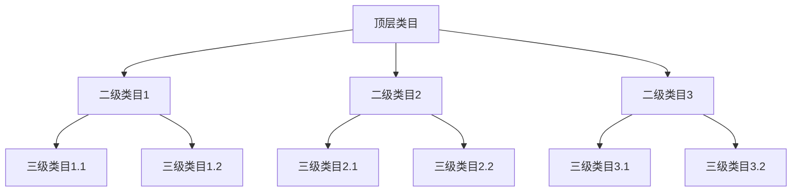

# 信息架构设计指南

> 产品信息架构设计的完整指南，包含原则、方法、工具和最佳实践

## 一、信息架构基础

### 1.1 什么是信息架构
信息架构（Information Architecture，IA）是对信息进行组织、结构化和标记的方法，目的是帮助用户更好地获取和理解信息。

### 1.2 信息架构的重要性
```
对产品的价值：
- 提升信息获取效率
- 优化用户体验
- 降低维护成本
- 提高系统扩展性

对用户的价值：
- 降低认知负荷
- 提高任务效率
- 减少操作错误
- 增强使用信心
```

## 二、信息架构原则

### 2.1 核心原则
| 原则 | 说明 | 应用方式 | 案例 |
|------|------|----------|------|
| 分类原则 | 合理分类和组织信息 | 内容分类、标签体系 | 电商商品分类 |
| 导航原则 | 清晰的信息访问路径 | 导航设计、面包屑 | 网站导航菜单 |
| 标签原则 | 准确的信息描述标签 | 命名规范、关键词 | 功能模块命名 |
| 检索原则 | 高效的信息查找方式 | 搜索系统、筛选 | 搜索引擎设计 |

### 2.2 设计准则
```
用户视角：
- 符合用户心智
- 降低学习成本
- 减少认知负荷
- 提供反馈机制

系统视角：
- 结构清晰
- 逻辑严谨
- 扩展性强
- 维护性好
```

## 三、信息架构方法论

### 3.1 自上而下法
```
设计步骤：
1. 确定顶层结构
2. 划分主要类别
3. 细化子类别
4. 建立关联关系

应用场景：
- 新产品设计
- 系统重构
- 架构规划
- 顶层设计
```

### 3.2 自下而上法
```
设计步骤：
1. 收集信息元素
2. 分析信息特征
3. 归类组织信息
4. 构建信息结构

应用场景：
- 内容重组
- 功能整合
- 系统优化
- 局部改进
```

## 四、信息组织方式

### 4.1 层级结构


### 4.2 组织模式
| 模式 | 说明 | 适用场景 | 案例 |
|------|------|----------|------|
| 层级型 | 树形层级结构 | 分类体系 | 文件系统 |
| 数据库型 | 关系型数据组织 | 复杂数据 | 图书管理 |
| 超文本型 | 网状关联结构 | 知识链接 | 维基百科 |
| 时序型 | 时间顺序组织 | 动态内容 | 新闻资讯 |

## 五、导航系统设计

### 5.1 导航类型
```
全局导航：
- 顶部导航
- 侧边导航
- 底部导航
- 快捷导航

局部导航：
- 二级导航
- 标签导航
- 面包屑导航
- 关联导航
```

### 5.2 导航设计原则
| 原则 | 说明 | 设计要点 | 示例 |
|------|------|----------|------|
| 可见性 | 导航位置明显 | 视觉突出 | 固定导航栏 |
| 可预期 | 导航行为符合预期 | 交互反馈 | 悬停效果 |
| 一致性 | 导航样式统一 | 视觉统一 | 导航风格 |
| 反馈性 | 提供导航反馈 | 状态提示 | 当前位置 |

## 六、标签系统设计

### 6.1 标签类型
```
功能标签：
- 导航标签
- 分类标签
- 操作标签
- 状态标签

内容标签：
- 主题标签
- 属性标签
- 关键词标签
- 标记标签
```

### 6.2 标签命名规范
```
命名原则：
1. 简单明确
2. 用户理解
3. 区分度高
4. 一致性强

命名技巧：
- 使用常用词
- 避免歧义
- 控制长度
- 保持一致
```

## 七、搜索系统设计

### 7.1 搜索类型
| 类型 | 说明 | 适用场景 | 示例 |
|------|------|----------|------|
| 全文搜索 | 检索所有内容 | 文档搜索 | 搜索引擎 |
| 结构化搜索 | 特定字段搜索 | 数据库查询 | 商品筛选 |
| 语义搜索 | 理解搜索意图 | 智能问答 | 语音助手 |
| 关联搜索 | 相关内容推荐 | 内容推荐 | 相关商品 |

### 7.2 搜索体验优化
```
输入体验：
- 搜索提示
- 热门推荐
- 历史记录
- 纠错建议

结果体验：
- 相关度排序
- 筛选功能
- 结果预览
- 为空提示
```

## 八、信息展示设计

### 8.1 展示形式
```
列表展示：
- 文本列表
- 图文列表
- 卡片列表
- 表格列表

可视化展示：
- 图表展示
- 地图展示
- 时间线展示
- 关系图展示
```

### 8.2 展示原则
| 原则 | 说明 | 设计要点 | 示例 |
|------|------|----------|------|
| 信息密度 | 合理的信息量 | 避免过载 | 分页展示 |
| 重要程度 | 突出重要信息 | 视觉层级 | 标题加粗 |
| 关联性 | 相关信息组织 | 空间布局 | 信息分组 |
| 可读性 | 便于阅读理解 | 版式设计 | 段落间距 |

## 九、实践案例

### 9.1 电商网站架构
```
信息结构：
一级类目：
- 商品分类
- 品牌馆
- 特色市场
- 会员服务

二级类目：
- 商品分类
  - 女装
  - 男装
  - 家电
  - 数码
- 品牌馆
  - 国际品牌
  - 国内品牌
  - 设计师品牌
  
导航系统：
- 全局导航
- 分类导航
- 面包屑导航
- 筛选导航
```

### 9.2 企业管理系统
```
功能模块：
- 系统管理
  - 用户管理
  - 角色权限
  - 系统设置
- 业务管理
  - 客户管理
  - 订单管理
  - 合同管理
- 数据中心
  - 数据统计
  - 报表分析
  - 数据导出

信息流：
1. 用户登录
2. 功能访问
3. 数据处理
4. 结果输出
```

## 十、工具与方法

### 10.1 设计工具
```
原型工具：
- Axure RP
- Sketch
- Figma
- XMind

分析工具：
- Google Analytics
- Hotjar
- UserZoom
- Optimal Workshop
```

### 10.2 设计方法
| 方法 | 用途 | 适用阶段 | 输出物 |
|------|------|----------|--------|
| 卡片分类 | 信息分类 | 前期规划 | 分类体系 |
| 用户访谈 | 需求分析 | 需求阶段 | 用户洞察 |
| 原型测试 | 方案验证 | 设计阶段 | 测试报告 |
| 可用性测试 | 体验评估 | 验证阶段 | 优化建议 |

## 十一、评估与优化

### 11.1 评估维度
```
用户维度：
- 可用性
- 易用性
- 效率
- 满意度

系统维度：
- 完整性
- 准确性
- 一致性
- 扩展性
```

### 11.2 优化方法
| 优化项 | 优化方向 | 优化方法 | 效果评估 |
|--------|----------|----------|----------|
| 导航优化 | 提升可达性 | 路径优化 | 到达率 |
| 搜索优化 | 提高准确率 | 算法优化 | 搜索成功率 |
| 分类优化 | 提升准确性 | 类目调整 | 分类准确率 |
| 标签优化 | 提高识别度 | 命名优化 | 理解正确率 |
