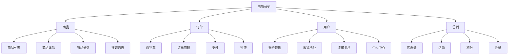
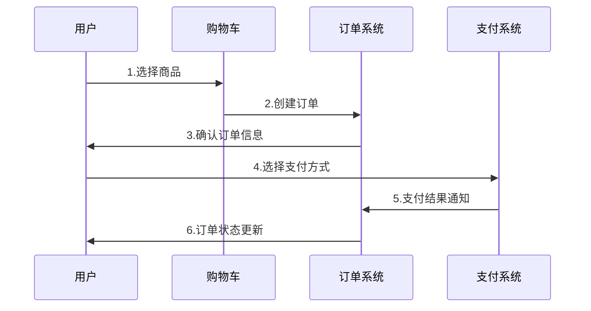

# 功能设计指南

> 产品功能设计的完整指南，包含方法论、案例和最佳实践

## 一、功能设计概述

### 1.1 什么是功能设计
功能设计是将产品需求转化为具体功能的过程，包括功能架构、业务流程、交互逻辑等内容。

### 1.2 功能设计的重要性
对产品的重要性：
- 实现产品价值
- 确保用户体验
- 指导开发实现
- 便于测试验证

对团队的重要性：
- 统一认知
- 提高效率
- 降低沟通成本
- 减少返工

## 二、功能设计方法论

### 2.1 设计原则
核心原则：
- 以用户为中心
- 简单易用
- 功能完整
- 逻辑清晰
- 可扩展性

设计准则：
- 一致性原则
- 最小惊讶原则
- 渐进式原则
- 容错性原则
- 反馈原则

### 2.2 设计流程
| 阶段 | 主要工作 | 输出物 | 相关人员 |
|------|----------|--------|----------|
| 需求分析 | 梳理需求、场景分析 | 需求文档、场景描述 | 产品经理、业务方 |
| 方案设计 | 功能架构、流程设计 | 功能架构图、流程图 | 产品经理、开发团队 |
| 详细设计 | 交互设计、界面设计 | 原型图、交互说明 | 产品经理、设计师 |
| 评审确认 | 方案评审、修改完善 | 评审记录、修改方案 | 所有相关方 |

## 三、功能架构设计

### 3.1 架构设计方法
自上而下法：
1. 确定顶层功能模块
2. 逐层分解子功能
3. 明确功能边界
4. 定义模块关系

自下而上法：
1. 列举具体功能点
2. 功能点分类
3. 构建功能模块
4. 建立层级关系

### 3.2 架构图示例
以电商APP为例：

## 四、业务流程设计

### 4.1 流程设计方法
设计步骤：
1. 确定起点和终点
2. 梳理关键节点
3. 设计处理逻辑
4. 考虑异常情况
5. 优化流程体验

### 4.2 流程图示例
以下单流程为例：

## 五、功能详细设计

### 5.1 功能描述模板
功能名称：
功能描述：
前置条件：
业务规则：
处理流程：
异常处理：

### 5.2 实际案例
以"用户注册"功能为例：
功能名称：用户注册

功能描述：
新用户通过手机号注册成为平台用户

前置条件：
- 用户未注册
- 手机号未被使用
- 网络连接正常

业务规则：
1. 手机号格式验证
2. 验证码有效期5分钟
3. 密码长度8-20位
4. 必须包含字母和数字

处理流程：
1. 输入手机号
2. 发送验证码
3. 验证手机号
4. 设置密码
5. 完成注册

异常处理：
- 手机号已注册：提示已注册
- 验证码错误：允许重试3次
- 验证码过期：重新发送
- 密码不合规：提示规则

## 六、功能评估与优化

### 6.1 评估维度
| 维度 | 评估内容 | 评估方法 | 参考标准 |
|------|----------|----------|----------|
| 必要性 | 功能价值 | 用户调研 | 使用频率大于20% |
| 可用性 | 使用体验 | 用户测试 | 任务完成率大于90% |
| 性能 | 响应时间 | 性能测试 | 加载时间小于3秒 |
| 成本 | 开发成本 | 工作量评估 | 投入产出比大于1 |

### 6.2 优化方法
数据驱动：
- 用户行为分析
- 转化率分析
- 性能监控
- A/B测试

问题发现：
- 用户反馈
- 客服记录
- 错误日志
- 性能报告

## 七、案例分析

### 7.1 微信支付功能设计
背景：
移动支付场景下的快速支付需求

解决方案：
1. 扫码支付
2. 收付款码
3. 指纹支付
4. 人脸支付

创新点：
- 支付便捷性
- 安全性设计
- 场景覆盖
- 用户体验

效果数据：
- 支付成功率99.9%
- 平均支付时间小于3秒
- 用户满意度95%
- 月活用户8亿+

### 7.2 抖音短视频功能设计
背景：
移动互联网时代的短视频娱乐需求

核心功能：
1. 智能推荐
2. 视频拍摄
3. 特效制作
4. 社交互动

创新点：
- 算法推荐
- 拍摄工具
- 互动机制
- 运营策略

效果数据：
- 日活用户6亿+
- 平均使用时长89分钟
- 创作者数量1亿+
- 视频播放量1000亿+/天

## 八、最佳实践

### 8.1 功能设计清单
前期准备：
□ 需求分析充分
□ 场景梳理完整
□ 用户调研到位
□ 竞品分析深入

方案设计：
□ 架构设计合理
□ 流程设计清晰
□ 交互设计友好
□ 异常处理完善

评审确认：
□ 团队评审通过
□ 测试用例完备
□ 技术评估可行
□ 项目排期合理

### 8.2 常见问题及解决方案
| 问题类型 | 具体问题 | 解决方案 | 预防措施 |
|----------|----------|----------|----------|
| 需求理解 | 需求理解偏差 | 加强沟通确认 | 需求评审会 |
| 设计缺陷 | 功能逻辑漏洞 | 全流程梳理 | 设计评审会 |
| 用户体验 | 操作流程复杂 | 简化优化流程 | 用户测试 |
| 技术实现 | 技术难度超出 | 调整技术方案 | 提前技术评估 |

## 九、工具和资源

### 9.1 推荐工具
设计工具：
- Axure：原型设计
- Sketch：界面设计
- XMind：思维导图
- Visio：流程图

协作工具：
- 石墨文档：文档协作
- 蓝湖：设计协作
- JIRA：项目管理
- Confluence：知识管理

### 9.2 参考资源
设计规范：
- Material Design
- Apple HIG
- 微信设计规范
- 支付宝设计规范

学习资源：
- 产品实战课程
- 设计系统文档
- 案例分析文章
- 行业研究报告