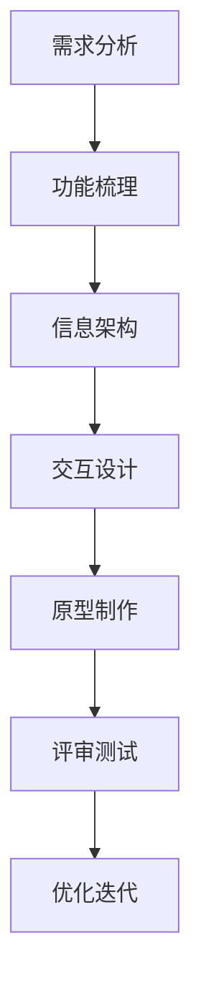

# 原型设计指南

> 产品原型设计的完整指南，包含方法论、工具使用和最佳实践

## 一、原型设计基础

### 1.1 什么是原型设计
原型设计是产品设计过程中的一个重要环节，通过低成本的方式快速呈现产品的界面、交互和功能，用于验证设计方案的可行性。

### 1.2 原型设计的重要性
```
产品价值：
- 降低开发风险
- 减少返工成本
- 提升开发效率
- 优化用户体验

沟通价值：
- 统一认知
- 明确需求
- 促进协作
- 快速迭代
```

## 二、原型设计类型

### 2.1 按保真度分类
| 类型 | 特点 | 适用场景 | 工具 |
|------|------|----------|------|
| 低保真原型 | 简单、快速、重功能 | 早期验证 | 纸笔、Balsamiq |
| 中保真原型 | 基本样式、可交互 | 流程验证 | Axure、墨刀 |
| 高保真原型 | 接近最终效果 | 视觉确认 | Sketch、Figma |

### 2.2 按用途分类
```
验证型原型：
- 概念验证
- 可行性验证
- 用户测试
- 方案对比

演示型原型：
- 方案汇报
- 投资路演
- 客户演示
- 团队协作
```

## 三、原型设计流程

### 3.1 设计步骤


### 3.2 各阶段工作要点
| 阶段 | 工作内容 | 输出物 | 注意事项 |
|------|----------|--------|----------|
| 需求分析 | 收集整理需求 | 需求文档 | 全面性 |
| 功能梳理 | 梳理功能点 | 功能列表 | 优先级 |
| 信息架构 | 设计信息结构 | 架构图 | 逻辑性 |
| 交互设计 | 设计交互流程 | 流程图 | 易用性 |
| 原型制作 | 制作原型图 | 原型文件 | 完整性 |
| 评审测试 | 评审和测试 | 问题清单 | 客观性 |
| 优化迭代 | 持续改进 | 迭代版本 | 及时性 |

## 四、原型设计规范

### 4.1 页面规范
```
布局规范：
- 统一栅格
- 标准间距
- 对齐方式
- 响应式

组件规范：
- 导航组件
- 表单组件
- 列表组件
- 弹窗组件
```

### 4.2 交互规范
| 类型 | 规范说明 | 示例 | 注意事项 |
|------|----------|------|----------|
| 导航交互 | 层级不超过3层 | 菜单导航 | 路径清晰 |
| 表单交互 | 即时校验反馈 | 注册表单 | 容错友好 |
| 列表交互 | 分页或加载更多 | 商品列表 | 性能考虑 |
| 弹窗交互 | 明确的触发和关闭 | 确认弹窗 | 避免打扰 |

## 五、原型设计工具

### 5.1 主流工具对比
| 工具 | 特点 | 适用场景 | 价格 |
|------|------|----------|------|
| Axure RP | 功能强大，学习成本高 | 复杂产品 | 付费 |
| 墨刀 | 上手快，协作好 | 轻量产品 | 免费+付费 |
| Sketch | 设计精美，生态丰富 | 视觉设计 | 付费 |
| Figma | 在线协作，跨平台 | 团队协作 | 免费+付费 |

### 5.2 Axure使用技巧
```
基础功能：
- 页面创建
- 组件使用
- 交互设置
- 样式调整

高级功能：
1. 母版设置
2. 中继器
3. 动态面板
4. 条件判断
```

## 六、原型设计方法

### 6.1 页面布局方法
```
布局原则：
- 视觉层级
- 信息分区
- 重点突出
- 留白合理

常用布局：
1. F型布局
2. Z型布局
3. 网格布局
4. 卡片布局
```

### 6.2 交互设计方法
| 方法 | 说明 | 适用场景 | 案例 |
|------|------|----------|------|
| 渐进展示 | 逐步展示信息 | 复杂表单 | 分步注册 |
| 即时反馈 | 及时响应操作 | 数据输入 | 表单验证 |
| 预防错误 | 防止用户出错 | 重要操作 | 删除确认 |
| 状态清晰 | 明确系统状态 | 操作流程 | 进度提示 |

## 七、原型评审与测试

### 7.1 评审方法
```
评审维度：
- 功能完整性
- 流程合理性
- 交互易用性
- 体验一致性

评审流程：
1. 准备评审
2. 演示讲解
3. 收集反馈
4. 整理问题
```

### 7.2 测试方法
| 测试类型 | 测试内容 | 测试方法 | 关注点 |
|----------|----------|----------|--------|
| 可用性测试 | 易用性评估 | 用户测试 | 完成率 |
| 流程测试 | 流程验证 | 场景测试 | 顺畅度 |
| 功能测试 | 功能验证 | 清单测试 | 完整性 |
| 体验测试 | 体验评估 | 访谈调研 | 满意度 |

## 八、案例分析

### 8.1 电商APP原型设计
```
核心流程：
1. 浏览商品
2. 商品搜索
3. 加入购物车
4. 订单支付
5. 物流查询

设计要点：
- 分类导航清晰
- 搜索便捷高效
- 下单流程简单
- 支付安全可靠
```

### 8.2 企业后台原型设计
```
系统架构：
- 用户管理
- 权限管理
- 内容管理
- 数据统计

设计要点：
- 层级结构清晰
- 操作路径最短
- 批量处理便捷
- 数据展示直观
```

## 九、最佳实践

### 9.1 设计技巧
```
提升效率：
- 善用组件库
- 建立模板
- 使用母版
- 快捷键操作

提升质量：
1. 命名规范
2. 分组管理
3. 状态完整
4. 注释说明
```

### 9.2 常见问题
| 问题类型 | 问题描述 | 解决方案 | 预防措施 |
|----------|----------|----------|----------|
| 流程断点 | 流程不完整 | 全流程梳理 | 建立清单 |
| 交互遗漏 | 交互未覆盖 | 场景测试 | 多方评审 |
| 体验问题 | 操作不便捷 | 用户测试 | 遵循规范 |
| 视觉混乱 | 布局不合理 | 统一规范 | 模板制作 |

## 十、工具资源

### 10.1 推荐工具
```
原型工具：
- Axure RP
- 墨刀
- Sketch
- Figma

辅助工具：
- XMind：思维导图
- ProcessOn：流程图
- 蓝湖：设计协作
- PxCook：标注工具
```

### 10.2 学习资源
```
设计规范：
- Material Design
- Apple HIG
- Ant Design
- Element UI

学习平台：
- UI中国
- 人人都是产品经理
- Axure中文网
- 墨刀学院
```
