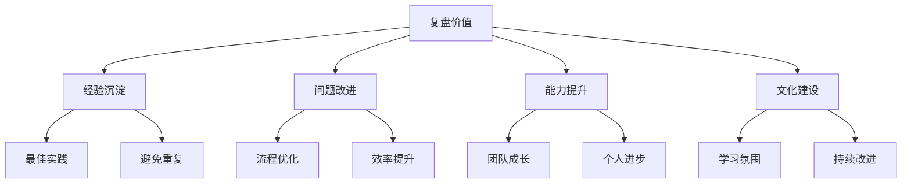
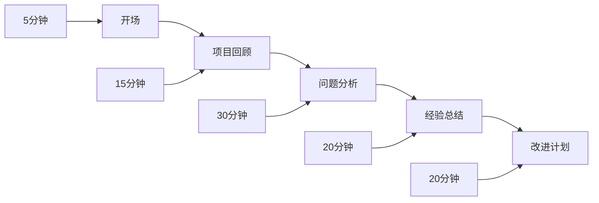

# 项目总结复盘指南

> 远哥说：项目总结复盘是一个项目的"收官之战"，也是经验积累和能力提升的重要环节。今天我结合多年经验，和大家分享如何做好项目总结复盘。

## 一、总结复盘的意义

### 1.1 为什么要总结复盘
```
对团队的价值：
- 沉淀项目经验
- 发现改进空间
- 提升团队能力
- 促进知识共享

对个人的价值：
- 积累实战经验
- 提升专业能力
- 培养复盘思维
- 加速个人成长
```

### 1.2 复盘的重要性


## 二、总结复盘的方法

### 2.1 复盘框架
| 维度 | 关注点 | 分析方法 | 输出 |
|------|--------|----------|------|
| 目标达成 | 完成情况 | 对比分析 | 达成度 |
| 过程执行 | 执行效果 | 过程分析 | 优化点 |
| 问题总结 | 问题分类 | 根因分析 | 解决方案 |
| 经验提炼 | 经验教训 | 提炼总结 | 最佳实践 |

### 2.2 复盘步骤
> 远哥说：好的复盘要有明确的步骤和方法，我来分享一个实用的复盘方法。

```
准备阶段：
1. 收集资料
   - 项目文档
   - 会议记录
   - 数据报告
   - 反馈意见

2. 分析整理
   - 目标达成度
   - 过程执行情况
   - 问题清单
   - 经验教训

3. 组织复盘会
   - 确定参与人
   - 准备材料
   - 设计议程
   - 分配任务

4. 形成输出
   - 复盘报告
   - 改进计划
   - 经验总结
   - 最佳实践
```

## 三、复盘的内容

### 3.1 目标复盘
```
业务目标：
- 功能完成度
- 质量达成度
- 用户满意度
- 业务价值

技术目标：
1. 性能指标
2. 稳定性
3. 可扩展性
4. 技术创新

管理目标：
- 进度控制
- 成本控制
- 团队协作
- 风险管理
```

### 3.2 过程复盘
| 阶段 | 评估维度 | 分析要点 | 改进建议 |
|------|----------|----------|----------|
| 需求阶段 | 需求质量 | 需求变更情况 | 加强需求管理 |
| 设计阶段 | 设计合理性 | 设计评审效果 | 优化评审机制 |
| 开发阶段 | 开发效率 | 技术难点解决 | 提升技术能力 |
| 测试阶段 | 测试覆盖 | Bug分布情况 | 完善测试体系 |

## 四、复盘会议组织

### 4.1 会议准备
```
前期准备：
- 确定参会人员
- 收集会议材料
- 设计会议流程
- 准备会议环境

材料准备：
1. 项目总览
2. 数据分析
3. 问题清单
4. 讨论话题
```

### 4.2 会议流程
> 远哥说：复盘会议要注意控制节奏，保证每个环节都能充分讨论。



## 五、经验总结方法

### 5.1 经验提炼
```
成功经验：
- 可复制的方法
- 有效的工具
- 优秀的实践
- 创新的思路

失败教训：
1. 典型问题
2. 风险点
3. 规避方法
4. 应对策略
```

### 5.2 案例分享
> 远哥说：我来分享一个电商项目的复盘案例。

| 类别 | 经验总结 | 实施效果 | 推广价值 |
|------|----------|----------|----------|
| 需求管理 | 需求评审机制 | 减少返工 | 高 |
| 技术方案 | 分布式架构 | 性能提升 | 高 |
| 测试策略 | 自动化测试 | 效率提升 | 中 |
| 发布流程 | 灰度发布 | 风险可控 | 高 |

## 六、持续改进

### 6.1 改进计划
```
短期计划：
- 问题修复
- 流程优化
- 工具改进
- 规范完善

长期计划：
1. 架构升级
2. 技术创新
3. 团队建设
4. 文化建设
```

### 6.2 跟踪执行
| 改进项 | 责任人 | 完成时间 | 验收标准 |
|--------|--------|----------|----------|
| 需求流程 | 产品经理 | 1个月 | 新流程落地 |
| 代码规范 | 技术负责人 | 2周 | 规范文档 |
| 测试覆盖 | 测试负责人 | 1个月 | 覆盖率提升 |
| 监控体系 | 运维负责人 | 2个月 | 系统上线 |

## 七、文档输出

### 7.1 文档模板
```
复盘报告结构：
1. 项目概述
   - 项目背景
   - 项目目标
   - 项目范围
   - 项目团队

2. 目标达成
   - 完成情况
   - 数据分析
   - 效果评估
   - 价值分析

3. 过程分析
   - 执行情况
   - 问题分析
   - 解决方案
   - 优化建议

4. 经验总结
   - 成功经验
   - 失败教训
   - 最佳实践
   - 改进计划
```

### 7.2 文档管理
```
文档要求：
- 结构清晰
- 重点突出
- 数据支撑
- 落地可行

存储管理：
1. 统一存储
2. 分类管理
3. 权限控制
4. 版本管理
```

## 八、最佳实践

### 8.1 复盘清单
```
复盘准备：
□ 资料收集完整
□ 数据分析充分
□ 问题梳理清晰
□ 会议准备充分

复盘执行：
□ 各方充分参与
□ 讨论深入有效
□ 结论明确具体
□ 改进计划可行

成果固化：
□ 文档完整规范
□ 经验有效提炼
□ 改进措施落地
□ 知识有效传承
```

### 8.2 注意事项
> 远哥说：做了这么多年复盘，我总结了几点重要的经验：

```
复盘原则：
1. 客观公正
   - 实事求是
   - 避免主观
   - 数据说话
   - 全面分析

2. 重在改进
   - 找到根因
   - 提出方案
   - 持续跟进
   - 验证效果

3. 注重实效
   - 关注价值
   - 突出重点
   - 务求实效
   - 推动落地

4. 促进成长
   - 经验萃取
   - 能力提升
   - 团队进步
   - 文化建设
```

## 九、常见问题

### 9.1 复盘误区
```
常见误区：
- 流于形式
- 避重就轻
- 表面总结
- 缺乏行动

解决方法：
1. 明确目的
2. 深入分析
3. 务求实效
4. 重视执行
```

### 9.2 解决方案
| 问题 | 表现 | 原因 | 解决方案 |
|------|------|------|----------|
| 参与度低 | 发言少 | 氛围不够 | 引导讨论 |
| 总结浅 | 不够深入 | 准备不足 | 加强分析 |
| 改进慢 | 执行不力 | 重视不够 | 跟踪推进 |
| 效果差 | 价值不大 | 方法不当 | 优化方法 |

## 十、工具推荐

### 10.1 复盘工具
```
会议工具：
- 腾讯会议
- 飞书会议
- Zoom
- Teams

文档工具：
1. Confluence
2. 语雀
3. 飞书文档
4. 腾讯文档
```

### 10.2 分析工具
```
数据分析：
- Excel
- PowerBI
- Tableau
- QuickBI

可视化工具：
- ProcessOn
- Draw.io
- XMind
- MindManager
```