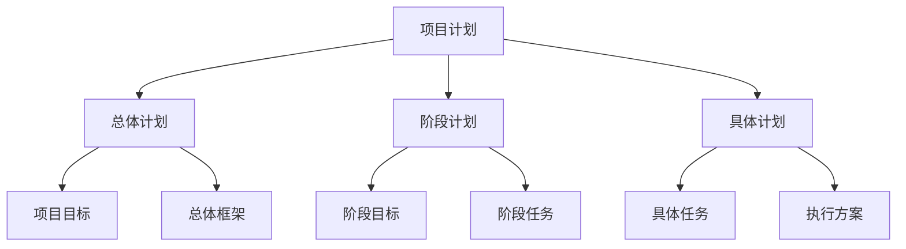
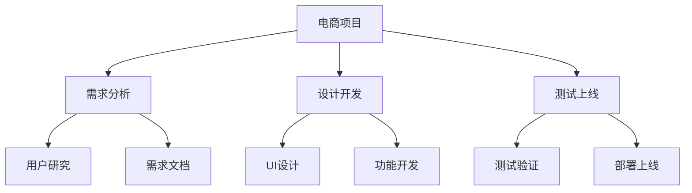

# 项目计划指南

> 远哥说：项目计划是项目管理中最重要的文档之一，它就像是项目的导航图，指导团队如何实现项目目标。今天我来分享如何制定一份好的项目计划。

## 一、项目计划概述

### 1.1 项目计划的重要性
```
对项目的意义：
- 明确项目目标
- 规范项目流程
- 控制项目风险
- 指导项目执行

对团队的意义：
- 统一认识
- 明确分工
- 协调资源
- 提高效率
```

### 1.2 计划的层次


## 二、项目计划要素

### 2.1 基本要素
| 要素 | 内容 | 作用 | 示例 |
|------|------|------|------|
| 目标 | 项目期望达到的结果 | 指明方向 | 系统上线 |
| 范围 | 项目工作的边界 | 控制边界 | 功能清单 |
| 进度 | 项目时间安排 | 把控节奏 | 甘特图 |
| 资源 | 项目所需资源 | 保障执行 | 人力配置 |

### 2.2 扩展要素
```
质量要求：
- 功能要求
- 性能要求
- 安全要求
- 体验要求

风险管理：
1. 风险识别
2. 风险评估
3. 应对策略
4. 监控方案

沟通计划：
- 沟通机制
- 汇报制度
- 会议安排
- 文档管理
```

## 三、计划制定流程

### 3.1 制定步骤
```
前期准备：
1. 收集信息
   - 项目背景
   - 业务需求
   - 技术条件
   - 资源情况

2. 分析评估
   - 可行性分析
   - 风险评估
   - 资源评估
   - 成本评估

3. 计划编制
   - 目标分解
   - 任务分解
   - 进度安排
   - 资源分配

4. 计划评审
   - 技术评审
   - 管理评审
   - 客户确认
   - 最终定稿
```

### 3.2 工作分解
> 远哥说：WBS（工作分解结构）是制定项目计划的重要工具，它能帮助我们将项目工作分解成可管理的单元。



## 四、进度计划

### 4.1 进度计划方法
```
关键路径法：
- 识别关键任务
- 计算工期
- 确定关键路径
- 优化进度计划

敏捷迭代法：
1. Sprint规划
2. 每日站会
3. 迭代评审
4. 持续交付
```

### 4.2 里程碑计划
| 阶段 | 里程碑 | 时间节点 | 验收标准 |
|------|--------|----------|----------|
| 启动 | 项目立项 | T+0 | 立项报告 |
| 需求 | 需求确认 | T+10 | PRD文档 |
| 开发 | 功能完成 | T+40 | 功能测试 |
| 测试 | 测试通过 | T+50 | 测试报告 |
| 上线 | 正式发布 | T+60 | 上线确认 |

## 五、资源计划

### 5.1 人力资源
```
团队组成：
- 产品经理
- UI设计师
- 前端工程师
- 后端工程师
- 测试工程师
- 运维工程师

人力分配：
1. 角色职责
2. 工作量
3. 时间投入
4. 协作方式
```

### 5.2 其他资源
| 资源类型 | 具体内容 | 获取方式 | 使用计划 |
|----------|----------|----------|----------|
| 硬件资源 | 服务器、设备 | 采购/租用 | 按需配置 |
| 软件资源 | 开发工具、环境 | 购买/部署 | 统一配置 |
| 场地资源 | 办公场地 | 租用 | 固定使用 |
| 第三方服务 | 云服务、API | 采购 | 按需使用 |

## 六、质量计划

### 6.1 质量目标
```
功能性目标：
- 功能完整性
- 业务正确性
- 数据准确性
- 接口稳定性

非功能性目标：
1. 性能指标
2. 安全要求
3. 可用性
4. 用户体验
```

### 6.2 质量保证
| 环节 | 保证措施 | 检查方法 | 负责人 |
|------|----------|----------|--------|
| 需求 | 评审确认 | 评审会 | 产品经理 |
| 设计 | 规范检查 | 评审会 | 技术负责人 |
| 开发 | 代码审查 | CodeReview | 开发负责人 |
| 测试 | 测试用例 | 测试执行 | 测试负责人 |

## 七、风险计划

### 7.1 风险识别
```
技术风险：
- 技术难度
- 技术成熟度
- 系统稳定性
- 性能瓶颈

管理风险：
1. 进度延期
2. 需求变更
3. 人员流失
4. 沟通障碍
```

### 7.2 应对策略
| 风险类型 | 风险等级 | 应对措施 | 责任人 |
|----------|----------|----------|--------|
| 技术难题 | 高 | 提前预研 | 技术负责人 |
| 需求变更 | 中 | 变更控制 | 产品经理 |
| 进度延期 | 中 | 资源调配 | 项目经理 |
| 质量问题 | 高 | 加强测试 | 测试负责人 |

## 八、沟通计划

### 8.1 沟通机制
```
例会制度：
- 每日站会
- 周例会
- 月度会议
- 里程碑会议

汇报制度：
1. 日报
2. 周报
3. 月报
4. 总结报告
```

### 8.2 文档管理
| 文档类型 | 更新频率 | 负责人 | 存储位置 |
|----------|----------|--------|----------|
| 需求文档 | 实时更新 | 产品经理 | 文档库 |
| 设计文档 | 版本更新 | 设计师 | 文档库 |
| 测试文档 | 迭代更新 | 测试工程师 | 文档库 |
| 运维文档 | 定期更新 | 运维工程师 | 文档库 |

## 九、最佳实践

### 9.1 计划清单
```
计划内容：
□ 目标明确
□ 范围清晰
□ 进度可行
□ 资源匹配
□ 风险可控

执行跟踪：
□ 进度监控
□ 质量把控
□ 风险管理
□ 及时调整
```

### 9.2 经验总结
> 远哥说：这些年做项目管理，我总结了几点经验：

```
核心要点：
1. 目标导向
   - 明确目标
   - 分解任务
   - 量化指标
   - 跟踪结果

2. 资源平衡
   - 合理分配
   - 优化利用
   - 协调冲突
   - 灵活调整

3. 风险防控
   - 提前识别
   - 及时应对
   - 持续监控
   - 总结经验

4. 沟通协作
   - 建立机制
   - 及时同步
   - 问题跟进
   - 信息共享
```

## 十、工具推荐

### 10.1 项目管理工具
```
计划工具：
- Microsoft Project
- OmniPlan
- ProjectLibre
- TeamGantt

协作工具：
1. JIRA
2. Trello
3. Asana
4. Monday
```

### 10.2 文档管理工具
```
文档协作：
- Confluence
- 语雀
- 飞书文档
- 腾讯文档

代码管理：
- GitHub
- GitLab
- Bitbucket
- Coding