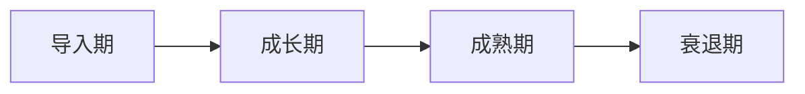

# 产品生命周期：从导入到衰退的全周期管理指南

> 深入理解产品生命周期的各个阶段特点，掌握不同阶段的策略方法，助你成为产品全周期管理专家

## 一、产品生命周期概述

产品生命周期(Product Life Cycle，简称PLC)是指产品从进入市场到退出市场的整个过程，通常包括导入期、成长期、成熟期和衰退期四个阶段。

### 1.1 为什么要研究产品生命周期？

**案例：某社交APP的生命周期管理**

```
初期：
- 月活用户：10万
- 增长率：200%
- 营收：微薄

现状：
- 月活用户：1000万
- 增长率：20%
- 营收：稳定增长

关键收获：
- 不同阶段采取不同策略
- 提前预判下一阶段
- 延长产品生命周期
```

### 1.2 生命周期曲线解析



| 阶段 | 特征 | 关键指标 | 管理重点 |
|-----|------|---------|---------|
| 导入期 | 低增长、高投入 | 用户增长率 | 产品验证 |
| 成长期 | 快速增长、竞争加剧 | 市场份额 | 规模扩张 |
| 成熟期 | 增长放缓、竞争激烈 | 利润率 | 优化效率 |
| 衰退期 | 负增长、市场萎缩 | 现金流 | 转型创新 |

## 二、各阶段特点与策略

### 2.1 导入期：打好产品基础

**实战案例：某在线教育产品的导入期策略**

1. **市场导入策略**
```
目标定位：
- 目标用户：K12学生
- 核心价值：个性化学习
- 差异化点：AI辅导

推广策略：
- 免费试用
- KOL合作
- 校园推广
```

2. **产品迭代策略**
```
第一个月：
- MVP上线
- 核心功能测试
- 收集用户反馈

第二个月：
- 功能优化
- 体验改进
- 小规模推广

第三个月：
- 产品完善
- 运营体系搭建
- 扩大用户规模
```

### 2.2 成长期：快速抢占市场

**案例：某外卖平台的成长期打法**

1. **规模化策略**
```
用户增长：
- 补贴策略
- 裂变营销
- 渠道扩张

商家拓展：
- 降低门槛
- 运营扶持
- 激励计划
```

2. **竞争策略**
```
差异化竞争：
- 独特功能
- 服务升级
- 品牌建设

资源整合：
- 战略合作
- 资本运作
- 生态布局
```