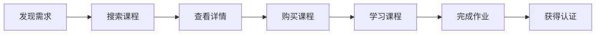

# 需求分析：从模糊到清晰的需求分析全流程

> 通过系统化的需求分析方法，帮助你准确理解用户需求，设计出优秀的产品方案

## 一、需求分析的重要性

### 1.1 为什么要做需求分析？

**案例：某企业协作平台的需求分析教训**

```
项目背景：
- 开发周期：6个月
- 投入人力：15人
- 项目预算：200万

问题：
- 上线后发现核心功能与用户需求不符
- 30%功能几乎无人使用
- 重要场景未覆盖

教训：
- 前期需求分析不充分
- 忽视了用户实际工作场景
- 未做充分的需求验证
```

### 1.2 需求分析的价值

1. **降低风险**
- 减少开发返工
- 控制项目成本
- 提高成功率

2. **提升效率**
- 明确开发方向
- 优化资源分配
- 加快项目进度

## 二、需求分析方法论

### 2.1 5W2H分析法

**案例：某电商APP购物车功能分析**

```
What（是什么）：
- 购物车功能模块
- 商品暂存空间
- 下单入口

Why（为什么）：
- 提升购物体验
- 增加客单价
- 提高转化率

Who（谁用）：
- 目标用户画像
- 使用场景
- 使用频率

When（什么时候）：
- 浏览商品时
- 比价时
- 结算时

Where（在哪里）：
- APP端
- H5端
- 小程序端

How（怎么做）：
- 功能设计
- 交互流程
- 技术实现

How much（多少）：
- 开发成本
- 维护成本
- 预期收益
```

### 2.2 KANO模型分析

**实战案例：某在线教育产品功能分析**

| 需求类型 | 功能示例 | 优先级 | 投入建议 |
|---------|---------|--------|----------|
| 基本型 | 视频播放 | 必须实现 | 保证可用性 |
| 期望型 | 笔记功能 | 应该实现 | 重点投入 |
| 兴奋型 | AI助教 | 可以实现 | 创新尝试 |
| 无差异型 | 皮肤切换 | 可不实现 | 最低优先级 |

### 2.3 用户旅程分析

**案例：在线课程学习流程分析**



每个环节的需求点：
```
1. 发现需求
- 个性化推荐
- 热门榜单
- 搜索引导

2. 搜索课程
- 精准搜索
- 分类筛选
- 智能推荐

3. 查看详情
- 课程介绍
- 师资展示
- 学员评价

4. 购买课程
- 价格体系
- 支付方式
- 优惠策略

5. 学习课程
- 进度跟踪
- 笔记系统
- 互动答疑

6. 完成作业
- 作业系统
- 批改反馈
- 成绩管理

7. 获得认证
- 证书发放
- 技能认证
- 就业推荐
```

## 三、需求分析工具

### 3.1 需求收集工具

1. **调研工具**
- 问卷星：问卷调查
- Axure：原型验证
- 访谈录音：深度访谈

2. **数据分析工具**
- Google Analytics：行为分析
- 热力图：界面分析
- SQL：数据挖掘

### 3.2 需求管理工具

1. **文档工具**
- XMind：思维导图
- Visio：流程图
- PRD模板：需求文档

2. **协作工具**
- JIRA：需求管理
- Trello：任务跟踪
- Confluence：知识沉淀

## 四、需求分析实践技巧

### 4.1 需求分析流程

**案例：某支付产品需求分析全流程**

1. **需求收集**
```
方法：
- 用户访谈
- 竞品分析
- 数据分析

产出：
- 用户反馈记录
- 竞品分析报告
- 数据分析报告
```

2. **需求分析**
```
工具：
- 5W2H分析
- KANO模型
- 用户旅程图

产出：
- 需求分析文档
- 功能列表
- 优先级排序
```

3. **需求验证**
```
方法：
- 用户访谈
- 原型测试
- A/B测试

产出：
- 测试报告
- 改进建议
- 最终方案
```

### 4.2 常见问题及解决方案

1. **需求不清晰**
```
解决方案：
- 多轮沟通确认
- 制作原型验证
- 小范围测试
```

2. **需求冲突**
```
处理方法：
- 明确优先级
- 寻找平衡点
- 分期实现
```

3. **需求变更**
```
应对策略：
- 变更评估
- 影响分析
- 及时调整
```

### 4.3 最佳实践建议

1. **分析准备**
- 了解业务背景
- 收集相关资料
- 确定分析范围

2. **过程管理**
- 及时记录沟通
- 定期同步进展
- 把控分析质量

3. **结果输出**
- 形成完整文档
- 组织评审会议
- 跟踪落地情况

## 五、案例分享

### 5.1 某金融APP需求分析案例

```
项目背景：
- 用户反馈操作繁琐
- 转化率低于预期
- 竞品推出新功能

分析过程：
1. 用户研究
- 访谈30位用户
- 分析用户行为数据
- 绘制用户旅程图

2. 问题诊断
- 识别痛点问题
- 分析原因
- 提出解决方案

3. 方案验证
- 制作交互原型
- 用户测试
- 数据验证

最终成果：
- 操作步骤减少40%
- 转化率提升35%
- 用户满意度提升
```

