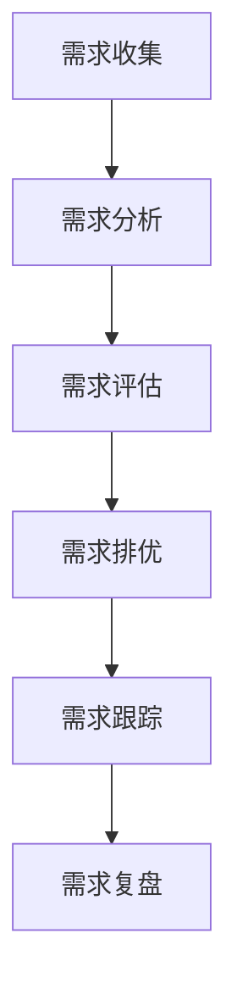

# 需求管理：产品需求的全生命周期管理

> 掌握需求管理的核心方法，建立科学的需求管理体系，提高产品开发效率

## 一、需求管理概述

### 1.1 什么是需求管理？

需求管理是对产品需求进行系统化管理的过程，包括需求收集、分析、评估、排优、跟踪等环节。

### 1.2 为什么要做需求管理？

**案例：某社交产品的需求管理困境**

```
管理混乱的表现：
- 需求来源杂乱
- 优先级不清晰
- 需求频繁变更
- 资源浪费严重

造成的后果：
- 开发效率低下
- 团队沟通成本高
- 产品方向偏离
- 用户体验差

改进后的效果：
- 需求处理时间-50%
- 开发效率+40%
- 团队满意度+60%
```

## 二、需求管理体系

### 2.1 需求管理框架



### 2.2 需求分类体系

**案例：某企业协作平台的需求分类**

| 需求类型 | 描述 | 处理策略 | 示例 |
|---------|------|---------|------|
| 战略需求 | 公司战略导向 | 优先级最高 | 全平台改版 |
| 业务需求 | 业务部门提出 | 评估后排期 | 新功能开发 |
| 用户需求 | 用户反馈 | 数据验证 | 体验优化 |
| 技术需求 | 技术改进 | 与业务需求结合 | 性能优化 |

## 三、需求管理流程

### 3.1 需求收集流程

**实战案例：某电商平台需求收集流程**

1. **需求来源管理**
```
内部来源：
- 公司战略
- 业务部门
- 运营反馈
- 技术团队

外部来源：
- 用户反馈
- 市场调研
- 竞品分析
- 行业趋势
```

2. **需求记录标准**
```
基本信息：
- 需求编号
- 提出人
- 提出时间
- 需求描述

详细信息：
- 业务背景
- 解决方案
- 预期收益
- 评估结果
```

### 3.2 需求评估流程

**案例：需求评估四维度模型**

1. **价值评估**
```
业务价值：
- 营收贡献
- 用户增长
- 效率提升

成本评估：
- 开发成本
- 维护成本
- 机会成本
```

2. **可行性评估**
```
技术可行性：
- 技术难度
- 实现周期
- 稳定性风险

资源可行性：
- 人力资源
- 时间资源
- 预算资源
```

### 3.3 需求优先级管理

**实战案例：某产品需求优先级矩阵**

```
优先级矩阵：

       高价值  |  低价值
高紧急 |   P0   |   P1
低紧急 |   P1   |   P2

处理策略：
P0：立即处理
P1：本次迭代
P2：下次迭代
P3：待定需求
```

## 四、需求管理工具

### 4.1 文档管理工具

1. **需求池管理**
```
工具：JIRA/Trello
用途：
- 需求记录
- 状态跟踪
- 优先级管理
- 协作沟通
```

2. **文档协作**
```
工具：Confluence/语雀
用途：
- 需求文档
- 会议记录
- 决策过程
- 知识沉淀
```

### 4.2 项目管理工具

1. **敏捷开发工具**
```
工具：JIRA/禅道
功能：
- 迭代规划
- 任务分配
- 进度跟踪
- 工时统计
```

2. **协作沟通工具**
```
工具：飞书/钉钉
功能：
- 即时沟通
- 文件共享
- 会议纪要
- 任务提醒
```

## 五、需求管理最佳实践

### 5.1 需求评审机制

**案例：某互联网公司的需求评审流程**

```
评审层级：

1. 业务预评审
- 参与人：产品、业务负责人
- 重点：业务价值、优先级

2. 技术评审
- 参与人：产品、研发、测试
- 重点：技术可行性、工作量

3. 最终评审
- 参与人：产品、研发、测试、业务
- 重点：排期、资源分配
```

### 5.2 需求变更控制

1. **变更流程**
```
申请变更：
- 变更原因
- 影响评估
- 应对方案

评估审批：
- 变更成本
- 收益分析
- 风险评估

执行跟踪：
- 方案调整
- 进度把控
- 结果验证
```

2. **变更原则**
```
必要性原则：
- 确实必要
- 收益明显
- 风险可控

可行性原则：
- 技术可行
- 资源充足
- 时间允许
```

### 5.3 需求复盘机制

**案例：某产品的需求复盘框架**

```
复盘维度：

1. 需求实现度
- 功能完整性
- 质量达成度
- 时间达成度

2. 过程评估
- 需求准确度
- 沟通效率
- 协作顺畅度

3. 效果评估
- 用户反馈
- 数据表现
- 业务目标

4. 经验总结
- 成功经验
- 问题教训
- 改进建议
```

## 六、常见问题及解决方案

### 6.1 需求管理难点

1. **需求过多**
```
解决方案：
- 建立评估机制
- 严格优先级
- 控制迭代量
```

2. **需求变更频繁**
```
解决方案：
- 完善评审机制
- 提高门槛
- 控制影响范围
```

3. **跨部门协作**
```
解决方案：
- 明确职责
- 建立机制
- 加强沟通
```

### 6.2 最佳实践建议

1. **流程优化**
- 简化审批流程
- 标准化工具
- 自动化处理

2. **团队协作**
- 提高沟通效率
- 明确职责分工
- 建立反馈机制

3. **持续改进**
- 定期复盘总结
- 优化管理流程
- 更新最佳实践

