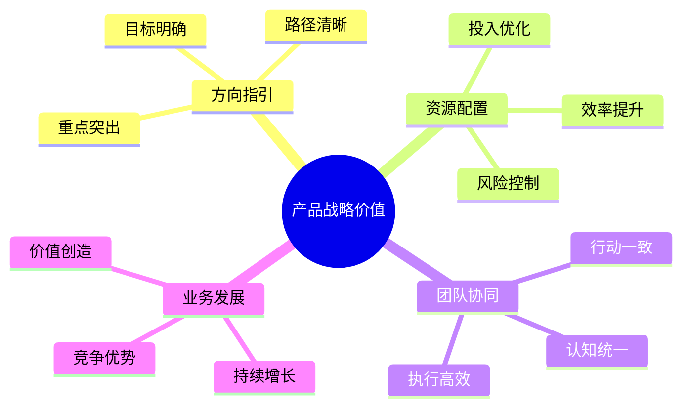
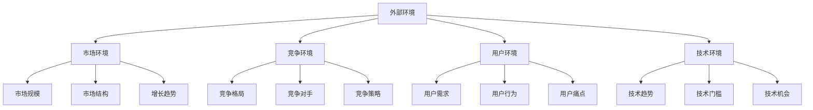
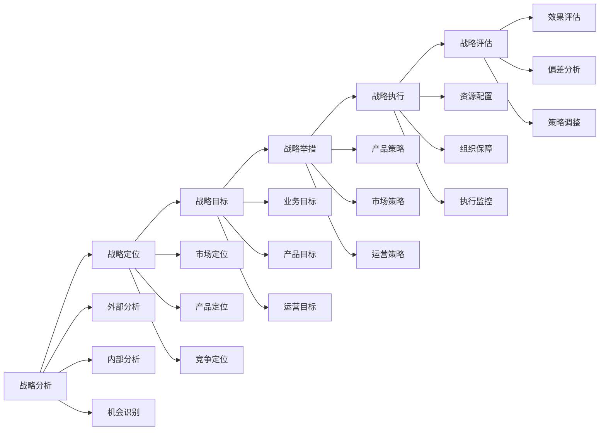
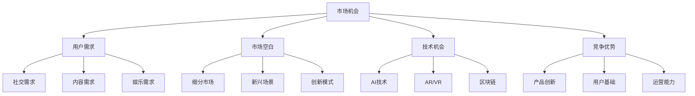
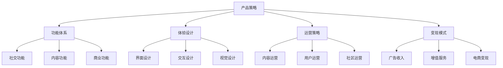

# 产品战略：指引产品发展方向的顶层设计

## 一、产品战略概述

### 1.1 什么是产品战略？

产品战略是产品发展的顶层设计，是指导产品规划和决策的纲领性文件，主要包括：
- 产品愿景
- 市场定位
- 竞争策略
- 发展规划

### 1.2 产品战略的价值



## 二、产品战略制定方法

### 2.1 战略分析框架

1. **外部环境分析**


2. **内部能力分析**
   ```markdown
   1. 资源能力
      - 人才储备
      - 技术积累
      - 资金实力
      - 品牌影响
   
   2. 核心优势
      - 产品优势
      - 技术优势
      - 市场优势
      - 运营优势
   
   3. 发展瓶颈
      - 能力短板
      - 资源不足
      - 效率问题
      - 创新不足
   ```

### 2.2 战略制定流程



## 三、产品战略实战案例

### 3.1 社交产品战略案例

#### 背景
新创企业计划开发一款面向年轻人的社交产品，需要制定产品战略

#### 战略分析

1. **市场机会**


2. **战略定位**
   ```markdown
   1. 目标用户
      - 核心用户：18-25岁年轻人
      - 兴趣特征：追求个性、热爱分享
      - 使用场景：碎片化时间、社交娱乐
      - 价值诉求：表达、连接、认同
   
   2. 产品定位
      - 产品类型：兴趣社交平台
      - 核心价值：基于兴趣的深度连接
      - 差异化：AI智能匹配+沉浸式体验
      - 商业模式：内容创作+社交电商
   ```

### 3.2 战略实施

1. **产品策略**


2. **发展规划**
   ```markdown
   第一阶段（0-6个月）：产品打磨
   - 核心功能开发
   - 产品体验优化
   - 种子用户积累
   
   第二阶段（7-12个月）：规模增长
   - 用户快速增长
   - 内容生态建设
   - 商业化探索
   
   第三阶段（13-24个月）：商业化
   - 商业模式完善
   - 收入规模提升
   - 生态价值释放
   ```

## 四、产品战略工具方法

### 4.1 战略分析工具

1. **PEST分析**
   - 政治环境（Political）
   - 经济环境（Economic）
   - 社会环境（Social）
   - 技术环境（Technological）

2. **波特五力模型**
   ```mermaid
   graph TD
       A[行业竞争] --> B[供应商议价能力]
       A --> C[购买者议价能力]
       A --> D[潜在进入者威胁]
       A --> E[替代品威胁]
       A --> F[现有竞争者竞争]
       
       B --> B1[供应商集中度]
       B --> B2[转换成本]
       B --> B3[供应商实力]
       
       C --> C1[购买者集中度]
       C --> C2[产品差异化]
       C --> C3[转换成本]
       
       D --> D1[进入壁垒]
       D --> D2[资金需求]
       D --> D3[规模经济]
       
       E --> E1[替代品性价比]
       E --> E2[转换成本]
       E --> E3[替代倾向]
       
       F --> F1[竞争者数量]
       F --> F2[产业增长]
       F --> F3[退出壁垒]
   ```

### 4.2 战略规划工具

1. **战略地图**
   ```markdown
   愿景与战略
   ↓
   财务视角
   - 收入增长策略
   - 生产力提升策略
   ↓
   客户视角
   - 产品/服务属性
   - 客户关系
   - 品牌形象
   ↓
   内部流程视角
   - 运营管理流程
   - 客户管理流程
   - 创新流程
   ↓
   学习与成长视角
   - 人力资本
   - 信息资本
   - 组织资本
   ```

2. **平衡计分卡**
   - 财务维度指标
   - 客户维度指标
   - 内部流程指标
   - 学习成长指标

## 五、产品战略实施管理

### 5.1 组织保障

1. **组织架构**
   - 战略决策层
   - 战略管理层
   - 战略执行层

2. **职责分工**
   - 决策机制
   - 执行机制
   - 协调机制

### 5.2 执行管理

1. **目标分解**
   ```mermaid
   graph TD
       A[战略目标] --> B[年度目标]
       B --> C[季度目标]
       C --> D[月度目标]
       
       B --> B1[业务目标]
       B --> B2[产品目标]
       B --> B3[运营目标]
       
       C --> C1[关键指标]
       C --> C2[重点项目]
       C --> C3[资源配置]
       
       D --> D1[具体任务]
       D --> D2[执行计划]
       D --> D3[考核标准]
   ```

2. **监控评估**
   - 执行监控
   - 效果评估
   - 偏差分析
   - 策略调整

## 六、实战练习

### 练习一：产品战略规划

任务：为一款教育产品制定产品战略
1. 市场分析
2. 战略定位
3. 目标设定
4. 策略制定
5. 实施规划

### 练习二：战略优化

步骤：
1. 战略评估
2. 问题分析
3. 优化方案
4. 实施计划
5. 效果跟踪

## 七、总结

产品战略制定需要注意：
1. 系统性思维
2. 前瞻性判断
3. 可执行性设计
4. 持续性优化
5. 灵活性调整

成功的产品战略应该：
- 目标明确
- 路径清晰
- 可落地执行
- 持续创造价值
- 保持竞争优势