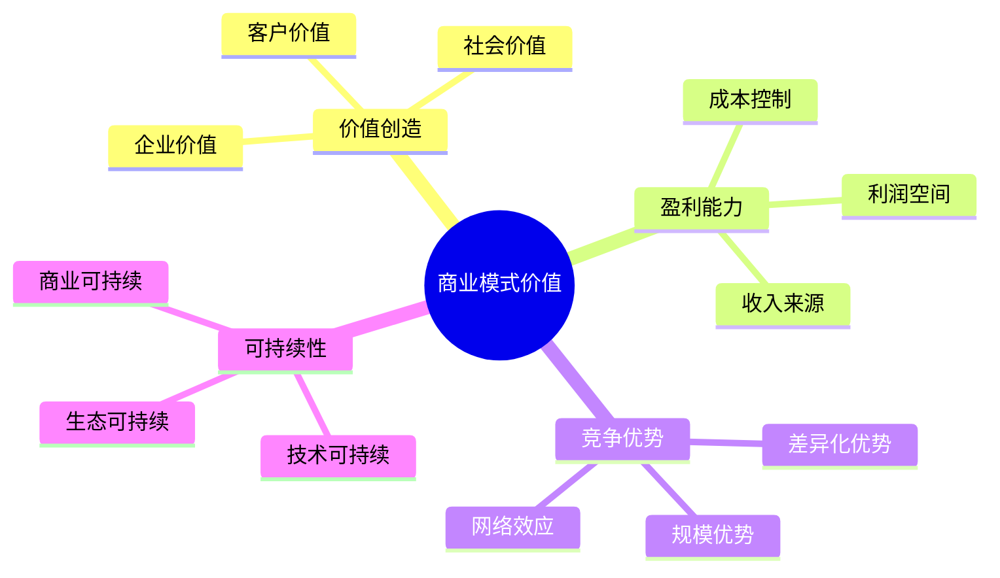
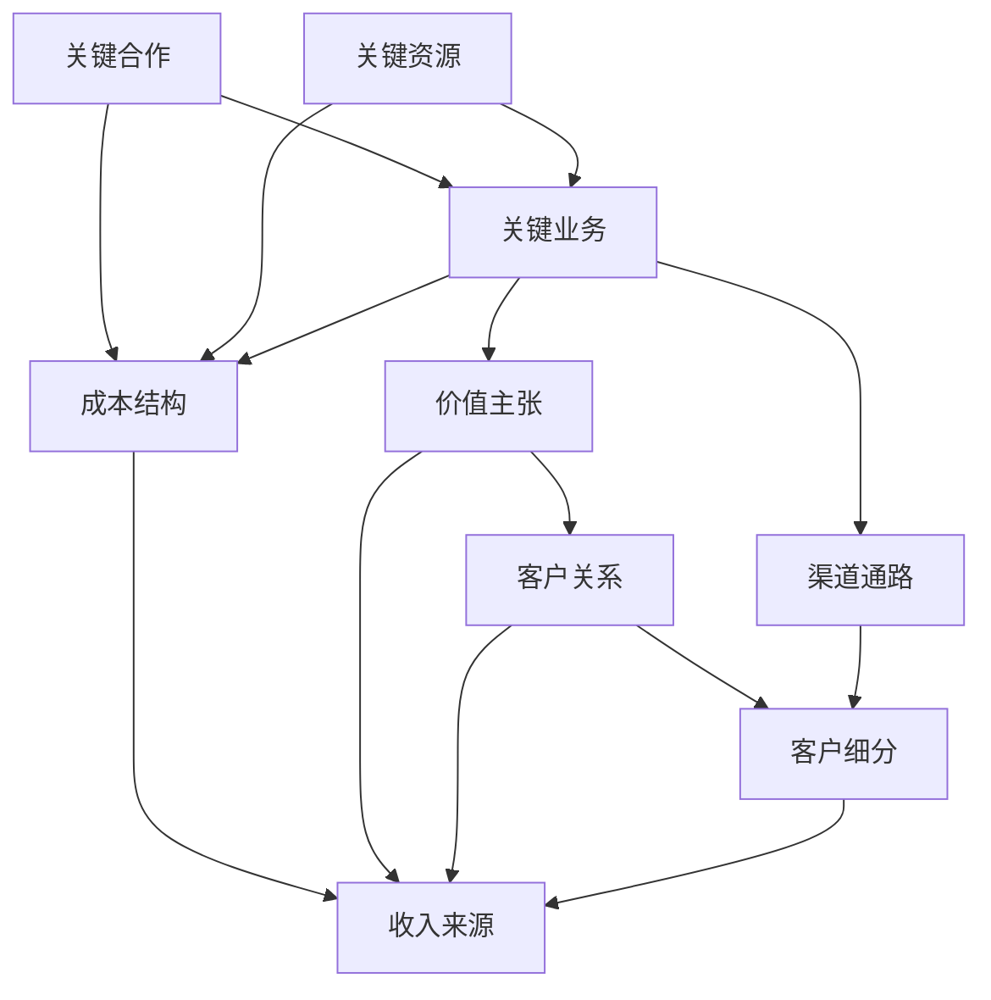
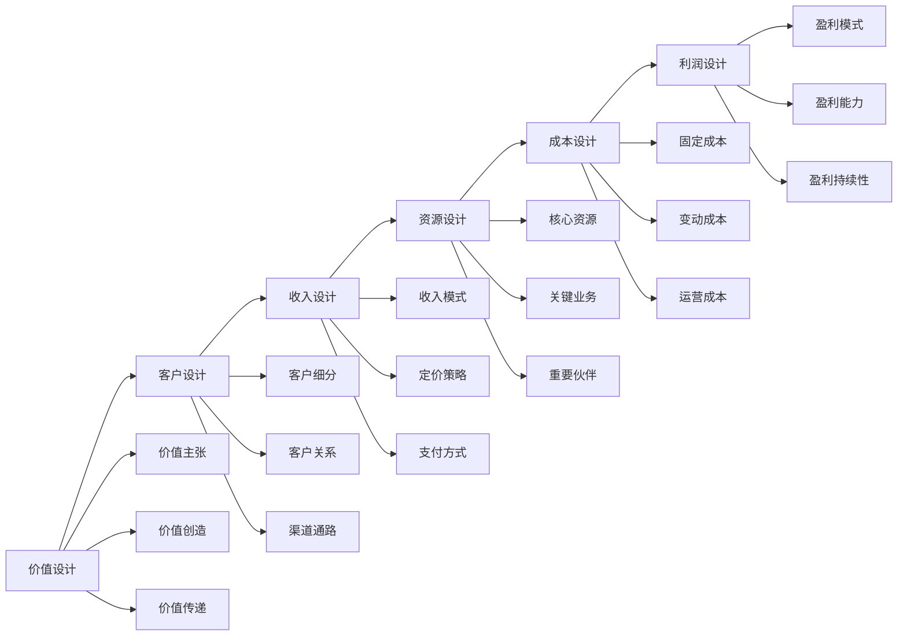
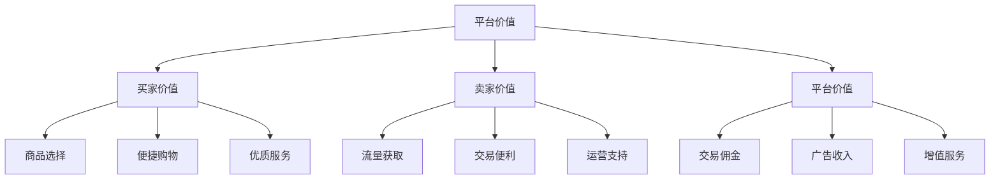
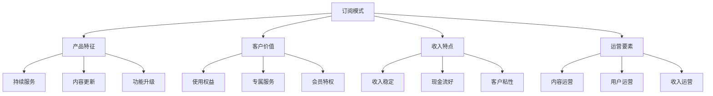
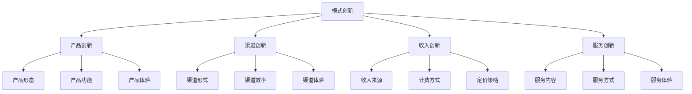
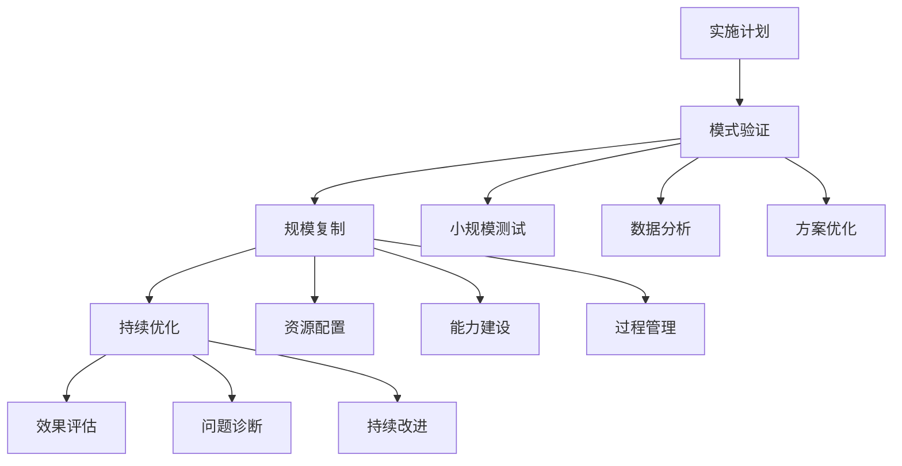

# 商业模式：产品价值变现的核心方法论

## 一、商业模式概述

### 1.1 什么是商业模式？

商业模式是描述企业如何创造、传递和获取价值的基本原理，主要包括：
- 价值主张
- 客户细分
- 收入来源
- 成本结构
- 核心资源
- 关键业务

### 1.2 商业模式的重要性



## 二、商业模式设计方法

### 2.1 商业模式画布



### 2.2 商业模式设计流程

1. **市场分析**
   ```markdown
   1. 市场规模
      - 总体市场规模
      - 目标市场规模
      - 市场增长趋势
   
   2. 竞争分析
      - 竞争格局
      - 竞争对手
      - 竞争策略
   
   3. 客户分析
      - 客户需求
      - 支付意愿
      - 使用行为
   ```

2. **模式设计**


## 三、典型商业模式案例

### 3.1 平台模式案例

#### 背景
某电商平台的商业模式分析

#### 模式分析

1. **价值创造**


2. **收入模式**
   ```markdown
   1. 交易收入
      - 平台佣金
      - 支付手续费
      - 物流分成
   
   2. 营销收入
      - 展示广告
      - 搜索广告
      - 精准推广
   
   3. 服务收入
      - 商家服务
      - 消费者服务
      - 技术服务
   ```

### 3.2 订阅模式案例

1. **模式特点**


2. **实施策略**
   ```markdown
   第一阶段：模式设计
   - 产品规划
   - 会员体系
   - 定价策略
   
   第二阶段：获客增长
   - 免费策略
   - 转化策略
   - 促活策略
   
   第三阶段：价值提升
   - 服务升级
   - 权益扩展
   - 收入优化
   ```

## 四、商业模式创新方法

### 4.1 创新维度

1. **价值创新**
   - 新客户价值
   - 新产品形态
   - 新服务模式

2. **模式创新**


### 4.2 创新工具

1. **商业模式创新画布**
   ```markdown
   1. 价值创新
      - 消除：哪些行业要素可以消除
      - 降低：哪些要素可以降低
      - 提升：哪些要素需要提升
      - 创造：哪些新要素需要创造
   
   2. 创新评估
      - 效用：是否创造新价值
      - 价格：是否具有价格优势
      - 成本：是否控制在合理范围
      - 采用：是否容易被市场接受
   ```

## 五、商业模式实施管理

### 5.1 实施策略

1. **落地计划**


2. **风险控制**
   - 市场风险
   - 运营风险
   - 财务风险
   - 合规风险

### 5.2 效果评估

1. **评估指标**
   ```markdown
   1. 业务指标
      - 用户规模
      - 交易规模
      - 活跃度
   
   2. 财务指标
      - 收入规模
      - 毛利率
      - 获客成本
      - 用户价值
   ```

2. **优化方向**
   - 模式优化
   - 效率提升
   - 体验改善
   - 成本控制

## 六、实战练习

### 练习一：商业模式设计

任务：设计一个在线教育产品的商业模式
1. 价值设计
2. 客户分析
3. 收入规划
4. 成本估算
5. 实施方案

### 练习二：商业模式优化

步骤：
1. 现状分析
2. 问题诊断
3. 方案设计
4. 实施计划
5. 效果评估

## 七、总结

商业模式设计需要注意：
1. 价值导向
2. 客户中心
3. 创新思维
4. 可持续性
5. 执行力度

成功的商业模式应该：
- 价值明确
- 模式清晰
- 可持续发展
- 规模化复制
- 持续优化改进