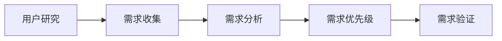

# 什么是产品经理？

::: tip 定义
产品经理（Product Manager）是一个负责产品整个生命周期管理的角色，从产品构思、规划、到开发、发布和持续迭代的全过程。
:::

## 产品经理的核心职责

产品经理需要平衡用户需求、业务目标和技术可行性，做出正确的产品决策。以下是产品经理的主要职责：

### 1. 用户需求管理 {#user-needs}

产品经理需要深入理解用户需求，主要通过以下方式：



- **用户研究**：通过用户访谈、问卷调查等方式收集用户反馈
- **需求收集**：整理来自各方的需求信息
- **需求分析**：评估需求的合理性和可行性
- **需求优先级**：对需求进行分级和排序
- **需求验证**：通过原型测试验证需求的准确性

### 2. 产品规划与战略 {#strategy}

::: warning 注意
产品规划需要考虑公司战略、市场环境、竞品情况等多个维度。
:::

产品经理需要制定清晰的产品战略和路线图：

| 规划层面 | 时间跨度 | 主要内容 |
|---------|---------|---------|
| 战略规划 | 1-3年 | 产品愿景、市场定位、商业模式 |
| 年度规划 | 1年 | 年度目标、重点项目、资源分配 |
| 季度规划 | 3个月 | 具体功能、迭代计划、里程碑 |

### 3. 跨团队协作 {#collaboration}

产品经理是连接各个团队的桥梁：

<code-group>
<code-block title="研发团队" active>
```markdown
- 编写产品需求文档(PRD)
- 澄清技术细节
- 跟进开发进度
- 验收功能实现
```
</code-block>

<code-block title="设计团队">
```markdown
- 提供产品原型
- 讨论交互方案
- 确认视觉设计
- 把控设计质量
```
</code-block>

<code-block title="运营团队">
```markdown
- 制定运营策略
- 收集用户反馈
- 分析运营数据
- 优化产品体验
```
</code-block>
</code-group>

## 必备技能

产品经理需要具备以下核心技能：

::: details 硬技能
- 需求分析与管理
- 产品设计与原型
- 项目管理
- 数据分析
- 文档写作
:::

::: details 软技能
- 沟通协调能力
- 逻辑思维能力
- 决策能力
- 学习能力
- 抗压能力
:::

## 常见误区 {#misconceptions}

::: danger 误区
1. 产品经理就是画原型图的
2. 产品经理只需要提需求就行
3. 产品经理不需要懂技术
4. 产品经理就是老板的传话筒
:::

### 正确认识

产品经理是一个需要全局视角的角色，需要：

1. 深入理解用户需求
2. 平衡各方利益
3. 把控产品方向
4. 推动产品落地

## 拓展阅读 {#further-reading}

::: tip 推荐书籍
1. 《人人都是产品经理》
2. 《产品思维》
3. 《启示录：打造用户喜爱的产品》
:::

## 相关资源 {#resources}

::: info 相关链接
- [产品经理职业发展路径](/pm-basics/role-definition/career-path.md)
- [产品经理日常工作](/pm-basics/role-definition/daily-work.md)
- [产品经理能力模型](/pm-basics/role-definition/competency-model.md)
:::
