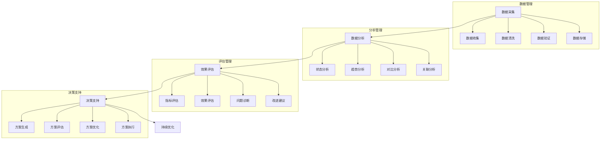

# 库存分析系统设计

> 远哥说：库存分析是优化库存管理的重要工具，通过多维度的数据分析和科学的评估方法，实现库存状态的精准把握和决策的科学支持。

## 一、系统概述

### 1.1 系统定位
```
功能定位：
1. 业务目标
   - 精准分析库存
   - 发现管理问题
   - 优化库存结构
   - 支持科学决策

2. 系统价值
   - 状态透明
   - 问题可视
   - 趋势预测
   - 决策支持

3. 用户角色
   - 分析主管：制定方案
   - 分析员：执行分析
   - 决策层：决策支持
   - 管理层：监督评估
```

### 1.2 核心功能
| 模块 | 功能点 | 业务价值 | 实现难点 |
|------|--------|----------|----------|
| 数据管理 | 数据采集 | 数据基础 | 数据质量 |
| 分析管理 | 多维分析 | 状态透明 | 分析方法 |
| 评估管理 | 效果评估 | 问题发现 | 评估体系 |
| 决策支持 | 方案建议 | 科学决策 | 建议精准 |

### 1.3 核心业务流程



## 二、功能设计

### 2.1 数据管理
```
功能模块：
1. 数据采集
   - 数据收集
   - 数据清洗
   - 数据验证
   - 数据存储

2. 数据处理
   - 数据转换
   - 数据整合
   - 数据计算
   - 数据校验

3. 数据分类
   - 基础数据
   - 业务数据
   - 分析数据
   - 评估数据

4. 数据维护
   - 数据更新
   - 数据备份
   - 数据恢复
   - 数据归档
```

### 2.2 分析管理
```
功能模块：
1. 状态分析
   - 结构分析
   - 分布分析
   - 层次分析
   - 关联分析

2. 趋势分析
   - 时序分析
   - 周期分析
   - 季节分析
   - 预测分析

3. 对比分析
   - 横向对比
   - 纵向对比
   - 基准对比
   - 目标对比

4. 诊断分析
   - 问题识别
   - 原因分析
   - 影响评估
   - 改进建议
```

## 三、流程设计

### 3.1 业务流程
```
流程步骤：
1. 数据采集
   - 数据收集
   - 数据清洗
   - 数据验证
   - 数据存储

2. 数据分析
   - 状态分析
   - 趋势分析
   - 对比分析
   - 诊断分析

3. 效果评估
   - 指标评估
   - 效果评估
   - 问题诊断
   - 改进建议

4. 决策支持
   - 方案生成
   - 方案评估
   - 方案优化
   - 方案执行
```

### 3.2 管理流程
| 阶段 | 工作内容 | 负责人 | 输出物 |
|------|----------|--------|--------|
| 采集阶段 | 数据采集 | 数据员 | 数据集 |
| 分析阶段 | 数据分析 | 分析员 | 分析报告 |
| 评估阶段 | 效果评估 | 评估员 | 评估报告 |
| 决策阶段 | 决策支持 | 决策层 | 决策方案 |

## 四、系统实现

### 4.1 技术架构
```
系统架构：
1. 前端技术
   - Web端：Angular
   - 移动端：React Native
   - 图表：D3.js
   - UI框架：Material UI

2. 后端技术
   - 开发语言：Python
   - 框架：Django
   - 数据库：PostgreSQL
   - 计算引擎：Spark

3. 算法模型
   - 分析算法
   - 预测算法
   - 诊断算法
   - 评估算法

4. 部署架构
   - 容器化：Docker
   - 编排：Kubernetes
   - 网关：Nginx
   - 监控：Grafana
```

### 4.2 数据模型
| 实体 | 属性 | 关系 | 说明 |
|------|------|------|------|
| 数据 | 数据信息 | 1:n | 主体 |
| 分析 | 分析信息 | n:1 | 从属 |
| 评估 | 评估信息 | n:1 | 从属 |
| 决策 | 决策信息 | n:1 | 从属 |

## 五、运营策略

### 5.1 分析策略
```
策略方向：
1. 数据策略
   - 全面采集
   - 及时处理
   - 准确验证
   - 安全存储

2. 分析策略
   - 多维分析
   - 深入分析
   - 精准分析
   - 预测分析

3. 评估策略
   - 科学评估
   - 全面评估
   - 持续评估
   - 动态评估

4. 优化策略
   - 方法优化
   - 流程优化
   - 效率优化
   - 持续改进
```

### 5.2 优化方向
| 方向 | 措施 | 目标 | 效果 |
|------|------|------|------|
| 数据优化 | 质量提升 | 数据准确 | 基础夯实 |
| 分析优化 | 方法改进 | 分析精准 | 洞察深入 |
| 评估优化 | 体系完善 | 评估科学 | 问题明确 |
| 决策优化 | 支持加强 | 决策科学 | 效果提升 |
